

<h3>Universidad Peruana de Ciencias Aplicadas</h3>

 

<strong>Ingeniería de Software - 2025-2</strong> 
<strong>1ASI0729 - Desarrollo de Aplicaciones Open Source</strong> 
<strong>NRC: 7369</strong> 
<strong>Profesor: Wilder Julio Espinoza Bravo</strong> 

 <strong>Informe del Trabajo Final</strong>  

<strong>Startup: InnovaSocial </strong> 
<strong>Producto: VolunPath </strong> 

### Team Members:

|             Member              |    Code    |
|:-------------------------------:|:----------:|
|  Aldair Ramos |    U20201F051     |
|  Bertha Roxmeri Román Rodriguez |   u20211c654   |
| Mel Andree Orellana Rodriguez | U202116018 |
|  Jean Pool Huaman De La Cruz |    U20201E781     |
|  Alex Gabriel Cusimayta Lobo | U202019131 |

<strong> Setiembre 2025</strong> 

# Registro de Versiones del Informe
|             Versión             |    Fecha   |    Descripción de modificación   |
|:-------------------------------:|:----------:|:----------:|
|  TB1 |    11/09/2025     |    Se han incluído los siguientes capítulos: Capítulo I: Introducción, Capítulo II: Requirements Elicitation & Analysis, Capítulo III: Requirements Specification, Capítulo IV: Product Design, Avance del Capítulo V: Product Implementation, Validation & Deployment hasta el punto 5.2.1.8, Avance de Conclusiones, Bibliografía y Anexos|           
    
# Project Report Collaboration Insights

- URL Project Report (Github): https://github.com/curso-nombre-startup-7369/report/tree/develop
---

# Contenido

## Tabla de contenidos
- [Student Outcome](#student-outcome)
- [Capítulo I: Introducción](#capítulo-i-introducción)
    - [1.1. Startup Profile](#11-startup-profile)
        - [1.1.1. Descripción de la Startup](#111-descripción-de-la-startup)
        - [1.1.2. Perfiles de integrantes del equipo](#112-perfiles-de-integrantes-del-equipo)
    - [1.2. Solution Profile](#12-solution-profile)
        - [1.2.1. Antecedentes y problemática](#121-antecedentes-y-problemática)
        - [1.2.2. Lean UX Process](#122-lean-ux-process)
            - [1.2.2.1. Lean UX Problem Statements](#1221-lean-ux-problem-statements)
            - [1.2.2.2. Lean UX Assumptions](#1222-lean-ux-assumptions)
            - [1.2.2.3. Lean UX Hypothesis Statements](#1223-lean-ux-hypothesis-statements)
            - [1.2.2.4. Lean UX Canvas](#1224-lean-ux-canvas)
    - [1.3. Segmentos objetivo](#13-segmentos-objetivo)
- [Capítulo II: Requirements Elicitation & Analysis](#capítulo-ii-requirements-elicitation--analysis)
    - [2.1. Competidores](#21-competidores)
        - [2.1.1. Análisis competitivo](#211-análisis-competitivo)
        - [2.1.2. Estrategias y tácticas frente a competidores](#212-estrategias-y-tácticas-frente-a-competidores)
    - [2.2. Entrevistas](#22-entrevistas)
        - [2.2.1. Diseño de entrevistas](#221-diseño-de-entrevistas)
        - [2.2.2. Registro de entrevistas](#222-registro-de-entrevistas)
        - [2.2.3. Análisis de entrevistas](#223-análisis-de-entrevistas)
    - [2.3. Needfinding](#23-needfinding)
        - [2.3.1. User Personas](#231-user-personas)
        - [2.3.2. User Task Matrix](#232-user-task-matrix)
        - [2.3.3. User Journey Mapping](#233-user-journey-mapping)
        - [2.3.4. Empathy Mapping](#234-empathy-mapping)
        - [2.3.5. As-is Scenario Mapping](#235-as-is-scenario-mapping)
    - [2.4. Ubiquitous Language](#24-ubiquitous-language)
- [Capítulo III: Requirements Specification](#capítulo-iii-requirements-specification)
    - [3.1. To-Be Scenario Mapping](#31-to-be-scenario-mapping)
    - [3.2. User Stories](#32-user-stories)
    - [3.3. Impact Mapping](#33-impact-mapping)
    - [3.4. Product Backlog](#34-product-backlog)
- [Capítulo IV: Product Design](#capítulo-iv-product-design)
    - [4.1. Style Guidelines](#41-style-guidelines)
        - [4.1.1. General Style Guidelines](#411-general-style-guidelines)
        - [4.1.2. Web Style Guidelines](#412-web-style-guidelines)
    - [4.2. Information Architecture](#42-information-architecture)
        - [4.2.1. Organization Systems](#421-organization-systems)
        - [4.2.2. Labeling Systems](#422-labeling-systems)
        - [4.2.3. SEO Tags and Meta Tags](#423-seo-tags-and-meta-tags)
        - [4.2.4. Searching Systems](#424-searching-systems)
        - [4.2.5. Navigation Systems](#425-navigation-systems)
    - [4.3. Landing Page UI Design](#43-landing-page-ui-design)
        - [4.3.1. Landing Page Wireframe](#431-landing-page-wireframe)
        - [4.3.2. Landing Page Mock-up](#432-landing-page-mock-up)
    - [4.4. Web Applications UX/UI Design](#44-web-applications-uxui-design)
        - [4.4.1. Web Applications Wireframes](#441-web-applications-wireframes)
        - [4.4.2. Web Applications Wireflow Diagrams](#442-web-applications-wireflow-diagrams)
        - [4.4.3. Web Applications Mock-ups](#443-web-applications-mock-ups)
        - [4.4.4. Web Applications User Flow Diagrams](#444-web-applications-user-flow-diagrams)
    - [4.5. Web Applications Prototyping](#45-web-applications-prototyping)
    - [4.6. Domain-Driven Software Architecture](#46-domain-driven-software-architecture)
        - [4.6.1. Software Architecture Context Diagram](#461-software-architecture-context-diagram)
        - [4.6.2. Software Architecture Container Diagrams](#462-software-architecture-container-diagrams)
        - [4.6.3. Software Architecture Components Diagrams](#463-software-architecture-components-diagrams)
    - [4.7. Software Object-Oriented Design](#47-software-object-oriented-design)
        - [4.7.1. Class Diagrams](#471-class-diagrams)
        - [4.7.2. Class Dictionary](#472-class-dictionary)
    - [4.8. Database Design](#48-database-design)
        - [4.8.1. Database Diagram](#481-database-diagram)
- [Capítulo V: Product Implementation, Validation & Deployment](#capítulo-v-product-implementation-validation--deployment)
    - [5.1. Software Configuration Management](#51-software-configuration-management)
        - [5.1.1. Software Development Environment Configuration](#511-software-development-environment-configuration)
        - [5.1.2. Source Code Management](#512-source-code-management)
        - [5.1.3. Source Code Style Guide & Conventions](#513-source-code-style-guide--conventions)
        - [5.1.4. Software Deployment Configuration](#514-software-deployment-configuration)
    - [5.2. Landing Page, Services & Applications Implementation](#52-landing-page-services--applications-implementation)
        - [5.2.1. Sprint 1](#521-sprint-1)
            - [5.2.1.1. Sprint Planning 1](#5211-sprint-planning-1)
            - [5.2.1.2. Aspect Leaders and Collaborators](#5212-aspect-leaders-and-collaborators)
            - [5.2.1.3. Sprint Backlog 1](#5213-sprint-backlog-1)
            - [5.2.1.4. Development Evidence for Sprint Review](#5214-development-evidence-for-sprint-review)
            - [5.2.1.5. Execution Evidence for Sprint Review](#5215-execution-evidence-for-sprint-review)
            - [5.2.1.6. Services Documentation Evidence for Sprint Review](#5216-services-documentation-evidence-for-sprint-review)
            - [5.2.1.7. Software Deployment Evidence for Sprint Review](#5217-software-deployment-evidence-for-sprint-review)
            - [5.2.1.8. Team Collaboration Insights during Sprint](#5218-team-collaboration-insights-during-sprint)

- [Conclusiones](#conclusiones)
- [Conclusiones y recomendaciones](#conclusiones-y-recomendaciones)
- [Video About-the-Team](#video-about-the-team)
- [Bibliografía](#bibliografía)
- [Anexos](#anexos)

#### 1.1.2. Perfiles de integrantes del equipo

| Estudiante | Descripción | Conocimientos |
|------------|-------------|---------------|
|     Aldair Joaquin Ramos Aguirre   U20201F051 | Soy estudiante de Ingeniería de software en la UPC, me gusta todo lo relacionado a la tecnología y desarrollo. Confió en que puedo aportar algo para el desarrollo de este proyecto.  | Conocimientos mayormente en C++, Python, CSS, HMTL Y SQL |
| (foto)   Nombres Apellidos   Código | Descripción del estudiante | Conocimientos del estudiante |
|    Bertha Roxmeri Román Rodriguez   u20211c654 | En estos momentos estoy cursando la carrera de ingeniería de software, en la cual obtengo conocimientos variados ya que integra distintas ciencias como computación, ciencias básicas y ciencias aplicadas. Puedo usar estos conocimientos para transformarlos en un producto industrial usando bases de la ingeniería para desarrollar algo innovador. | Conocimientos de HTML, CSS, C++ y Python |
|    Mel Andree Oreellana Rodriguez    U202116018 | Estudiante de Ingeniería de Software, comprometido con el trabajo en equipo, proactivo y orientado a resultados, con interés en aportar soluciones tecnológicas innovadoras. | HTML, CSS, JavaScript, SQL (frontend y bases de datos), Python (programación, automatización y análisis). |
|    Jean Pool Huaman De La Cruz   U20201E781 | Soy estudiante de la carrera de Ingeniería de Software en la UPC y tengo 22 años. A lo largo de mi formación me he destacado por mi compromiso con el aprendizaje constante, siempre buscando reforzar mis conocimientos y mejorar en las áreas que lo requieren. | Conocimientos en Python, C++ y otros lenguajes de programación. |

=======

---
# Student Outcome
### ABET – EAC - Student Outcome 3  
**Criterio:** Capacidad para comunicarse de manera efectiva con un rango diverso de audiencias, utilizando medios orales, escritos y visuales de forma clara y estructurada, adaptando el mensaje según el contexto, el propósito y las características del público objetivo.  

En el siguiente cuadro se presentan las acciones realizadas y las conclusiones formuladas por el grupo, las cuales evidencian y respaldan el cumplimiento de este resultado de aprendizaje.  

<table>
  <thead>
    <tr>
      <th>Criterio específico</th>
      <th>Nombre</th>
      <th>Acciones realizadas</th>
      <th>Conclusiones</th>
    </tr>
  </thead>
  <tbody>
    <!-- Criterio 1 -->
    <tr>
      <td rowspan="5">Comunica oralmente con efectividad a diferentes rangos de audiencia.</td>
      <td>Aldair Joaquin Ramos Aguirre</td>
      <td>
        TB1: Participé activamente en los grupos para la coordinación mediante llamadas, tratando de comunicar mis ideas con efectividad. 
        TP: 
        TB2: 
        TF:
      </td>
      <td rowspan="5"></td>
    </tr>
    <tr>
      <td>Alumno 2</td>
      <td>
        TB1: 
        TP: 
        TB2: 
        TF:
      </td>
    </tr>
    <tr>
      <td>Alumno 3</td>
      <td>
        TB1: 
        TP: 
        TB2: 
        TF:
      </td>
    </tr>
    <tr>
      <td>Mel Andree Orellana Rodriguez</td>
      <td>
        TB1:Apoyé en la elaboración del análisis de entrevistas del segmento de líderes, colaborando en la redacción y organización de la información para resaltar necesidades y expectativas clave 
        TP: 
        TB2: 
        TF:
      </td>
    </tr>
    <tr>
      <td>Jean Pool Huaman De La Cruz</td>
      <td>
        TB1:Participé activamente en las reuniones de equipo, expresando ideas de manera clara y cumpliendo con las tareas asignadas dentro de los plazos establecidos, lo que permitió una comunicación efectiva con mis compañeros. 
        TP: 
        TB2: 
        TF:
      </td>
    </tr>
    <!-- Criterio 2 -->
    <tr>
      <td rowspan="5">Comunica por escrito con efectividad a diferentes rangos de audiencia </td>
      <td>Aldair Joaquin Ramos Aguirre</td>
      <td>
        TB1: Trate de aportar activamente en los grupos para la coordinación mediante los grupos como whatsapp y discord para la repartición de tareas. 
        TP: 
        TB2: 
        TF:
      </td>
      <td rowspan="5"></td>
    </tr>
    <tr>
      <td>Alumno 2</td>
      <td>
        TB1: 
        TP: 
        TB2: 
        TF:
      </td>
    </tr>
    <tr>
      <td>Alumno 3</td>
      <td>
        TB1: 
        TP: 
        TB2: 
        TF:
      </td>
    </tr>
    <tr>
      <td>Mel Andree Orellana Rodriguz</td>
      <td>
        TB1:Participé en las reuniones grupales, apoyé a mis compañeros en el desarrollo del trabajo y elaboré el análisis del segmento, asegurando una redacción clara, organizada y coherente con los objetivos del proyecto. 
        TP: 
        TB2: 
        TF:
      </td>
    </tr>
    <tr>
      <td>Jean Pool Huaman De La Cruz</td>
      <td>
        TB1:Asistí a todas las llamadas grupales, apoyé a los miembros del equipo y redacté el Capítulo 1 del proyecto junto con la sección del Student Outcome, garantizando una comunicación escrita clara, organizada y adecuada al contexto. 
        TP: 
        TB2: 
        TF:
      </td>
    </tr>
  </tbody>
</table>

=======
En InnovaSocial, apostamos por la innovación tecnológica al servicio del voluntariado y las organizaciones sociales. Nuestro producto principal, VolunPath, es una plataforma web diseñada para ser un puente entre instituciones y personas que desean involucrarse en actividades solidarias.
Además de facilitar la conexión, la herramienta brinda a las organizaciones un espacio público para difundir su historia, proyectos, fotografías y eventos; junto con un panel privado que les permite gestionar de manera integral sus operaciones internas, como la asignación de roles, planificación de tareas, control de inventarios, manejo de calendarios y presupuestos. De esta manera, buscamos impulsar comunidades más organizadas y voluntarios con mayores oportunidades de desarrollo personal

**Misión**  
Desarrollar soluciones digitales que fortalezcan el vínculo entre voluntarios y organizaciones sociales, ofreciendo una plataforma confiable, intuitiva y práctica para la gestión de sus actividades, con el fin de promover la solidaridad, la participación activa y el bienestar colectivo.

**Visión**  
Ser reconocidos como un startup líder en América Latina en el desarrollo de plataformas digitales para el sector social, destacando por la innovación continua, el enfoque humano y la contribución a la modernización de los procesos en el ámbito del voluntariado.

### 1.2. Solution Profile
#### 1.2.1. Antecedentes y problemática
El voluntariado ha representado a lo largo del tiempo una de las expresiones más significativas de la participación ciudadana, aportando al progreso social, al apoyo de comunidades en situación de vulnerabilidad y al fortalecimiento de la cultura solidaria. No obstante, en la actualidad numerosas organizaciones enfrentan serias complicaciones para coordinar y sostener sus programas. Entre las principales dificultades se encuentran la carencia de recursos suficientes para una gestión adecuada, la escasa visibilidad de sus iniciativas, la falta de estrategias efectivas para captar nuevos voluntarios y la ausencia de procedimientos claros para asignar funciones y responsabilidades. Estas deficiencias ocasionan una menor eficiencia, desánimo entre los participantes y una disminución en el verdadero impacto que los proyectos sociales podrían alcanzar. 
### 5W + 2H – VolunPath  

#### **WHAT (QUÉ)**  
**¿Cuál es el problema?**  
Las organizaciones sociales y de voluntariado experimentan serias dificultades para coordinar, organizar y dar seguimiento a sus actividades. La mayoría depende de registros manuales o de herramientas aisladas (como hojas de cálculo, correos electrónicos o redes sociales), lo que genera desorganización, pérdida de información y poca visibilidad de sus proyectos.  

**¿Qué consecuencias tiene?**  
Esto limita la eficiencia de los programas, complica la atracción y retención de voluntarios, desmotiva la participación, genera duplicidad de esfuerzos y reduce el impacto real en las comunidades beneficiadas.  

#### **WHEN (CUÁNDO)**  
**¿Cuándo sucede el problema?**  
Cada vez que las organizaciones intentan gestionar tareas, roles, calendarios o presupuestos sin contar con herramientas centralizadas. También al difundir iniciativas de voluntariado y no lograr alcanzar suficiente audiencia o confianza entre los potenciales voluntarios.  

**¿Cuándo utiliza el cliente el producto?**  
La plataforma se usaría de manera continua, en cualquier momento que la organización necesite coordinar proyectos, registrar actividades, asignar voluntarios o dar a conocer sus campañas sociales.  

#### **WHERE (DÓNDE)**  
**¿Dónde se presenta el problema?**  
En ONGs, fundaciones, colectivos comunitarios y asociaciones que operan en ámbitos como salud, educación, medio ambiente o asistencia social. El problema es más evidente en regiones como América Latina, donde los procesos de digitalización en el sector social aún son limitados.  

**¿Dónde se usa el producto?**  
VolunPath puede ser utilizado desde cualquier dispositivo con conexión a internet, ya sea en oficinas institucionales, centros comunitarios o de manera remota, facilitando la gestión de equipos distribuidos.  

#### **WHO (QUIÉN)**  
**¿Quién tiene este problema?**  
Las entidades sociales que requieren optimizar la coordinación de sus programas y los voluntarios que desean participar, pero carecen de información clara y espacios organizados para integrarse.  

**¿Quién se beneficia del producto?**  
- Las organizaciones sociales, al mejorar su gestión interna.  
- Los voluntarios, al acceder a oportunidades claras y confiables.  
- Las comunidades, al recibir un apoyo más eficiente y con mayor impacto.  

#### **WHY (POR QUÉ)**  
**¿Por qué ocurre el problema?**  
Porque muchas organizaciones sociales carecen de recursos para invertir en herramientas especializadas y siguen utilizando procesos manuales o soluciones poco adaptadas a sus necesidades.  

**¿Por qué es importante resolverlo?**  
Porque modernizar la gestión del voluntariado permite fortalecer la participación ciudadana, fomentar la confianza y aumentar el impacto de los proyectos sociales.  

Como señala la *Plataforma del Voluntariado de España (2023)*, uno de los principales desafíos actuales es avanzar hacia modelos de gestión más innovadores que logren atraer a nuevas generaciones de voluntarios.  

#### **HOW (CÓMO)**  
**¿Cómo soluciona el producto el problema?**  
VolunPath actúa como un espacio digital integral que centraliza la organización de roles, tareas, calendarios y presupuestos, al mismo tiempo que facilita la difusión de proyectos y la visibilidad de las iniciativas.  

De este modo, promueve la transparencia, la confianza y una colaboración más efectiva entre voluntarios y organizaciones.  

#### **HOW MUCH (CUÁNTO)**  
**¿Cuánto mejora el producto la situación actual?**  
La implementación de la plataforma disminuye significativamente el tiempo invertido en gestiones manuales, reduce los errores y pérdidas de información, mejora la comunicación y aumenta la eficiencia en la ejecución de los proyectos.  

**¿Qué beneficios se obtienen?**  
Un mayor orden interno, más motivación en los voluntarios, la capacidad de llegar a un número más amplio de personas interesadas y, como resultado, un impacto social más fuerte y sostenible.  
 

#### 1.2.2. Lean UX Process
##### 1.2.2.1. Lean UX Problem Statements
En el ámbito social y del voluntariado, muchas organizaciones (ONGs, fundaciones y colectivos) enfrentan grandes dificultades para coordinar y dar seguimiento a sus proyectos. La mayoría aún depende de herramientas manuales o dispersas, como hojas de cálculo, correos electrónicos o redes sociales, lo que genera desorganización, pérdida de información y baja visibilidad de sus iniciativas.  
Estas limitaciones se traducen en consecuencias directas: duplicidad de esfuerzos, poca transparencia, desmotivación en los voluntarios y un impacto reducido en las comunidades beneficiadas.  
**Ante ello, VolunPath se plantea responder a preguntas clave:**  
- ¿Cómo centralizar en una sola plataforma la gestión de voluntarios y actividades?  
- ¿De qué manera incrementar la motivación y retención de los voluntarios?  
- ¿Cómo evitar la pérdida de datos y fortalecer la transparencia de los proyectos sociales?  
- ¿Qué estrategias permiten dar mayor visibilidad a las iniciativas comunitarias?  
- ¿Cómo facilitar el acceso de nuevas personas al voluntariado mediante un sistema confiable y accesible?

##### 1.2.2.2. Lean UX Assumptions
**Business Assumptions**  

- Existe una necesidad creciente de profesionalizar la gestión del voluntariado en organizaciones sociales.  
- Una plataforma integral que centralice roles, tareas, calendarios y comunicación puede resolver estas necesidades.  
- Los primeros clientes serán ONGs pequeñas y medianas, así como colectivos comunitarios que aún dependen de procesos manuales.  
- El valor principal buscado es una herramienta que ahorre tiempo, reduzca la desorganización y aumente la participación de los voluntarios.  
- Entre los beneficios adicionales destacan: mayor visibilidad de proyectos, reportes automáticos y transparencia en la comunicación.  
- La adquisición de clientes se logrará a través de alianzas con redes de voluntariado, marketing digital y recomendaciones entre organizaciones.  
- El modelo de negocio estará basado en suscripciones mensuales con planes escalables.  
- La competencia incluye herramientas genéricas de gestión de proyectos (Trello, Asana, Google Sheets), pero VolunPath se diferenciará por estar diseñado específicamente para el voluntariado.  
- El mayor riesgo es que las organizaciones no perciban valor suficiente para pagar una suscripción; se mitigará con un plan gratuito básico y demostraciones de impacto.

**User Assumptions**
  
- ¿Quién es el usuario? Coordinadores de voluntariado y líderes de ONGs.  
- ¿Qué problemas resuelve? Falta de organización, pérdida de datos, baja retención de voluntarios y escasa visibilidad de actividades.  
- ¿Qué características son importantes? Interfaz simple, registro rápido de actividades, reportes automáticos y comunicación integrada.  
- ¿Dónde encaja en su vida/trabajo? Como herramienta central para coordinar voluntarios y proyectos.  
- ¿Cuándo y cómo se usa? A diario para asignar tareas; semanalmente para seguimiento; mensualmente para reportes de impacto.  
- ¿Cómo debe comportarse? Con un diseño intuitivo, notificaciones claras, acceso desde cualquier dispositivo y soporte colaborativo. 

##### 1.2.2.3. Lean UX Hypothesis Statements
**Hipótesis 01**  
Creemos que las organizaciones sociales mejorarán la coordinación de sus proyectos si utilizan una plataforma que centralice tareas, roles y calendarios.  
Sabremos que hemos tenido éxito cuando al menos el 70% de los usuarios registren y gestionen actividades directamente en VolunPath durante el primer mes.  

**Hipótesis 02**  
Creemos que los voluntarios estarán más motivados y activos si cuentan con un sistema que muestre sus tareas, logros e impacto en la comunidad.  
Sabremos que hemos tenido éxito cuando la retención de voluntarios activos aumente un 20% tras 3 meses de uso.  

**Hipótesis 03**  
Creemos que las organizaciones atraerán a más personas si sus proyectos son visibles públicamente a través de la plataforma.  
Sabremos que hemos tenido éxito cuando el número de voluntarios nuevos aumente un 30% respecto a los métodos tradicionales.  

**Hipótesis 04**  
Creemos que la adopción de la plataforma será mayor si ofrecemos un plan gratuito básico con funciones esenciales y planes de pago escalables para organizaciones más grandes.  
Sabremos que hemos tenido éxito cuando al menos el 25% de los usuarios gratuitos migren a un plan de pago en los primeros seis meses.  

##### 1.2.2.4. Lean UX Canvas

**Enlace al Lean UX Canvas:** [**Ver en Miro**](https://miro.com/app/board/uXjVJK4zkZs=/?share_link_id=341368825653)

### 1.3. Segmentos objetivo
**Primer segmento objetivo:**  
Las organizaciones sociales (ONGs, fundaciones y colectivos comunitarios) que aún gestionan sus proyectos de forma manual o con herramientas dispersas.  
Buscan una plataforma que centralice la coordinación de voluntarios, tareas y calendarios para mejorar su eficiencia e impacto social.  

**Segundo segmento objetivo:**  
Los voluntarios, principalmente jóvenes y adultos entre 18 y 45 años, interesados en causas sociales.  
Requieren un sistema accesible y confiable que les permita integrarse fácilmente, visualizar sus tareas y mantener la motivación en su participación.
## Capítulo II: Requirements Elicitation & Analysis

### 2.1. Competidores

En este apartado se describen las principales plataformas que hoy dominan el sector de voluntariado digital. Analizar sus características permite identificar fortalezas y vacíos que VolunPath puede aprovechar para posicionarse estratégicamente.

| **Competidor**       | **Descripción**                                                                                   | **Características principales**                                                                 |
|-----------------------|---------------------------------------------------------------------------------------------------|-----------------------------------------------------------------------------------------------|
| **Idealist.org**      | Plataforma global que conecta personas con oportunidades de voluntariado, empleo social y proyectos comunitarios. | - Buscador avanzado de oportunidades   - Perfil público de organizaciones   - Publicación de eventos y proyectos   - Gran comunidad internacional |
| **VolunteerMatch.org** | Plataforma estadounidense que vincula ONGs y voluntarios mediante listados detallados de actividades. | - Sistema de emparejamiento entre voluntarios y organizaciones   - Integración con programas de voluntariado corporativo   - Publicación gratuita de oportunidades   - Comunidad sólida en EE. UU. |
| **GoVolunteer.com**   | Plataforma europea que conecta voluntarios con proyectos sociales y comunitarios, con énfasis en Alemania. | - Perfiles de organizaciones y proyectos   - Buscador filtrado por intereses y disponibilidad   - Promoción de proyectos sociales locales   - Espacio de comunidad digital |

---

#### 2.1.1. Análisis competitivo

En esta sección se presenta una tabla comparativa que resume el **perfil, propuesta de valor, mercado objetivo y estrategias clave** de los competidores frente a **VolunPath**, destacando las diferencias y ventajas competitivas.

| **Perfil / Categoría** | **VolunPath** | **Idealist.org** | **VolunteerMatch.org** | **GoVolunteer.com** |
|-------------------------|---------------|------------------|------------------------|----------------------|
| **Overview** | Plataforma web que conecta voluntarios y organizaciones, con perfiles públicos y dashboards privados para gestión interna (roles, tareas, inventarios, presupuestos, calendarios y métricas). | Plataforma global que conecta organizaciones y voluntarios. | Plataforma líder en EE.UU. para conectar ONGs y voluntarios. | Plataforma europea enfocada en proyectos sociales locales (principalmente Alemania). |
| **Ventaja Competitiva / Valor ofrecido** | Gestión integral interna **+** visibilidad pública en un mismo sistema; diseñada específicamente para ONGs latinoamericanas. | Comunidad internacional y amplia visibilidad. | Emparejamiento avanzado y programas corporativos. | Enfoque local con cercanía cultural y lingüística. |
| **Mercado Objetivo** | ONGs pequeñas/medianas, universidades, grupos comunitarios y voluntarios en América Latina. | ONGs, universidades, voluntarios y grupos comunitarios. | ONGs, corporaciones y voluntarios en EE.UU. | Voluntarios y ONGs en Europa (sobre todo Alemania). |
| **Estrategias de Marketing** | Alianzas con universidades, redes de voluntariado y gobiernos locales; marketing digital y gamificación. | Comunidad digital global y alianzas estratégicas. | Programas de responsabilidad social corporativa. | Marketing local y redes comunitarias. |
| **Productos / Servicios** | Perfiles públicos, dashboards internos, métricas de impacto y reportes automáticos. | Perfiles públicos y gestión básica de actividades. | Listado de oportunidades y matching corporativo. | Perfiles de proyectos locales y comunidad digital. |
| **Precios y Costos** | MVP gratuito + planes premium escalables según tamaño de la organización. | Gratuito con opciones premium para ONGs. | Gratuito para voluntarios, pago para ONGs premium. | Generalmente gratuito (financiado por apoyos sociales). |
| **Canales de Distribución** | Web responsive y app móvil en desarrollo. | Web responsive y futura app móvil. | Web + integraciones corporativas. | Web (principalmente en alemán). |
| **Fortalezas** | Plataforma integral, diseñada para el sector social latinoamericano. | Alcance global y visibilidad. | Matching avanzado y enfoque corporativo. | Conexión local y relevancia cultural. |
| **Debilidades** | Startup nueva, sin base de usuarios inicial ni posicionamiento consolidado. | Limitado en gestión interna. | Poca presencia fuera de EE.UU. | Alcance muy localizado. |
| **Oportunidades** | Digitalización creciente en América Latina y necesidad de transparencia. | Digitalización y confianza para donantes. | Expansión a otros países. | Crecer fuera de Alemania. |
| **Amenazas** | Competidores globales con mayor base de usuarios y capital. | Competencia emergente. | Saturación de mercado en EE.UU. | Dificultad para escalar internacionalmente. |

---

#### 2.1.2. Estrategias y tácticas frente a competidores

En este punto se desarrolla una **matriz FODA** que analiza la situación actual de VolunPath, identificando fortalezas, debilidades, oportunidades y amenazas. A partir de ese análisis, se plantean estrategias FO, DO, FA y DA para guiar la toma de decisiones estratégicas.

| **Fortalezas** | **Debilidades** |
|-----------------|-----------------|
| **Las fortalezas son los aspectos internos positivos que diferencian a VolunPath.**   - Gestión interna integral (roles, inventarios, presupuestos, calendarios).   - Combina perfil público + panel privado.   - Transparencia con métricas de impacto.   - Enfoque en ONGs pequeñas y medianas en LATAM. | **Las debilidades son limitaciones internas que pueden afectar la competitividad.**   - Startup nueva, sin base de usuarios inicial.   - Recursos limitados frente a competidores globales.   - Dependencia de adopción tecnológica por ONGs con baja digitalización.   - Menor reconocimiento de marca. |

| **Oportunidades** | **Estrategia FO** |
|--------------------|-------------------|
| **Las oportunidades representan condiciones externas favorables en el entorno.**   - Digitalización creciente de ONGs en LATAM.   - Demanda de transparencia y métricas para donantes.   - Brechas de mercado poco cubiertas en la región.   - Alianzas con universidades y gobiernos locales.   - Tendencia de gamificación y aprendizaje digital. | **Las estrategias FO aprovechan fortalezas internas para capitalizar oportunidades externas.**   - Ofrecer dashboards integrales para ONGs.   - Posicionar la transparencia como valor diferenciador.   - Crear alianzas institucionales para acelerar adopción. |

| **Estrategia DO** | **Amenazas** |
|-------------------|--------------|
| **Las estrategias DO buscan superar debilidades internas aprovechando oportunidades externas.**   - Brindar capacitaciones gratuitas en digitalización.   - Modelo freemium para facilitar adopción inicial.   - Alianzas con universidades/gobiernos para soporte. | **Las amenazas son factores externos que representan riesgos para VolunPath.**   - Competidores globales con gran base de usuarios.   - Nuevos entrantes con más capital.   - Saturación de plataformas similares.   - Resistencia cultural a la digitalización. |

| **Estrategia FA** | **Estrategia DA** |
|-------------------|-------------------|
| **Las estrategias FA utilizan las fortalezas para enfrentar amenazas externas.**   - Diferenciarse con gestión interna única (no solo matching).   - Construir comunidad sólida con gamificación.   - Posicionarse como la plataforma más accesible en LATAM. | **Las estrategias DA buscan reducir debilidades internas mientras se enfrentan amenazas.**   - Fidelizar usuarios desde etapas iniciales.   - Reducir barreras de entrada con onboarding simple.   - Diversificar usuarios entre ONGs, universidades y voluntarios. |

### 2.2. Entrevistas

En esta sección se presenta la investigación realizada mediante entrevistas a representantes de los segmentos objetivo de la plataforma: organizaciones de voluntariado y voluntarios individuales.
El propósito de estas entrevistas fue comprender las necesidades, motivaciones, problemas y expectativas de los usuarios en relación a la gestión de voluntarios y la participación en actividades solidarias. Esta información es fundamental para orientar el diseño del MVP y asegurar que la plataforma responda a los retos reales que enfrentan los usuarios.

#### 2.2.1. Diseño de entrevistas

En esta sección se detalla el diseño de entrevistas realizadas a los segmentos objetivo de la plataforma: organizaciones de voluntariado y voluntarios individuales. Se incluyen tanto las preguntas principales, enfocadas en entender procesos, necesidades y problemas, como las preguntas complementarias, destinadas a recolectar información demográfica y conductual para construir arquetipos de usuario.

## A. Para organizaciones  

1. Nombre de la organización y antigüedad  
2. Ubicación (distrito, ciudad, país)  
3. Número de miembros activos y roles principales  
4. Canales digitales utilizados para comunicación y coordinación (WhatsApp, correo, redes sociales)  
5. Nivel de familiaridad con herramientas digitales de gestión y métricas  
6. Personalidad del equipo (proactivo, colaborativo, innovador)  
7. Habilidades clave del equipo para el voluntariado  
8. Plataformas, marcas o influencias que siguen para informarse o capacitarse  
9. Objetivos principales al gestionar voluntarios  
10. Frustraciones actuales en la coordinación de actividades y comunicación  
11. ¿Cómo coordinan actualmente a sus voluntarios y asignan roles durante las actividades?  
12. ¿Qué herramientas digitales utilizan para organizar tareas, eventos o proyectos? ¿Qué limitaciones encuentran en ellas?  
13. ¿Cómo gestionan inventarios, recursos y presupuestos para sus actividades de voluntariado?  
14. ¿Qué dificultades enfrentan al comunicar eventos y tareas a los voluntarios?  
15. Si existiera una plataforma que centralice todo esto, ¿qué funcionalidades serían imprescindibles para ustedes?  

## B. Para voluntarios  

1. ¿Cuál es tu nombre completo y cuántos años tienes?  
2. ¿Cómo te identificas en cuanto a género?  
3. ¿En qué distrito o ciudad resides actualmente?  
4. ¿Cuál es tu estado civil? (soltero/a, casado/a, conviviente, otro)  
5. ¿Vives solo/a, con tu familia o con compañeros?  
6. ¿Cuál es tu ocupación actual o nivel de estudios?  
7. ¿Cómo te describirías en cuanto a tu forma de relacionarte con los demás y tu nivel de compromiso o proactividad?  
8. ¿Qué habilidades, talentos o conocimientos consideras que podrías aportar al voluntariado?  
9. ¿Qué redes sociales, plataformas o influencias digitales sueles usar para informarte o mantenerte conectado/a?  
10. ¿Qué dispositivos utilizas con mayor frecuencia (móvil, laptop, tablet) y qué canales digitales prefieres para comunicarte o recibir información (WhatsApp, correo, apps, redes sociales)?  
11. ¿Cómo descubres actualmente oportunidades de voluntariado?  
12. ¿Qué dificultades encuentras al participar en actividades voluntarias?  
13. Cuando participas, ¿cómo organizas tus tareas y actividades?  
14. ¿Qué te motiva a seguir participando en voluntariados?  
15. ¿Qué tipo de reconocimiento o historial de participación te gustaría tener en una plataforma?  

#### 2.2.2. Registro de entrevistas

## Segmento 1: Líderes de la Organización

|Entrevistado 1|Luis Espiritu|
|-|-|
|Edad|24|
|Distrito|San Juan de Miraflores, Lima|
|Foto||
|Link de la Entrevista|[Entrevista a Luis Espiritu](https://youtu.be/og09EQwGQzM)|
|Time | 0:03 - 07:01 |
|Análisis de Entrevista| Luis, representante de Educere con 5 años de existencia, describe un voluntariado enfocado en talleres y reforzamiento educativo para niños de 7 a 13 años en dos distritos de Lima, con el objetivo de empoderarlos y fomentar liderazgo comunitario. La organización cuenta con aproximadamente 10-15 voluntarios por sede, proactivos y comprometidos socialmente, aunque algunos requieren tiempo para adaptarse. La coordinación interna se realiza principalmente por WhatsApp y la planificación por Excel y Word, con recursos autogestionados. Sus principales dificultades son la deserción de voluntarios y la coincidencia de horarios para reuniones. Luis resalta la importancia de una plataforma digital centralizada para convocatorias, comunicación, seguimiento de actividades y presentación atractiva de los proyectos de manera intuitiva, para captar y mantener el interés de los jóvenes voluntarios. |

---

|Entrevistado 2|Kevin|
|-|-|
|Edad|27|
|Distrito|Lima|
|Foto||
|Link de la Entrevista|[Entrevista a Kevin Co-Fundador de Educere](https://www.youtube.com/watch?v=7-Bnvm3Mgr0)|
|Time | 0:00 - 15:54 |
|Análisis de Entrevista| Kevin, presidente de Educere, detalla cómo la organización promueve la educación mediante proyectos sociales y voluntariados. La comunicación interna se realiza por WhatsApp y la difusión externa mediante Facebook, Instagram, TikTok y LinkedIn. Utilizan Zoom, Google Meet y OBS para capacitaciones, aunque los costos y restricciones son limitantes. Emplean Canvas y Excel para planificación y gestión de recursos, financiándose mediante rifas y actividades comunitarias. El equipo es proactivo y colaborativo, con algunos miembros inactivos por estudios o trabajo. Los objetivos principales incluyen democratizar la educación, promover el conocimiento y garantizar acceso a educación de calidad. Entre las dificultades destacan organización interna poco sistematizada, comunicación externa dispersa y limitaciones presupuestarias. Kevin subraya la necesidad de una plataforma centralizada para gestionar voluntarios, roles, tareas, eventos, finanzas básicas, experiencias con evidencias y, de ser posible, un sistema de videollamadas accesible y económicamente sostenible. |

## Segmento 2: Voluntarios

|Entrevistado 1|George|
|-|-|
|Edad|28|
|Distrito|Lima|
|Foto||
|Link de la Entrevista|[Entrevista a George](https://www.youtube.com/watch?v=G24DPcCZRKE)|
|Time | 0:00 - 15:58 |
|Análisis de Entrevista| George, voluntario de 28 años, residente en Lima, se muestra comprometido y constante, motivado por contribuir a la comunidad y desarrollar experiencia profesional. Descubre oportunidades de voluntariado a través de recomendaciones, correos universitarios y redes sociales (Facebook e Instagram), coordinándose mediante su celular con recordatorios y agenda. Sus principales dificultades incluyen falta de información clara sobre horarios y responsabilidades, así como problemas de coordinación inicial. Valora una plataforma que muestre sus logros, estadísticas de participación y certificados digitales, como respaldo para oportunidades laborales, y prefiere canales ágiles de comunicación como WhatsApp y correo electrónico. |

---

|Entrevistado 2|Carmen Rosa Quispe|
|-|-|
|Edad|27|
|Distrito|Lima|
|Foto||
|Link de la Entrevista|[Entrevista a Carmen Rosa Quispe](https://www.youtube.com/watch?v=klmW76gVbFQ)|
|Time | 0:00 - 16:06 |
|Análisis de Entrevista| Carmen Rosa, de 27 años, residente en Lima, es proactiva, organizada y comunicativa, disfruta planificar tareas y coordinar actividades. Se entera de voluntariados mediante Instagram, TikTok, Facebook, recomendaciones de amigos, grupos de WhatsApp y anuncios universitarios. Prefiere WhatsApp y correo electrónico para coordinarse. Sus principales dificultades son falta de tiempo por estudios y trabajo, y escasa coordinación en algunos proyectos. Para organizarse utiliza recordatorios, planificación diaria y reparto de responsabilidades con otros voluntarios. Busca una plataforma que registre historial de participaciones, horas dedicadas, proyectos colaborados, certificados digitales e insignias que reconozcan su esfuerzo y contribuyan a su desarrollo profesional. |

---

|Entrevistado 3|Romina Lopa|
|-|-|
|Edad|21|
|Distrito|San Juan de Lurigancho, Lima|
|Foto||
|Link de la Entrevista|[Entrevista a Romina Lopa](https://youtu.be/0qkLYH6JgH4)|
|Time | 0:00 - 16:13 |
|Análisis de Entrevista| Romina, residente en San Juan de Lurigancho, es social y proactiva, aportando habilidades comunicativas y expresivas a los voluntariados. Usa Instagram y TikTok para mantenerse informada y dispositivos como celular, laptop y ocasionalmente televisión para conectarse a los canales de difusión. Descubre oportunidades de voluntariado por Instagram. Sus principales dificultades incluyen falta de organización, olvidos y falta de tiempo en los voluntariados. Para organizarse usa libretas y apoyo de miembros encargados de recordar tareas y roles. Desea una plataforma que permita visibilizar sus logros y eventos en los que ha participado en las organizaciones. |

#### 2.2.3. Análisis de entrevistas

### Segmento 1: Líderes 

**Características Objetivas:**
- **Experiencia en voluntariado:** Luis y Kevin lideran una organización, con años de existencia, gestionando programas de voluntariado enfocados en educación para niños de 7 a 13 años.
- **Número de voluntarios:** Cada sede cuenta con aproximadamente 10-15 voluntarios activos.
- **Canales de coordinación:** Principalmente WhatsApp para comunicación interna; utilizan Word y Excel para planificación y gestión de recursos.
- **Uso de plataformas externas:** Kevin menciona uso de Zoom, Google Meet y OBS para capacitaciones, aunque con limitaciones de costo.
- **Gestión de recursos:** Financiamiento autogestionado mediante rifas, campeonatos y actividades comunitarias; uso de Canvas y Excel para planificación y presupuestos.

**Características Subjetivas:**
- **Actitud del equipo:** Los líderes destacan iniciativa, compromiso social y proactividad; algunos voluntarios presentan inactividad temporal debido a estudios, trabajo o salud.
- **Motivación:** Promover educación de calidad, empoderar a los niños y fomentar liderazgo comunitario.
- **Frustraciones:** Deserción de voluntarios, dificultades de comunicación interna y externa, costos de plataformas, falta de metodologías ágiles y registro sistematizado de experiencias.
- **Expectativas de plataforma:** Desean una plataforma centralizada para convocatorias, gestión de voluntarios, coordinación de eventos, administración básica de finanzas, sistematización de experiencias con evidencia de impacto y videollamadas accesibles.

**Conclusión:**
Los líderes de Educere muestran una fuerte orientación hacia la organización efectiva de voluntarios y la expansión de proyectos educativos. La principal oportunidad es desarrollar una plataforma centralizada que integre gestión de voluntarios, planificación de actividades y seguimiento del impacto, facilitando la coordinación interna y la comunicación externa de manera intuitiva y accesible.

---

### Segmento 2: Voluntarios 

**Características Objetivas:**
- **Perfil de los voluntarios:** George (28 años), Carmen Rosa (27 años) y Romina Lopa, residentes en Lima, comprometidos con el voluntariado y motivados por aportar a la comunidad y desarrollar experiencia profesional.
- **Canales de descubrimiento:** Redes sociales (Facebook, Instagram, TikTok), recomendaciones de amigos, correos universitarios y anuncios institucionales.
- **Herramientas de coordinación:** WhatsApp, correo electrónico, recordatorios y agendas personales.
- **Participación y roles:** Los voluntarios participan activamente en talleres y actividades, aunque algunos presentan limitaciones de tiempo o coordinación debido a estudios o trabajo.

**Características Subjetivas:**
- **Motivación:** Impacto positivo en la comunidad, desarrollo profesional, interacción con personas de intereses similares.
- **Dificultades:** Falta de información clara sobre horarios y responsabilidades, desorganización en algunas actividades, descoordinación inicial.
- **Preferencias de plataforma:** Desean visualizar logros, historial de participaciones, horas dedicadas, proyectos colaborativos, certificados digitales e insignias que reconozcan su esfuerzo y sirvan para oportunidades laborales o desarrollo profesional.

**Conclusión:**
Los voluntarios de Educere valoran la claridad, el reconocimiento y la facilidad de coordinación en sus actividades. Existe una oportunidad de ofrecer una plataforma digital que centralice información sobre tareas, logros, certificaciones y comunicación, facilitando la organización y aumentando la motivación para mantener su participación activa.

### 2.3. Needfinding
#### 2.3.1. User Personas

A través de perfiles detallados, esta sección describe a los diferentes User Personas, explorando sus características demográficas, motivaciones, necesidades, comportamientos y frustraciones. El análisis permite identificar patrones comunes y específicos en los segmentos objetivo, facilitando el diseño de soluciones alineadas con sus expectativas, optimizando su experiencia y resolviendo los desafíos más relevantes que enfrentan en su contexto.

Segmento 1 → Organizaciones de voluntariado

  

Segmento 2 → Voluntarios

  

#### 2.3.2. User Task Matrix

Segmento 1 → Organizaciones de voluntariado

**Nombre:** Kevin  
**Edad:** 27 años  
**Interés:** Tener una plataforma centralizada y asequible que les permita organizarse mejor, ahorrar recursos, aumentar su visibilidad y demostrar el impacto de su labor social.  

#### Tareas del Usuario

| Tarea | Frecuencia | Importancia | Comentarios |
|-------|------------|-------------|-------------|
| Coordinar voluntarios y asignar roles | Alta (semanal o diaria en eventos) | Muy alta | Actualmente usan WhatsApp y reuniones largas; buscan reducir el tiempo invertido y evitar confusiones. |
| Planificar actividades y proyectos | Media-alta (mensual/trimestral) | Muy alta | La planificación consume tiempo por la dispersión de herramientas; una plataforma integrada ayudaría a centralizar. |
| Gestionar recursos (tiempo, dinero, materiales) | Media (según proyecto) | Alta | Es clave para la sostenibilidad de las actividades; necesitan control de gastos y presupuestos. |
| Sistematizar experiencias y generar reportes | Media (al finalizar proyectos) | Alta | Recolectar evidencias es importante para transparencia y aprendizaje, pero actualmente es engorroso. |
| Difundir iniciativas y logros | Alta (semanal/mensual) | Alta | Necesitan mayor visibilidad para atraer voluntarios y aliados; hoy lo hacen en redes sociales de forma poco estructurada. |
| Usar plataformas de comunicación y gestión | Alta (diaria/semanal) | Media | Actualmente recurren a Zoom y Drive, pero buscan soluciones más económicas y adaptadas. |

---

Segmento 2 → Voluntarios

**Nombre:** Carmen  
**Edad:** 27 años  
**Interés:** Como voluntaria, participar en proyectos con impacto social claro, bien organizados y que reconozcan su esfuerzo.  

#### Tareas del Usuario

| Tarea | Frecuencia | Importancia | Comentarios |
|-------|------------|-------------|-------------|
| Descubrir oportunidades de voluntariado | Semanal | Alta | Usa redes sociales, publicaciones de amigos, páginas de organizaciones y WhatsApp. |
| Comunicarse y coordinar con voluntarios y líderes | Diaria | Alta | Prefiere WhatsApp para comunicación rápida y correo electrónico para lo formal. |
| Participar en actividades voluntarias (proyectos/eventos) | Mensual / Quincenal | Alta | Se motiva por el impacto social y la conexión con otras personas. |
| Organizar y planificar sus tareas personales y de voluntariado | Semanal | Alta | Usa recordatorios, divide actividades por días y reparte responsabilidades. |
| Manejar conflictos de tiempo (trabajo, estudios, voluntariado) | Frecuente | Alta | Dificultad principal: falta de tiempo y superposición de actividades. |
| Recibir reconocimiento y validar historial de participación | Ocasional | Media-Alta | Desea certificados digitales, insignias y un historial con horas y proyectos. |
| Informarse sobre proyectos e impacto del voluntariado | Mensual | Media | Le interesa ver los resultados y sentir que su aporte genera impacto positivo. |

#### 2.3.3. User Journey Mapping

#### Segmento 1 – Organizaciones
En el caso de las organizaciones de voluntariado, el User Journey Mapping refleja cómo coordinadores como Kevin interactúan con la gestión de voluntarios desde la planeación de actividades hasta la evaluación de resultados. Este recorrido permite identificar los puntos de dolor en procesos clave como la asignación de roles, el manejo de recursos, la comunicación con equipos y la necesidad de reportes de impacto. Así, se evidencia cómo la plataforma puede aportar valor al optimizar tiempos, centralizar información y dar mayor visibilidad frente a aliados y donantes.

  

#### Segmento 2 – Voluntarios
En el caso de los voluntarios individuales, el User Journey Mapping permite comprender cómo participantes como Carmen descubren, se inscriben y colaboran en actividades solidarias. Este análisis muestra sus motivaciones, expectativas y dificultades a lo largo del proceso: desde encontrar oportunidades confiables, organizar su tiempo entre trabajo/estudios y voluntariado, hasta recibir reconocimiento por su aporte. De esta manera, se identifican momentos críticos donde la plataforma puede generar confianza, motivación y sentido de pertenencia para aumentar la retención y el compromiso del voluntariado.

  

### 2.3.2. Empathy Mapping  

En esta sección se desarrolla el **Empathy Mapping** para los segmentos objetivo identificados. Esta herramienta permite visualizar cómo piensan, sienten, dicen y hacen los usuarios en relación con el voluntariado y el uso de herramientas digitales. Su propósito es profundizar en la comprensión de sus motivaciones, frustraciones y expectativas, generando insights que orienten el diseño del MVP.  

#### Empathy Mapping – Segmento 1 (Kevin, líder de organización)  

Este mapa se centra en comprender la perspectiva de un **líder organizacional** que gestiona voluntarios y proyectos sociales. Se busca identificar sus principales dolores en la coordinación, gestión de recursos y visibilidad, así como las aspiraciones que lo motivan a adoptar una plataforma digital centralizada.  

  

#### Empathy Mapping – Segmento 2 (Carmen, voluntaria)  

Este mapa explora la experiencia de una **voluntaria activa** que busca oportunidades claras, bien organizadas y con reconocimiento. El análisis se orienta a entender cómo vive su rol dentro de los proyectos sociales, qué la motiva a participar y qué barreras enfrenta al equilibrar su tiempo personal con el voluntariado.  

  

#### 2.3.5. As-is Scenario Mapping

El **As-is Scenario Mapping** permite describir y analizar los procesos actuales que siguen los usuarios en sus actividades cotidianas, antes de implementar una nueva solución tecnológica.  
Este mapeo ayuda a identificar los pasos, herramientas y canales que utilizan hoy tanto las organizaciones de voluntariado como los voluntarios individuales, así como las dificultades y puntos de fricción que experimentan en dichas interacciones.  

En el contexto de VolunPath, el objetivo de esta técnica es **comprender la situación actual de gestión y participación en voluntariado**, para luego diseñar un MVP que optimice estos procesos, reduzca barreras y mejore la experiencia de los usuarios.  

#### Segmento 1: Líder de organización (Kevin)  

En el caso de los líderes de organizaciones, el As-is Scenario Mapping busca detallar cómo gestionan actualmente a sus voluntarios, los recursos disponibles y la comunicación interna.  
Se analizan las herramientas que emplean (WhatsApp, reuniones presenciales, hojas de cálculo), las dificultades más frecuentes (duplicación de tareas, falta de centralización, baja trazabilidad) y los puntos críticos que generan sobrecarga de tiempo y recursos.  

  

#### Segmento 2: Voluntaria individual (Carmen)  

Para los voluntarios individuales, el As-is Scenario Mapping describe cómo descubren oportunidades, se comunican con los líderes y participan en actividades.  
Se examinan los medios utilizados (redes sociales, contactos directos, WhatsApp), los problemas habituales (falta de información clara, desorganización de horarios, baja visibilidad del impacto) y las expectativas no cubiertas que pueden afectar su motivación y continuidad en el voluntariado.  

  

### 2.4. Ubiquitous Language

El **Ubiquitous Language** es un concepto central en el diseño de software dentro del enfoque de *Domain-Driven Design (DDD)*.  
Consiste en construir un lenguaje común y compartido entre los miembros del equipo técnico, los stakeholders y los usuarios finales, evitando ambigüedades y garantizando que todos comprendan de la misma manera los términos clave del dominio.  

En el caso de VolunPath, el desarrollo de un lenguaje ubicuo resulta esencial para asegurar que las funcionalidades de la plataforma reflejen con precisión las necesidades del sector social.  
Este lenguaje común permitirá que conceptos como *voluntario, líder, tarea, inventario, presupuesto, métrica de impacto* o *dashboard* se definan claramente, facilitando la comunicación, la documentación y el diseño colaborativo de la solución.  

| **Término**              | **Definición en el contexto**                                                                 |
|---------------------------|-----------------------------------------------------------------------------------------------|
| **Voluntario / Voluntaria** | Persona que se une a los proyectos y asume roles según su disponibilidad.                   |
| **Rol**                   | Función o responsabilidad asignada dentro de un proyecto (ej. coordinador, facilitador, apoyo logístico). |
| **Proyecto**              | Iniciativa social, educativa, cultural o ambiental organizada por Educere.                   |
| **Actividad**             | Acciones concretas dentro de un proyecto (ej. rifa, capacitación, campaña).                  |
| **Asamblea**              | Reunión formal de los miembros para tomar decisiones.                                         |
| **Oportunidad de voluntariado** | Actividad o evento en el que los voluntarios pueden colaborar.                          |
| **Disponibilidad de tiempo** | Capacidad del voluntario para equilibrar estudios, trabajo, familia y voluntariado.         |
| **Planificación**         | Proceso de organizar recursos, tiempos y presupuestos.                                        |
| **Comunicación**          | Intercambio de información entre voluntarios y organizadores, normalmente a través de WhatsApp, Facebook o correo electrónico. |
| **Difusión**              | Publicación y comunicación de proyectos en redes sociales.                                    |
| **Métrica de impacto**    | Indicador para medir resultados (ej. seguidores, alcance, número de participantes, impacto social). |
| **Sistematización**       | Registro y organización de experiencias y aprendizajes de un proyecto.                       |
| **Repositorio digital**   | Espacio centralizado para almacenar documentos, evidencias y materiales.                      |
| **Certificado digital**   | Reconocimiento formal que valida la participación del voluntario en una actividad o proyecto. |
| **Historial de participación** | Registro de proyectos, horas y actividades en los que el voluntario ha colaborado.       |
| **Reconocimiento**        | Valoración al esfuerzo del voluntario mediante insignias, certificados o menciones.           |
| **Motivación**            | Razón principal que impulsa al voluntario a seguir participando (impacto positivo, comunidad, desarrollo personal). |
| **Dificultad / Dolor**    | Obstáculos que enfrenta el voluntario (falta de tiempo, desorganización, poca coordinación).  |
| **Impacto social**        | Resultado visible de las actividades, que refleja cómo las acciones del voluntariado benefician a la comunidad. |

## Capítulo III: Requirements Specification
---
### 3.1. To-Be Scenario Mapping

Segmento Objetivo 1: Organizaciones sociales

Kevin Pachas

 

Segmento Objetivo 2: Voluntarios

Carmen Quispe

 

### 3.2. User Stories

#### Epic Story
| Epic ID | Título | Descripción |
|---------|--------|-------------|
| 1 | Gestión de Voluntarios y Roles | Como organización quiero registrar, editar y organizar a los voluntarios y asignarles roles y tareas para coordinar mejor las actividades y mantener un control centralizado de datos. |
|2 | Gestión de Proyectos y Actividades | Como organización quiero crear, administrar y monitorear proyectos sociales, definiendo responsables, objetivos, fechas y actividades asociadas, para planificar y dar seguimiento a los proyectos. |
| 3 | Reconocimiento y Motivación del Voluntariado | Como organización quiero hacer seguimiento al historial y logros de los voluntarios, otorgando insignias y reconocimientos para motivar su participación y compromiso. |
| 4 | Difusión y Visibilidad de Proyectos | Como organización quiero publicar proyectos en la web y compartirlos en redes sociales para atraer nuevos voluntarios y aumentar el impacto de los proyectos. |
| 5 | Comunicación y Notificaciones | Como organización y voluntario quiero recibir notificaciones y comunicarme internamente para coordinar tareas y mantener informado al equipo. |
| 6 | Landing Page Institucional | Como visitante quiero acceder a la información de la organización, conocer los servicios, registrarme y contactar, a través de una página web accesible y clara. |
| 7 | Gestión de Inventario y Recursos | Como administrador quiero registrar y controlar los recursos físicos o digitales usados en proyectos, visualizar el stock disponible y recibir alertas de bajo inventario. |
| 8 | Gestión Financiera y Donaciones | Como organización quiero registrar, visualizar y auditar donaciones económicas o en especie, vinculándolas a proyectos activos y generando reportes contables. |
| 9 | Analítica e Impacto Social | Como administrador quiero medir el impacto de los proyectos y desempeño de los voluntarios, generar métricas, reportes y estadísticas visuales para la toma de decisiones. |

#### Technical Epic
| Technical Epic ID | Título                      | Descripción                                                                                                                           |
| ----------------- | --------------------------- | ------------------------------------------------------------------------------------------------------------------------------------- |
| 1                 | API RESTful y Seguridad     | Endpoints, autenticación y manejo seguro de datos para garantizar interoperabilidad y seguridad.                                      |
| 2                 | Monitoreo y Auditoría       | Auditoría de acciones y generación de reportes para seguimiento del sistema y usuarios.                                               |
| 3                 | Mantenimiento y Performance | Backups automáticos, pruebas unitarias, optimización de rendimiento y control de versiones de API para confiabilidad y mantenimiento. |

#### Users Stories
| User Story ID | Título | Descripción | Epic ID | Criterios de Aceptación |
|---------------|--------|-------------|---------|------------------------|
| US01 | Registro de Voluntarios | Como organización, quiero registrar fácilmente a nuevos voluntarios para tener un control centralizado de sus datos. | 1 | Dado que el coordinador accede al módulo de voluntarios, cuando ingresa los datos del nuevo voluntario y guarda el registro, entonces el sistema crea un perfil con confirmación automática por correo. |
| US02 | Asignación de Roles y Tareas | Como coordinador, quiero asignar roles y tareas a los voluntarios para organizar mejor las actividades. | 1 | Dado que un voluntario tiene un perfil activo, cuando el coordinador asigna roles o tareas, entonces el sistema registra la asignación y envía una notificación. |
| US03 | Seguimiento de Actividades | Como coordinador, quiero hacer seguimiento al avance de tareas para verificar el progreso de los voluntarios. | 1 | Dado que existen tareas asignadas, cuando un voluntario actualiza su estado, entonces el coordinador visualiza el progreso y recibe alertas de tareas vencidas. |
| US04 | Registro de Organizaciones | Como representante, quiero registrar mi organización para gestionar proyectos y voluntarios. | 1 | Dado que un representante llena el formulario, cuando envía la solicitud, entonces el sistema crea el registro pendiente de validación. |
| US05 | Validación de Organizaciones | Como administrador, quiero aprobar solicitudes de nuevas organizaciones. | 1 | Dado que hay solicitudes pendientes, cuando el administrador revisa y aprueba, entonces la organización recibe una confirmación. |
| US06 | Gestión de Voluntarios | Como organización, quiero editar o eliminar datos de mis voluntarios. | 1 | Dado que el coordinador accede al perfil, cuando edita o elimina, entonces el sistema actualiza o borra la información. |
| US07 | Recuperación de Contraseña | Como usuario, quiero restablecer mi contraseña si la olvido. | 1 | Dado que el usuario solicita recuperación, cuando sigue el enlace enviado, entonces puede establecer una nueva contraseña. |
| US08 | Creación de Proyectos | Como organización, quiero crear proyectos con objetivos, responsables y fechas para planificar el trabajo. | 2 | Dado que el usuario accede al panel de proyectos, cuando crea uno nuevo con los datos requeridos, entonces el sistema lo guarda y muestra en la lista activa. |
| US09 | Calendario de Actividades | Como voluntario, quiero ver un calendario con mis actividades para organizarme mejor. | 2 | Dado que el voluntario tiene tareas asignadas, cuando accede al calendario, entonces se muestran las actividades según estado y proyecto. |
| US10 | Perfil con Historial de Participación | Como voluntario, quiero tener un historial de mis actividades realizadas para ver mi progreso. | 3 | Dado que un voluntario completa tareas, cuando consulta su perfil, entonces el sistema muestra su historial actualizado. |
| US11 | Sistema de Insignias y Logros | Como voluntario, quiero recibir insignias y reconocimientos al completar actividades para sentirme motivado. | 3 | Dado que un voluntario cumple un objetivo, cuando alcanza los criterios de un logro, entonces el sistema asigna una insignia visible en su perfil. |
| US12 | Página Pública de Proyectos | Como organización, quiero publicar proyectos visibles para que personas externas puedan inscribirse. | 4 | Dado que un proyecto es marcado como público, cuando un visitante accede a la web, entonces puede ver el detalle y postularse. |
| US13 | Integración con Redes Sociales | Como organización, quiero compartir los proyectos en redes sociales para atraer más voluntarios. | 4 | Dado que un proyecto está publicado, cuando se selecciona “Compartir”, entonces se genera un enlace directo a la red elegida. |
| US14 | Mensajería Interna | Como voluntario, quiero comunicarme con el coordinador dentro de la plataforma para resolver dudas. | 5 | Dado que el usuario está autenticado, cuando envía un mensaje, entonces el sistema lo guarda y notifica al destinatario. |
| US15 | Notificaciones de Actividades | Como voluntario, quiero recibir notificaciones sobre mis tareas para mantenerme informado. | 5 | Dado que una tarea cambia de estado, cuando se actualiza o vence, entonces el sistema envía una notificación. |
| US16 | Panel de Administración | Como administrador, quiero ver un panel con estadísticas generales. | 6 | Dado que hay datos registrados, cuando se accede al panel, entonces se visualizan métricas actualizadas. |
| US17 | Seguimiento de Impacto | Como organización, quiero medir el impacto de mis proyectos. | 9 | Dado que existen registros de proyectos, cuando se generan métricas, entonces el sistema calcula y muestra resultados. |
| US18 | Generación de Reportes | Como organización, quiero generar reportes PDF de actividades y voluntarios. | 9 | Dado que se selecciona un rango de fechas, cuando se solicita un reporte, entonces el sistema genera un PDF descargable. |
| US19 | Panel de Métricas Globales | Como administrador, quiero visualizar indicadores globales. | 9 | Dado que existen datos, cuando se accede al panel, entonces el sistema muestra gráficos y estadísticas actualizadas. |
| US20 | Control de Accesos | Como administrador, quiero definir roles y permisos. | 7 | Dado que existen usuarios, cuando se asignan roles, entonces se limita el acceso según privilegios. |
| US21 | Cifrado de Datos | Como desarrollador, quiero cifrar contraseñas y datos sensibles. | 7 | Dado que un usuario registra datos, cuando se almacenan, entonces el sistema los guarda cifrados. |
| US22 | Gestión de Donaciones | Como organización, quiero registrar y ver donaciones. | 8 | Dado que se ingresa una donación, cuando se guarda, entonces aparece en el historial y puede exportarse. |

#### Technical Story
| Technical Story ID | Título                          | Descripción                                                                           | Criterios de Aceptación                                                                                     | Technical Epic ID |
| ------------------ | ------------------------------- | ------------------------------------------------------------------------------------- | ---------------------------------------------------------------------------------------------------------- | ----------------- |
| TS01               | API de Autenticación            | Implementar endpoints para login, registro y manejo de JWT para autenticación segura. | Dado que un usuario se registra o inicia sesión, cuando los datos son correctos, entonces recibe un JWT válido. | 1                 |
| TS02               | API de Proyectos                | Gestionar proyectos vía RESTful endpoints con GET, POST, PUT y DELETE.                | Dado que un proyecto existe o se crea, cuando se realizan operaciones CRUD, entonces se reflejan correctamente en la base de datos. | 1                 |
| TS03               | API de Voluntarios              | Exponer endpoints para gestión de voluntarios y control de acceso por token.          | Dado que un voluntario es registrado o modificado, cuando el token es válido, entonces la operación se ejecuta correctamente. | 1                 |
| TS04               | API de Mensajes                 | Crear endpoints para envío y recepción de mensajes internos en tiempo real.           | Dado que un usuario envía un mensaje, cuando el destinatario está activo, entonces recibe el mensaje en tiempo real. | 1                 |
| TS05               | API de Reportes                 | Generar reportes vía API, exportables a JSON o PDF.                                   | Dado que se solicita un reporte, cuando existen datos, entonces se genera y se puede exportar en JSON o PDF. | 2                 |
| TS06               | Seguridad del Token             | Implementar expiración y renovación de tokens JWT.                                    | Dado que un token se acerca a su expiración, cuando se solicita renovación, entonces se emite un nuevo token válido. | 1                 |
| TS07               | Auditoría de Acciones           | Registrar logs de todas las modificaciones en el sistema.                             | Dado que un usuario realiza cambios, cuando se completa la acción, entonces se registra un log con detalle de la operación. | 2                 |
| TS08               | Copias de Seguridad             | Configurar backups automáticos periódicos.                                            | Dado que se configura un backup, cuando ocurre el horario programado, entonces se genera una copia automática y almacenada. | 3                 |
| TS09               | Exportar Logs                   | Permitir exportación de registros del sistema en CSV o PDF.                           | Dado que un administrador solicita exportar logs, cuando los logs existen, entonces se descargan correctamente en CSV o PDF. | 3                 |
| TS10               | Pruebas Unitarias y Performance | Ejecutar pruebas automáticas y optimizar tiempos de respuesta del backend.            | Dado que se ejecutan pruebas unitarias, cuando todas pasan, entonces se valida la integridad y el rendimiento del sistema. | 3                 |
| TS11               | Control de Versiones API        | Documentar y versionar todos los endpoints REST.                                      | Dado que se documenta un endpoint, cuando se hace un cambio, entonces se actualiza la versión de la API y la documentación correspondiente. | 3                 |

### 3.3. Impact Mapping

Segmento Objetivo 1: Organizaciones sociales

Kevin Pachas

 

Segmento Objetivo 2: Voluntarios

Carmen Quispe

 

### 3.4. Product Backlog

| Orden | User Story ID | Título | Descripción | Story Points |
|:------:|:--------------|:--------|:-------------|:-------------:|
| 1 | US01 | Página Principal Atractiva | Como visitante, quiero visualizar una página inicial con diseño atractivo para entender la misión de VolunPath. | 3 |
| 2 | US02 | Encabezado con Menú de Navegación | Como visitante, quiero navegar fácilmente entre secciones desde el menú superior. | 2 |
| 3 | US03 | Sección “Acerca de Nosotros” | Como visitante, quiero conocer la misión, visión y valores de VolunPath para entender su impacto social. | 2 |
| 4 | US04 | Sección de Voluntariados Destacados | Como visitante, quiero visualizar proyectos destacados para motivarme a participar. | 3 |
| 5 | US05 | Botón “Únete Ahora” | Como visitante, quiero un botón visible que me dirija al registro de voluntarios. | 2 |
| 6 | US06 | Testimonios de Voluntarios | Como visitante, quiero leer experiencias reales de voluntarios para sentir confianza. | 3 |
| 7 | US07 | Sección de Impacto Social | Como visitante, quiero ver estadísticas del impacto logrado por la comunidad. | 3 |
| 8 | US08 | Sección de Alianzas y Colaboradores | Como visitante, quiero ver las instituciones asociadas para validar la credibilidad de VolunPath. | 2 |
| 9 | US09 | Formulario de Contacto | Como visitante, quiero enviar un mensaje directamente desde la web para resolver dudas o proponer colaboración. | 3 |
| 10 | US10 | Pie de Página (Footer) | Como visitante, quiero acceder fácilmente a redes sociales, políticas y datos de contacto desde el pie de página. | 2 |
| 11 | US11 | Diseño Responsivo | Como visitante, quiero que la landing page se vea correctamente en dispositivos móviles. | 5 |
| 12 | US12 | SEO Básico | Como visitante potencial, quiero encontrar la página fácilmente en buscadores. | 5 |
| 13 | US13 | Sección de Newsletter | Como visitante, quiero suscribirme a un boletín informativo para recibir noticias del proyecto. | 3 |
| 14 | US14 | Registro de Voluntarios | Como organización, quiero registrar fácilmente a nuevos voluntarios para tener un control centralizado de sus datos. | 5 |
| 15 | US15 | Asignación de Roles y Tareas | Como coordinador, quiero asignar roles y tareas a los voluntarios para organizar mejor las actividades. | 5 |
| 16 | US16 | Creación de Proyectos | Como organización, quiero crear proyectos con objetivos, responsables y fechas para planificar el trabajo. | 5 |
| 17 | US17 | Calendario de Actividades | Como voluntario, quiero ver un calendario con mis actividades para organizarme mejor. | 3 |
| 18 | US18 | Perfil con Historial de Participación | Como voluntario, quiero tener un historial de mis actividades realizadas para ver mi progreso. | 3 |
| 19 | US19 | Mensajería Interna | Como voluntario, quiero comunicarme con el coordinador dentro de la plataforma para resolver dudas. | 5 |
| 20 | US20 | Notificaciones de Actividades | Como voluntario, quiero recibir notificaciones sobre mis tareas para mantenerme informado. | 3 |

## Capítulo IV: Product Design
---
### 4.1. Style Guidelines
Los conjuntos de reglas y sugerencias que se establecieron para estandarizar la presentación, el estilo y la accesibilidad de la Landing Page y las aplicaciones web se conocen como guías de estilo.
#### 4.1.1. General Style Guidelines
La gama de colores que se eligió para la página de aterrizaje y la aplicación web es:

Los colores azules expresan seriedad, profesionalismo y confianza. El amarillo muestra motivación, optimismo y energía; el verde representa la comunidad, la sostenibilidad y el crecimiento.

En general, esta paleta transmite un equilibrio entre la credibilidad institucional, el propósito social y la energía de la juventud, lo que fortalece la identidad de VolunPath como una plataforma de confianza e innovadora.

Las fuentes elegidas para la identidad visual son:

Dongle proporciona un estilo moderno y tecnológico, con un diseño liviano y minimalista que mejora la legibilidad en ambientes digitales.Con un diseño fuerte y singular, Angkor comunica seriedad, propósito y fuerza, a la vez que le brinda a la marca una tonalidad institucional y cultural. Chango, con sus líneas expresivas y redondeadas, brinda un matiz optimista, jovial y próximo, lo que ayuda a vincularse con la comunidad de donantes y voluntarios.

La mezcla de estos tipos de letra establece un balance entre lo institucional y lo humano, presentando a VolunPath como una plataforma confiable e inclusiva.

La forma de comunicarse que se utiliza en VolunPath es tranquila y amistosa.

Esta tonalidad es coherente con el tipo de plataforma que se trata: un espacio diseñado para organizaciones sociales y voluntarios, donde son esenciales la empatía, la confianza y la claridad.

El objetivo del carácter amigable es crear cercanía con el usuario empleando un lenguaje positivo, motivador y accesible que fomente la acción y potencie el concepto de comunidad. Por otro lado, la tranquilidad en el diseño y la redacción ayuda a comunicar profesionalismo, orden y calma, elementos cruciales en una herramienta de gestión organizacional.

#### 4.1.2. Web Style Guidelines
Para la creación de la landing page y de la aplicación web de VolunPath, se estableció una paleta cromática que consta esencialmente de colores verdes y azules, a los que se les añadieron toques amarillos. Estos colores posibilitan que se transmita dinamismo, crecimiento y confianza, conservando la coherencia con la identidad de la plataforma.

Se eligieron las fuentes tipográficas de Angkor, Chango y Dongle, cada una con un rol particular en la jerarquía visual. Se utiliza Chango para secciones clave de comunicación, ya que aporta un toque juvenil y próximo; Angkor es reservado para títulos con una naturaleza institucional y sólida; mientras que Dongle se usa en la mayoría de los textos debido a su legibilidad en ambientes digitales y a su estilo minimalista.

El diseño asegura una experiencia fluida para el usuario en todos los dispositivos al enfocarse en la accesibilidad, la adaptabilidad y la sencillez. Se dio preferencia a los principios de usabilidad y diseño adaptable, asegurando que los componentes visuales y textuales mantengan su nitidez e impacto en pantallas móviles y computadoras de escritorio.

### 4.2. Information Architecture
En esta sección explicaremos cómo organizar, estructurar y etiquetar el contenido de Volunpath Landing Page y la aplicación web de manera que sea fácil de entender y usar para los usuarios. Nos concentramos en el diseño de sistemas de información como sitios web y sistemas de gestión de contenido con el objetivo de mejorar la usabilidad y la experiencia del usuario.

#### 4.2.1. Organization Systems
**Organización jerárquica (visual hierarchy)**

El dashboard principal de VolunPath organiza la aplicación web de manera jerárquica, lo que facilita el acceso a las funciones más importantes: la gestión de voluntarios y miembros, la creación de eventos, la administración del inventario y la generación de reportes. En un nivel secundario, los usuarios tienen acceso a datos de soporte como estadísticas pormenorizadas, registro de actividades y de interacciones dentro de la organización. Finalmente, en una etapa más avanzada, los administradores tienen la posibilidad de realizar configuraciones de perfiles, permisos personalizados y controlar las notificaciones. Esta jerarquía visual hace más fácil la navegación y posibilita que los usuarios, de forma intuitiva, prioricen sus quehaceres, lo cual optimiza la gestión del impacto social.

**Organización secuencial (step-by-step to accomplish)**

En VolunPath, se utiliza la organización secuencial en procedimientos que necesitan ser llevados a cabo siguiendo una sucesión de pasos ordenados. Un ejemplo es el registro de nuevos voluntarios u organizaciones, que dirige a los usuarios por medio de un proceso gradual: creación de cuenta, configuración del perfil, definición de roles y aceptación de términos. La creación de eventos es otro caso, en el que los administradores siguen una serie de pasos: determinar objetivos, documentar recursos, asignar responsabilidades y hacer público el evento. Esta perspectiva secuencial facilita la experiencia, disminuye el esfuerzo cognitivo y garantiza que los procedimientos esenciales se realicen de manera estructurada y clara.

**Organización de tipo matricial**

En las áreas de VolunPath donde se cruzan varias categorías al mismo tiempo, se emplea la estructura matricial. Por ejemplo, cuando se trata de gestionar a los voluntarios y miembros, es posible estructurar los datos cruzando dimensiones como la experiencia, las habilidades y la disponibilidad. Otro ejemplo es el apartado de informes, en el cual se pueden poner filtros según el tipo de evento, la duración de tiempo o las métricas de impacto social. Esta organización matricial posibilita que los usuarios hallen con rapidez conexiones entre datos, lo cual favorece el análisis de información compleja y optimiza la toma de decisiones estratégicas.

#### 4.2.2. Labeling Systems
La aplicación web utiliza un sistema de etiquetado para asegurar la claridad y optimizar la experiencia de uso, lo que permite a los usuarios distinguir con rapidez las funciones principales y secundarias. A continuación, se explican las etiquetas empleadas y su finalidad:

| Etiqueta | Descripción |
|----------|-------------|
|Perfil de Usuario|Facilita que el usuario administre su información personal, intereses, competencias, antecedentes de voluntariado, preferencias comunicativas y ajustes de privacidad.|
| Dashboard | Ofrece una perspectiva centralizada de los voluntariados en funcionamiento, así como de las labores asignadas, roles, agenda de actividades y reportes de avance dentro de cada proyecto u organización.|
| Comunidad | Lugar en el que voluntarios y organizaciones pueden interactuar, compartir vivencias, exhibir historias con impacto y participar en foros temáticos vinculados a diferentes causas sociales.|
|Mensajes|Incorpora mensajes directos entre usuarios, anuncios oficiales de las organizaciones y mensajes grupales organizacionales. Permite la coordinación de actividades y una comunicación en tiempo real.|
|Soporte y Ayuda|Sección que incluye recursos de autoayuda, como tutoriales y preguntas frecuentes (FAQ), la posibilidad de comunicarse directamente con el soporte técnico y la opción de informar sobre problemas o incidentes en la plataforma.|
|Búsqueda Global|Una barra de búsqueda universal para buscar oportunidades de voluntariado, filtrar organizaciones, localizar usuarios y acceder a recursos o documentos importantes con rapidez.|
|Donaciones (opcional)|Lugar en el que los usuarios tienen la posibilidad de observar campañas de recaudación, hacer contribuciones monetarias o en especie y verificar la transparencia de las metas logradas y los fondos.|
|Gamificación (opcional)|Sistema de recompensas, insignias y logros que incentiva la participación activa, al reconocer el compromiso y el esfuerzo de las organizaciones y los voluntarios.|

#### 4.2.3. SEO Tags and Meta Tags
Los metatags y las etiquetas de optimización para motores de búsqueda (SEO) son fundamentales, ya que posibilitan que la plataforma obtenga mayor visibilidad, credibilidad y un mejor lugar en los resultados de búsqueda. Para VolunPath, estos componentes están enfocados en comunicar confianza, comunidad e impacto social, de acuerdo con la meta de unir a los voluntarios con las entidades.

**Landing Page:**

Título: VolunPath — Conecta. Organiza. Potencia tu impacto.

Descripción: VolunPath es la plataforma que conecta voluntarios con organizaciones. Gestiona perfiles, proyectos, inventario y reportes en un solo lugar, potenciando tu impacto social.

Palabras clave: voluntariado, impacto social, gestión de organizaciones, dashboard, reportes, voluntarios, proyectos sociales, ONG, comunidad solidaria.

Autores: Equipo de VolunPath

**Aplicación web:**

Título: VolunPath — Conecta. Organiza. Potencia tu impacto.

Descripción: Herramienta digital para gestionar perfiles, coordinar tareas, administrar inventario, generar reportes y fortalecer comunidades solidarias.

Palabras clave: voluntarios, organizaciones, gestión de proyectos, dashboard colaborativo, tareas, inventario, reportes, comunidad, impacto social, solidaridad, ONG.

Autor: Equipo de VolunPath

#### 4.2.4. Searching Systems

El sistema de búsqueda de VolunPath tiene como objetivo simplificar que tanto los voluntarios como las instituciones tengan acceso a información fundamental. Este sistema se enlaza a una base de datos central donde hay información acerca de perfiles de usuarios, proyectos en curso, voluntariados que están disponibles, eventos y organizaciones que están registradas.

El buscador posibilita filtrar y llegar rápidamente a:

Perfiles de organizaciones o voluntarios, que simplifican la comunicación entre las partes.

Eventos y proyectos activos en los que los usuarios tienen la posibilidad de registrarse o pedir colaboración.

Roles y tareas que se asignan en el tablero de control, con el fin de mejorar la administración interna de los equipos.

Comunidades y mensajes, lo que posibilita la localización de grupos o diálogos específicos.

Los usuarios podrán acceder fácilmente a la información que necesiten, ya que este sistema de búsqueda estará presente en las secciones principales de la plataforma: Dashboard, Comunidad, Mensajes e Inventario.

Así, el buscador de VolunPath no solo hace más rápida la navegación, sino que también mejora la interacción entre los usuarios y el manejo de recursos en la plataforma.

#### 4.2.5. Navigation Systems

Los sistemas de navegación que se emplean en VolunPath son los siguientes:

Landing Page: barra de navegación para entrar a secciones importantes como Cómo funciona, Funcionalidades, Registro, Planes y Entrar.

Aplicación web: menú centralizado con secciones tales como Dashboard, comunidad, perfil, mensajes, notificaciones y asistencia.

Tarjetas interactivas: empleadas en Dashboard, Comunidad y Planes para examinar de modo visual y veloz proyectos, voluntariados y recursos.

Estos sistemas garantizan una navegación que es clara, intuitiva y adaptable a cualquier dispositivo.

### 4.3. Landing Page UI Design
#### 4.3.1. Landing Page Wireframe

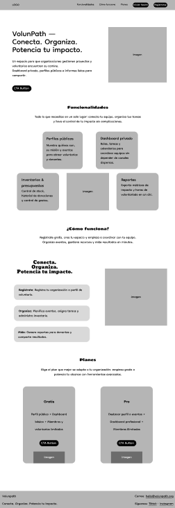

#### 4.3.2. Landing Page Mock-up

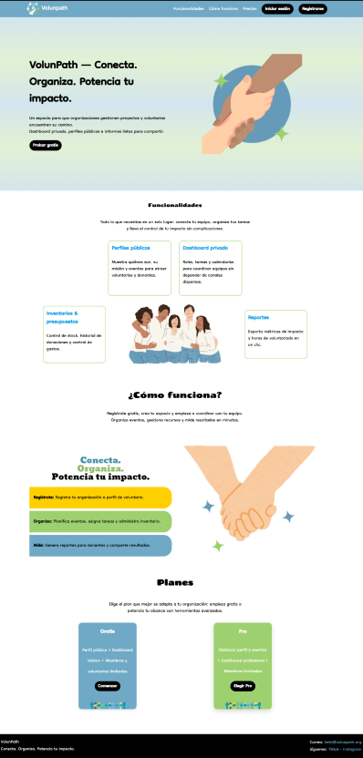

### 4.4. Web Applications UX/UI Design
#### 4.4.1. Web Applications Wireframes

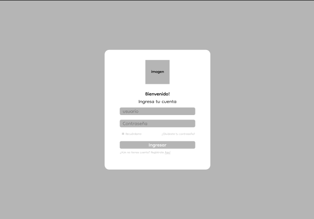

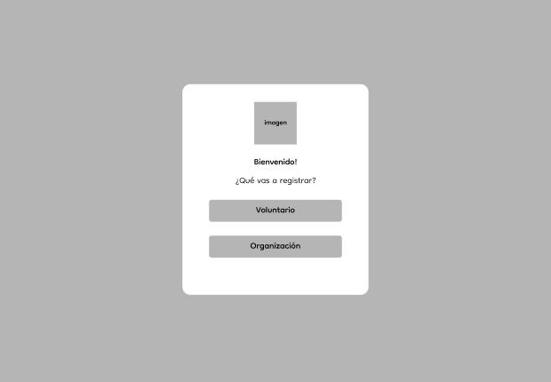

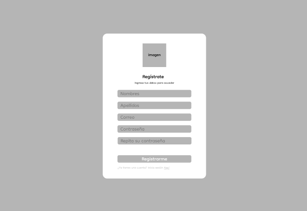

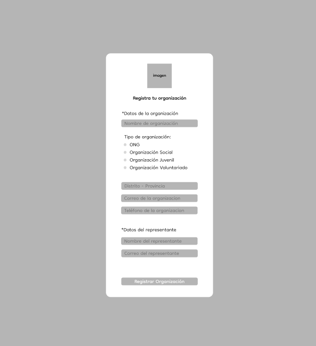

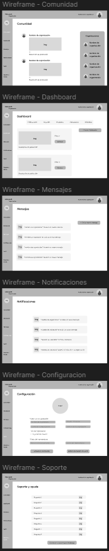

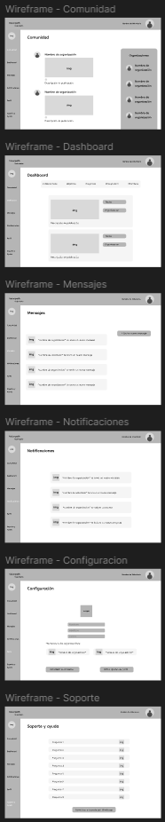

#### 4.4.2. Web Applications Wireflow Diagrams

#### 4.4.3. Web Applications Mock-ups

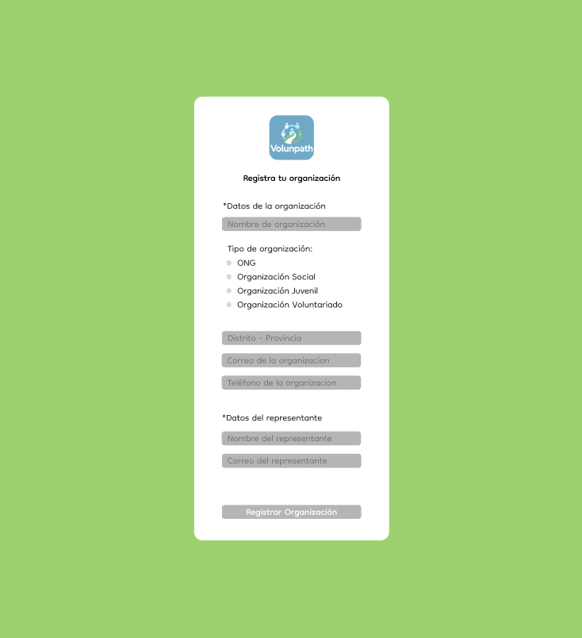

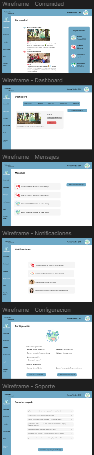

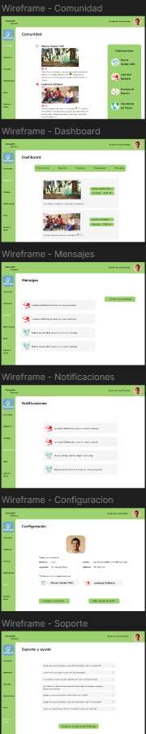

#### 4.4.4. Web Applications User Flow Diagrams

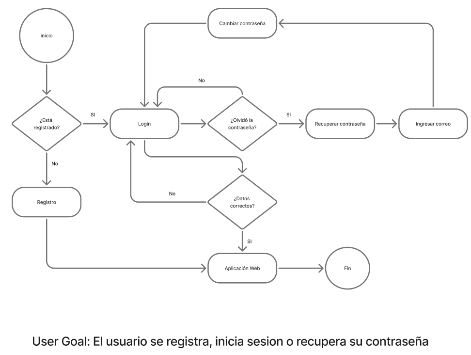

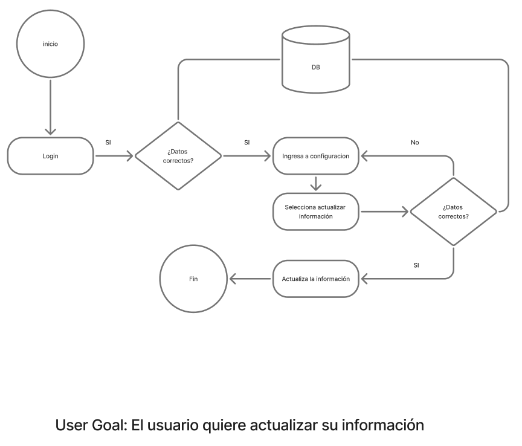

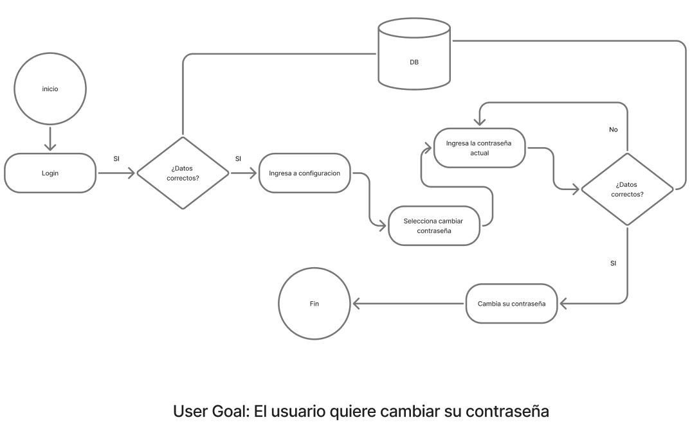

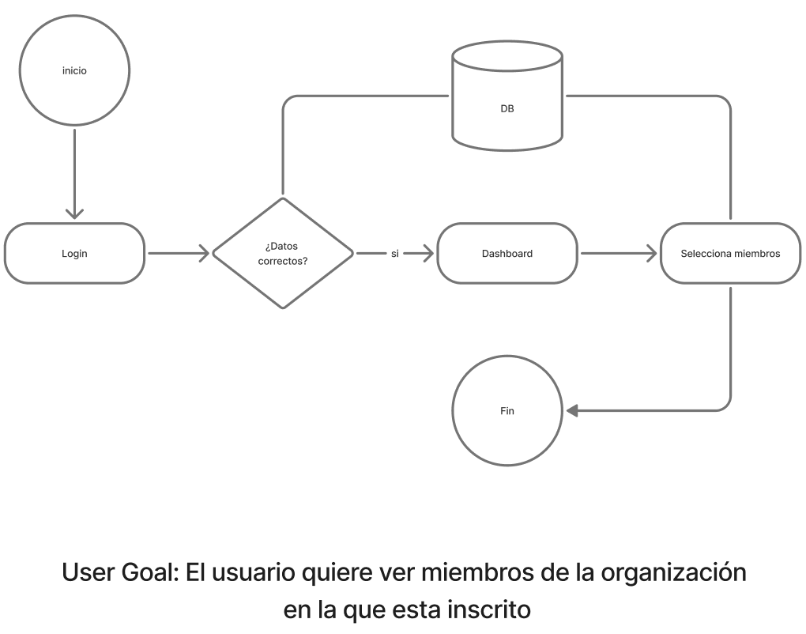

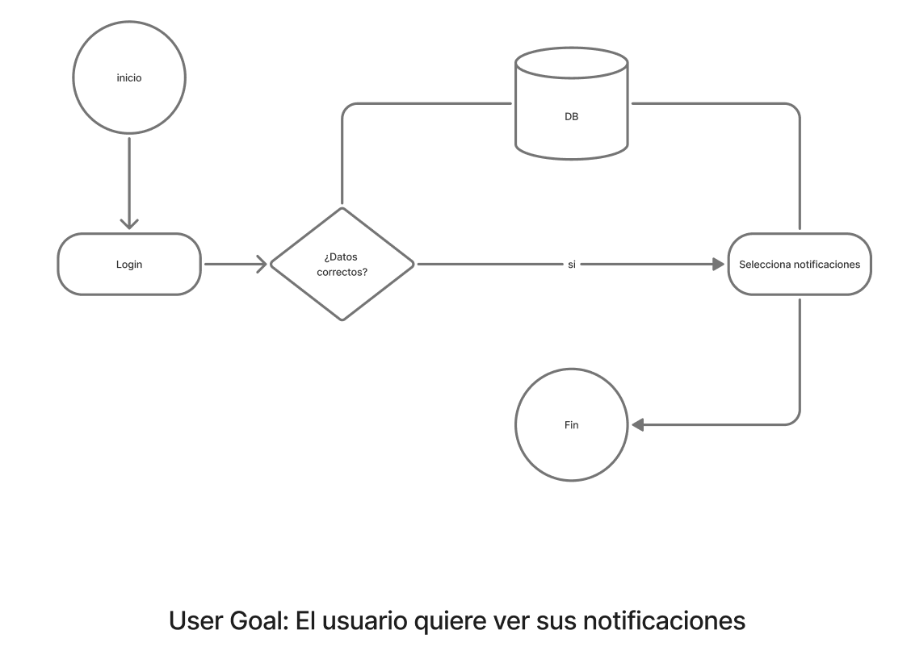

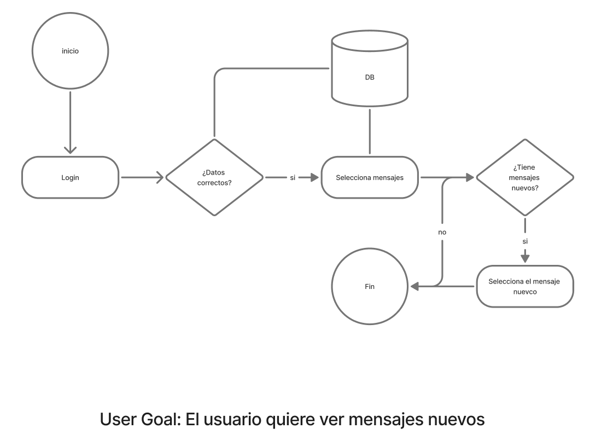

### 4.5. Web Applications Prototyping

Link de Figma: https://www.figma.com/design/aM9rO7pEqiztLkzXoCDExr/Volunpath?node-id=0-1&t=OmI73NqEb7ZuBqSi-1

### 4.6. Domain-Driven Software Architecture
#### 4.6.1. Software Architecture Context Diagram

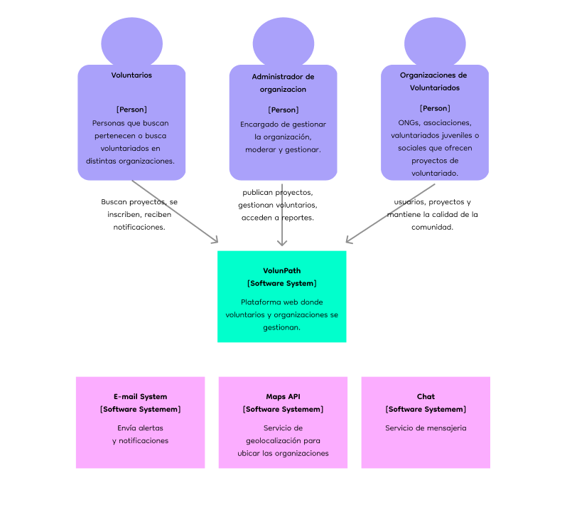

#### 4.6.2. Software Architecture Container Diagrams

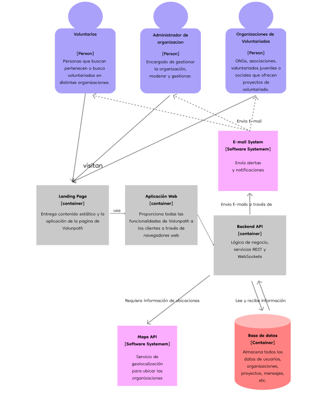

#### 4.6.3. Software Architecture Components Diagrams

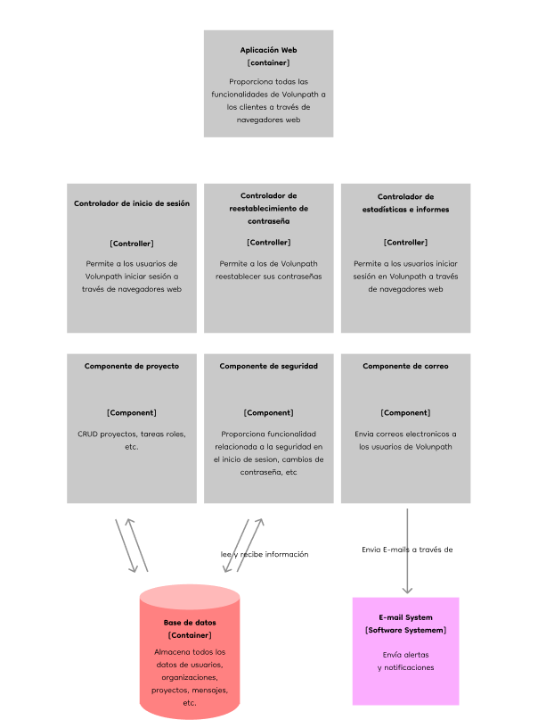

### 4.7. Software Object-Oriented Design
#### 4.7.1. Class Diagrams

#### 4.7.2. Class Dictionary

Este **Class Dictionary** describe las principales entidades de dominio, sus atributos, métodos clave y relaciones.  
---
### User
- **Responsabilidad:** Autenticación, autorización y datos base del actor (voluntario, coordinador, admin).  
- **Atributos:** id, email, passwordHash, displayName, role (enum: VOLUNTEER, COORDINATOR, ORG_ADMIN, SUPER_ADMIN), createdAt, updatedAt, active.  
- **Métodos:** login(), logout(), changePassword(), updateProfile().  
- **Relaciones:**  
  - 1 → 1 VolunteerProfile (opcional)  
  - 1 → * Notification  
  - Miembro de Conversation

---

### VolunteerProfile
- **Responsabilidad:** Información específica de voluntarios (disponibilidad, historial).  
- **Atributos:** id, userId (FK), phone, availability (Value Object: días/horas), totalHours, bio, skills.  
- **Métodos:** getHistory(), addHours(), uploadDocument().  
- **Relaciones:** → Assignment, → Badge, → Application

---

### Organization
- **Responsabilidad:** Entidad organizadora; publica página pública; gestiona proyectos y recursos.  
- **Atributos:** id, name, description, publicUrlSlug, address (VO), contactEmail, createdAt.  
- **Métodos:** createProject(), publishPage(), addAdmin().  
- **Relaciones:** 1 → * Project, 1 → * InventoryItem, 1 → * Budget

---

### Project
- **Responsabilidad:** Agrupa tareas, vacantes, página pública y panel administrativo.  
- **Atributos:** id, orgId (FK), name, description, startDate, endDate, isPublic, vacancies, status.  
- **Métodos:** createTask(), archive(), publish().  
- **Relaciones:** 1 → * Task, 1 → * Photo, 1 → * Application

---

### Task
- **Responsabilidad:** Unidad de trabajo a asignar y trackear.  
- **Atributos:** id, projectId, title, description, state (enum: PENDING, IN_PROGRESS, COMPLETED), dueDate, estimatedHours, createdBy, priority.  
- **Métodos:** assignTo(volunteer), updateState(), addComment().  
- **Relaciones:** 1 → * Assignment

---

### Assignment
- **Responsabilidad:** Vínculo entre Task y VolunteerProfile, con roles en esa tarea.  
- **Atributos:** id, taskId, volunteerProfileId, roles (many-to-many via join), assignedAt, state, hoursContributed.  
- **Métodos:** updateState(), logHours().  
- **Relaciones:** many-to-many con Role

---

### Role
- **Responsabilidad:** Roles operativos (ej. Líder de equipo, Auxiliar logístico).  
- **Atributos:** id, name, description.  
- **Métodos:** n/a

---

### Badge
- **Responsabilidad:** Gamificación (recompensas).  
- **Atributos:** id, code, title, description, criteria (expresión), iconUrl.  
- **Métodos:** awardTo(volunteer) (invocado por regla de negocio)

---

### Notification
- **Responsabilidad:** Notificar por canales (in-app, email, push).  
- **Atributos:** id, userId, channel *(EMAIL, IN_APP, PUSH)*, payload, read, sentAt.  
- **Métodos:** send(), markRead()

---

### Conversation / Message
- **Responsabilidad:** Mensajería interna.  
- **Conversation Atributos:** id, participantIds, createdAt  
- **Message Atributos:** id, conversationId, senderId, content, sentAt, readBy  
- **Métodos:** sendMessage(), fetchHistory()  
- **Relaciones:**  
  - **User** *miembro de* **Conversation**  
  - **Conversation** 1 → * **Message**

---

### CalendarEvent
- **Responsabilidad:** Representa eventos (tareas, reuniones) y sincronización con calendarios externos.  
- **Atributos:** id, ownerId(User), title, start, end, location, `externalSyncId.  
- **Métodos:** syncWithDevice()

---

### InventoryItem
- **Responsabilidad:** Control de inventario para proyectos.  
- **Atributos:** id, orgId, name, quantity, unit, reserved.  
- **Métodos:** `reserve(q), release(q)

---

### Budget
- **Responsabilidad:** Control de presupuestos por organización/proyecto.  
- **Atributos:** id, orgId, name, amount, spent.  
- **Métodos:** allocate(), adjust()

---

### Photo
- **Responsabilidad:** Recursos multimedia de proyectos (públicos o privados).  
- **Atributos:** id, projectId, url, uploadedBy, createdAt.  
- **Métodos:** *n/a*

---

### Application
- **Responsabilidad:** Proceso de postulación para vacantes públicas.  
- **Atributos:** id, projectId, volunteerId, state *(APPLIED, APPROVED, REJECTED)*, appliedAt, notes.  
- **Métodos:** approve(), reject()

---

### Consideraciones de Diseño OO
- **Domain Services:**  
  - BadgeService (evaluación y otorgamiento de insignias)  
  - NotificationService` 
  - AssignmentService
- **Repositorios por agregado:** ProjectRepository, VolunteerRepository, TaskRepository.  
- **Value Objects:** Address, Availability (inmutables).  
- **Transacciones:** Operaciones multi-aggregate (asignar tarea + notificar + log) mediante **Application Service** con patrón **Unit of Work**.

### 4.8. Database Design
#### 4.8.1. Database Diagram

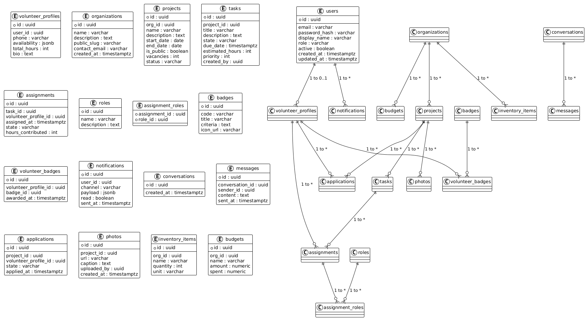

=======

## Capítulo V: Product Implementation, Validation & Deployment
---
### 5.1. Software Configuration Management
#### 5.1.1. Software Development Environment Configuration

En esta sección se describen las herramientas utilizadas por nuestro equipo de EMSafe para colaborar de manera efectiva durante todo el ciclo de vida del producto digital. Estas herramientas se organizan según las actividades que soportan: gestión del proyecto, diseño de producto, desarrollo de software, despliegue y documentación.

#### Project Management y Requirements Management

- [**Trello**](https://trello.com/): Herramienta visual utilizada para la planificación y seguimiento de tareas del proyecto. Facilita el trabajo en equipo mediante tableros compartidos.
- [**Google Drive**](https://drive.google.com/) & [**Google Docs**](https://docs.google.com/): Plataforma de trabajo colaborativo para almacenar documentación, redactar informes y gestionar entregables todo en la nube.

---

#### Product UX/UI Design

- [**Figma**](https://www.figma.com/): Herramienta principal para diseñar interfaces, crear wireframes y prototipos interactivos. Soporta colaboración en tiempo real.
- [**Miro**](https://miro.com/): Plataforma para crear mapas mentales, flujos de usuario y esquemas de navegación, útil en fases iniciales del diseño y planificación.

---

#### Software Development

- [**IntelliJ IDEA**](https://www.jetbrains.com/idea/): Entorno de desarrollo utilizado para programar el backend en Spring Boot. Ofrece herramientas avanzadas para depuración, testing y gestión de proyectos en Java.
- [**Visual Studio Code (VS Code)**](https://code.visualstudio.com/): Editor de código utilizado para desarrollar la aplicación frontend en Angular. Ligero, extensible y con terminal integrada.
- [**Angular**](https://angular.io/): Framework para construir la interfaz web del sistema. Permite desarrollar aplicaciones SPA modernas y mantenibles.
- [**Angular Material**](https://material.angular.io/): Librería de componentes basada en Material Design que permite mantener un diseño coherente, accesible y profesional en la interfaz.
- [**Spring Boot**](https://spring.io/projects/spring-boot): Framework Java para el desarrollo del backend. Facilita la creación de APIs RESTful que se comunican con el frontend y la base de datos.
- [**Git**](https://git-scm.com/) + [**GitHub**](https://github.com/): Sistema de control de versiones distribuido para gestionar el código fuente, colaborar entre miembros del equipo y mantener el historial de cambios.

---

#### Software Deployment

- [**GitHub Pages**](https://pages.github.com/): Servicio utilizado para el despliegue de la Landing Page estática del proyecto directamente desde un repositorio GitHub.
- [**Railway**](https://railway.app/): Servicio en la nube empleado para desplegar tanto el frontend en Angular como el backend en Spring Boot. Estos entornos permiten exponer los servicios web y la aplicación de forma pública.

---

#### Software Documentation

- [**Notion**](https://www.notion.so/): Espacio centralizado para almacenar documentación técnica y funcional del sistema, como manuales de usuario, decisiones de arquitectura y guías de uso.
- [**Swagger**](https://swagger.io/): Herramienta para documentar y visualizar la API REST del backend desarrollado en Spring Boot. Permite probar endpoints desde una interfaz gráfica.

#### 5.1.2. Source Code Management

Para la gestión del código fuente del proyecto  VolunPath, nuestro equipo utiliza [**GitHub**](https://github.com/) como plataforma central, aprovechando el sistema de control de versiones [**Git**](https://git-scm.com/) para facilitar la colaboración, el seguimiento de cambios y la integración de nuevas funcionalidades de forma ordenada y segura.

---

#### Repositorios del Proyecto

- **Landing Page**:  
  [https://github.com/OpenSource-VolunPath-7369/landing](https://github.com/OpenSource-VolunPath-7369/landing)

- **Frontend Web Application (Angular)**:  
  [https://github.com/OpenSource-VolunPath-7369/frontend](https://github.com/OpenSource-VolunPath-7369/frontend)

- **Web Services (Spring Boot – Backend)**:  
  [https://github.com/OpenSource-VolunPath-7369/backend](https://github.com/OpenSource-VolunPath-7369/backend)

---

#### Modelo de Ramas - GitFlow

Para el desarrollo colaborativo y el control de versiones, adoptamos el workflow **GitFlow**, basado en la estructura propuesta por *Vincent Driessen*. Este modelo permite desarrollar múltiples funcionalidades en paralelo, controlar versiones estables y facilitar correcciones en producción.

##### Ramas principales

- **`main`**: Contiene el código en estado estable, listo para producción o despliegue. Solo se fusionan cambios aprobados, verificados y testeados.
- **`develop`**: Rama de integración donde se combinan todas las nuevas funcionalidades antes de ser consideradas para una nueva versión estable.

##### Ramas de soporte

- **feature/**: Se crean a partir de `develop` para desarrollar nuevas funcionalidades.
- **release/**: Se crean desde `develop` cuando se prepara una nueva versión del sistema. Se realizan ajustes menores, documentación y pruebas finales antes de integrarse a `main`.
- **hotfix/**: Se crean directamente desde `main` para corregir errores críticos en producción. Una vez resuelto el problema, se fusionan tanto en `main` como en `develop`.

---

#### Semantic Versioning (SemVer)

EMSafe aplica la convención [**Semantic Versioning 2.0.0**](https://semver.org/), donde los números de versión siguen el formato `MAJOR.MINOR.PATCH`:

- **MAJOR**: Se incrementa cuando se introducen cambios incompatibles con versiones anteriores.
- **MINOR**: Se incrementa cuando se agregan nuevas funcionalidades de forma retrocompatible.
- **PATCH**: Se incrementa al aplicar correcciones menores o ajustes retrocompatibles.

---

#### Convención de Commits – Conventional Commits

Para mantener un historial claro y significativo de los cambios, el equipo utiliza la convención [**Conventional Commits**](https://www.conventionalcommits.org/), lo que facilita:

- la lectura del historial de versiones,
- el uso de herramientas de integración continua,
- la generación automática de changelogs.

##### Tipos de commits utilizados:

- `feat`: Nueva funcionalidad  
- `fix`: Corrección de errores  
- `docs`: Cambios en documentación  
- `style`: Cambios en formato/estilo sin afectar la lógica  
- `refactor`: Reestructuración del código sin cambio funcional  
- `test`: Cambios en tests  
- `build`: Cambios que afectan al sistema de compilación o dependencias  
- `ci`: Configuraciones de integración continua  
- `chore`: Tareas menores de mantenimiento  
- `perf`: Mejoras de rendimiento  
- `revert`: Reversión de un commit anterior  

#### 5.1.3. Source Code Style Guide & Conventions

Con el objetivo de mantener un código legible, limpio, coherente y fácilmente mantenible, se aplicarán guías de estilo y convenciones específicas para cada uno de los lenguajes y tecnologías utilizadas en el desarrollo del sistema.  
Todas las variables, funciones, clases y elementos del sistema se nombrarán en inglés, siguiendo las convenciones estándar de nomenclatura y formato para cada lenguaje.

---

#### HTML / CSS

- **Guía adoptada**: [Google HTML/CSS Style Guide](https://google.github.io/styleguide/htmlcssguide.html)
- **Estructura**:
  - El código HTML será indentado con 2 espacios (sin tabulaciones).
  - Se dejarán líneas en blanco entre secciones para mejorar la legibilidad.
- **Etiquetas**:
  - Todas las etiquetas se cerrarán correctamente.
  - Se evitará el uso de atributos innecesarios.
  - Se usarán comillas dobles (`"`) para todos los valores de atributos.
- **Nomenclatura CSS**:
  - Se aplicará la metodología **BEM (Block Element Modifier)** para nombrar clases, mejorando la organización, escalabilidad y reutilización de estilos.

---

#### JavaScript / TypeScript

- **Guías adoptadas**:
  - [Google JavaScript Style Guide](https://google.github.io/styleguide/jsguide.html)
  - [Google TypeScript Style Guide](https://google.github.io/styleguide/tsguide.html)

- **Formato**:
  - `camelCase` para variables y funciones.
  - `PascalCase` para clases y componentes.
  - Uso exclusivo de `let` y `const` (evitar `var`).
  - Inclusión de espacios alrededor de operadores y después de comas.

- **Comentarios**:
  - Se usarán comentarios claros y concisos.
  - Los bloques complejos estarán documentados con `/* */`.

- **Scope**:
  - Las variables se definirán en el **scope más reducido posible**.

---

#### Angular (Frontend)

- **Guía adoptada**: [Angular Style Guide](https://angular.io/guide/styleguide)

- **Estructura del proyecto**:
  - Cada componente tendrá su propio directorio con archivos: `.ts`, `.html`, `.css`, y `.spec.ts`.
  - Se seguirá la convención: `feature-name.component.ts`.

- **Nomenclatura**:
  - Componentes: `PascalCase`
  - Variables: `camelCase`
  - Módulos: `PascalCase`

- **Modularización**:
  - El código se organizará por características (**feature-based folders**) para facilitar el mantenimiento y escalabilidad.

---

#### Java + Spring Boot (Backend)

- **Guía adoptada**: [Google Java Style Guide](https://google.github.io/styleguide/javaguide.html) + buenas prácticas de Spring Boot.

- **Estructura del proyecto**:
  - Separación por capas: `controller`, `service`, `repository`, `dto`, `model`.
  - Uso adecuado de anotaciones: `@Service`, `@RestController`, `@Repository`.

- **Nomenclatura**:
  - Clases: `PascalCase`
  - Variables y métodos: `camelCase`
  - Constantes: `MAYÚSCULAS_CON_GUIONES`

#### 5.1.4. Software Deployment Configuration

La estrategia de despliegue está diseñada para asegurar que las aplicaciones funcionen correctamente y de forma estable en los entornos de producción. Para ello, se aplicarán herramientas y prácticas que permitan un proceso ágil, seguro y automatizado.

---

#### Landing Page

La Landing Page está desarrollada como un sitio web estático utilizando HTML, CSS y JavaScript, y es desplegada mediante **GitHub Pages**, aprovechando la integración directa con el repositorio de código.

- **Repositorio**:  
  [https://github.com/OpenSource-VolunPath-7369/landing](https://github.com/OpenSource-VolunPath-7369/landing)

- **Plataforma de despliegue**: GitHub Pages  
- **Dominio de publicación**:  
  [https://opensource-volunpath-7369.github.io/landing/](https://opensource-volunpath-7369.github.io/landing/)

- **Modo de despliegue**:  
  Automático, activado desde la rama `main`, con el contenido publicado desde la carpeta raíz del repositorio.

Cada vez que se realiza un `push` a la rama `main`, la Landing Page se actualiza automáticamente en producción, permitiendo mantener siempre en línea la última versión del contenido público.

---

#### Frontend Web Application (Angular)

La aplicación web de VolunPath, desarrollada con **Angular**, es desplegada mediante **Railway**, una plataforma que permite conectar directamente con GitHub y automatizar todo el proceso de compilación y publicación del proyecto.

- **Repositorio**:  
  [https://github.com/OpenSource-VolunPath-7369/frontend](https://github.com/OpenSource-VolunPath-7369/frontend)

- **Comando de build**:  
  `ng build --configuration=production`

- **Despliegue**:  
  Railway detecta los cambios en la rama `main`, compila el proyecto y publica automáticamente la nueva versión.

- **Configuración adicional**:  
  Las variables de entorno necesarias para la conexión con la API del backend serán gestionadas desde el panel de Railway.

Este enfoque permite mantener el frontend actualizado sin necesidad de despliegues manuales, garantizando eficiencia y rapidez en la entrega de nuevas versiones.

---

#### Web Services (Spring Boot)

El backend, desarrollado con **Spring Boot**, también se desplegará en **Railway**, permitiendo exponer la API REST de forma pública y controlada. Railway gestiona el servidor, los puertos, las variables de entorno y el acceso a la base de datos.

- **Repositorio**:  
  [https://github.com/OpenSource-VolunPath-7369/backend](https://github.com/OpenSource-VolunPath-7369/backend)

- **Compilación del proyecto**:  
  `./mvnw clean package`  
  o  
  `./gradlew build`

- **Despliegue**:  
  Automático mediante integración con GitHub. Railway se encarga de detectar cambios en `main`, construir el `.jar`, y ejecutar el servicio en su entorno cloud.

- **API Documentation**:  
  Al desplegarse, el backend expone la interfaz de prueba **Swagger UI**, útil para validar los endpoints y probar funcionalidades.

 

### 5.2. Landing Page, Services & Applications Implementation
#### 5.2.1. Sprint 1

##### 5.2.1.1. Sprint Planning 1
##### 5.2.1.2. Aspect Leaders and Collaborators
##### 5.2.1.3. Sprint Backlog 1
##### 5.2.1.4. Development Evidence for Sprint Review
##### 5.2.1.5. Execution Evidence for Sprint Review
##### 5.2.1.6. Services Documentation Evidence for Sprint Review
##### 5.2.1.7. Software Deployment Evidence for Sprint Review
##### 5.2.1.8. Team Collaboration Insights during Sprint

#### 5.2.2. Sprint 2

Esta sección presenta el progreso realizado durante el Sprint 2, detallando tanto el avance del producto como el trabajo en equipo. Se incluyen los resultados del Sprint Planning, el Sprint Backlog, evidencias del desarrollo y la ejecución para la Sprint Review, la documentación de los servicios desarrollados y reflexiones sobre la colaboración del equipo a lo largo del sprint.

##### 5.2.2.1. Sprint Planning 2

En esta sección se detallan los aspectos clave de la reunión de planificación del Sprint. Se inicia con una introducción que describe el enfoque principal del sprint y sus metas. A continuación, se presenta un cuadro resumen que organiza la información relevante discutida durante la reunión de planificación, siguiendo la estructura indicada para proporcionar claridad sobre las tareas y los objetivos acordados.

A continuación, se muestra un cuadro resumen que estructura los datos importantes debatidos durante la reunión de planificación del sprint, siguiendo la estructura establecida para ofrecer claridad sobre las tareas y metas pactadas.

| Sprint # | 2 |
|---|---|
| **Sprint Planning Background** | |
| Date | 14/11/2025 |
| Time | 05:00 PM |
| Location | virtual |
| Prepared By | Mel Andree Orellana |
| Attendees (to planning meeting) | Mel Andree Orellana Rodriguez|
| **Sprint 3 - 2 Review Summary** | Desarrollo de Front-end  |
| **Sprint 3 - 2 Retrospective Summary** | Correcciones de errores en la documentación. |
| **Sprint 3 Goal** |Me impulse en desarrollar las funcionalidades principales del frontend  el panel de control. Trabaje para garantizar una estructura fiable que permita una navegación fluida por toda la plataforma. Cree que esto proporcionará una experiencia de usuario clara e intuitiva, lo cual se confirmará cuando los usuarios puedan acceder a las diferentes secciones del panel sin problemas de navegación ni de carga de datos.|
| **Sprint 3 Velocity** | 80 |
| **Sum of Story Points** | 80 |

##### 5.2.2.2. Aspect Leaders and Collaborators

| Team Member (Last Name, First Name) | GitHub Username | Organizations (L/C) | Notifications (L/C) | Volunteers (CTA) (L/C) | Messages (L/C) |
|------------------------------------|------------------|------------------------------------|------------------|----------------------------------|-------------|
| Orellana Rodriguez, Mel Andree                 | melandree8      | C                                 | C                | C                     | C            |        

##### 5.2.2.3. Sprint Backlog 2
##### 5.2.2.4. Development Evidence for Sprint Review

En esta sección se presenta el progreso alcanzado en el desarrollo de la aplicación web durante el sprint, enfocado principalmente en la implementación de las interfaces y funciones fundamentales. El trabajo se centró en construir una experiencia de usuario sólida mediante la creación de elementos visuales, componentes interactivos y una navegación coherente.

La tabla que se muestra a continuación recopila los commits clave realizados en cada repositorio del proyecto, lo cual permite hacer un seguimiento del avance técnico logrado en este sprint.

| Repository                    | Branch  | Commit Id | Commit Message                                                   | Commit Message Body | Commited on (Date) |
|------------------------------|---------|-----------|------------------------------------------------------------------|---------------------|--------------------|
| Frontend/melandree8   | develop | df0a847   | chore(project): initial frontend setup                                   | empty                  | 14/11/2025      |

##### 5.2.2.5. Execution Evidence for Sprint Review

###  Registro de Usuarios
- **Registro de Voluntarios**: Formulario completo para registro de nuevos voluntarios con campos como nombre, email, contraseña, habilidades, intereses, ubicación, biografía y avatar
- **Registro de Organizaciones**: Formulario para registro de organizaciones con campos como nombre, email, contraseña, descripción, sitio web, teléfono, dirección, año de fundación, categorías, redes sociales y logo
- **Selección de Tipo de Usuario**: Radio buttons horizontales para seleccionar entre "Voluntario" y "Organización"
- **Validación de Campos**: Validación en tiempo real de todos los campos del formulario
- **Carga de Imágenes**: Funcionalidad para cargar y previsualizar avatares/logos en formato base64
- **Integración con Backend**: Creación de usuario y perfil correspondiente en el backend

###  Perfil de Usuario
- **Visualización de Perfil**: Página dedicada para visualizar y editar el perfil del usuario autenticado
- **Edición de Perfil para Voluntarios**: Permite actualizar información personal como nombre, email, teléfono, biografía, habilidades, intereses, ubicación y avatar
- **Edición de Perfil para Organizaciones**: Permite actualizar información de la organización como nombre, email, teléfono, descripción, sitio web, dirección, año de fundación, categorías, redes sociales y logo
- **Actualización en Tiempo Real**: Los cambios se reflejan inmediatamente en el backend
- **Validación de Formularios**: Validación de campos antes de guardar cambios
- **Manejo de Imágenes**: Actualización de avatares y logos con almacenamiento en base64

### Página de Comunidad
- **Visualización de Publicaciones**: Muestra todas las publicaciones de las organizaciones en un feed
- **Filtrado por Organización**: Permite ver publicaciones de organizaciones específicas
- **Sistema de Likes**: Los voluntarios pueden dar like a las publicaciones que les interesan
- **Información de Organizaciones**: Muestra detalles de las organizaciones que publican
- **Navegación a Perfiles**: Enlaces para ver el perfil completo de cada organización
- **Imágenes de Publicaciones**: Visualización de imágenes asociadas a cada publicación

###  Dashboard de Organizaciones
- **Gestión de Publicaciones**: Las organizaciones pueden ver todas sus publicaciones en un panel centralizado
- **Crear Nueva Publicación**: Botón para acceder al formulario de creación de publicaciones
- **Editar Publicaciones**: Opción para editar publicaciones existentes
- **Eliminar Publicaciones**: Funcionalidad para eliminar publicaciones
- **Estadísticas**: Visualización de likes y estadísticas de cada publicación

### Crear/Editar Publicación
- **Formulario de Publicación**: Formulario completo para crear nuevas publicaciones con título, descripción e imagen
- **Carga de Imágenes**: Funcionalidad para cargar imágenes en formato base64
- **Estados de Publicación**: Gestión de estados (borrador, publicado, archivado)
- **Edición de Publicaciones Existentes**: Permite modificar publicaciones ya creadas
- **Validación de Campos**: Validación de campos requeridos antes de publicar

### Página de Mensajes
- **Lista de Conversaciones**: Visualización de todos los mensajes recibidos y enviados
- **Búsqueda de Mensajes**: Funcionalidad para buscar mensajes específicos
- **Filtrado por Remitente**: Opción para filtrar mensajes por remitente
- **Visualización de Mensajes**: Muestra el contenido, remitente, destinatario y timestamp de cada mensaje
- **Fotos de Perfil**: Muestra las fotos de perfil de los remitentes en los mensajes
- **Mensajes No Leídos**: Indicador visual para mensajes no leídos
- **Marcar como Leído**: Funcionalidad para marcar mensajes individuales como leídos
- **Marcar Todos como Leídos**: Opción para marcar todos los mensajes como leídos de una vez

### Envío de Mensajes
- **Enviar Mensaje a Organizaciones**: Los voluntarios pueden enviar mensajes a organizaciones
- **Enviar Mensaje a Voluntarios**: Las organizaciones pueden enviar mensajes a voluntarios
- **Selección Múltiple de Destinatarios**: Permite seleccionar múltiples destinatarios para enviar el mismo mensaje
- **Seleccionar Todos**: Opción para seleccionar todos los destinatarios disponibles
- **Formulario de Mensaje**: Campos para asunto, contenido y URL opcional
- **Creación Automática de Notificaciones**: Al enviar un mensaje, se crea automáticamente una notificación para el destinatario
- **Manejo de IDs**: Gestión correcta de userIds para organizaciones y voluntarios

### Página de Notificaciones
- **Lista de Notificaciones**: Visualización de todas las notificaciones del usuario
- **Notificaciones No Leídas**: Indicador visual para notificaciones no leídas
- **Filtrado por Tipo**: Diferentes tipos de notificaciones (nuevo mensaje, nueva actividad, actividad confirmada, actividad cancelada, general)
- **Marcar como Leída**: Funcionalidad para marcar notificaciones individuales como leídas
- **Marcar Todas como Leídas**: Opción para marcar todas las notificaciones como leídas
- **Navegación desde Notificaciones**: Enlaces para navegar a la acción relacionada (mensajes, publicaciones, etc.)
- **Notificaciones para Organizaciones**: Gestión especial de notificaciones para organizaciones usando userId correcto
- **Ordenamiento por Fecha**: Notificaciones ordenadas por fecha (más recientes primero)

### Opciones del Menú
- **Comunidad**: Acceso a la página de comunidad (para voluntarios)
- **Dashboard**: Acceso al panel de control (para organizaciones)
- **Mensajes**: Acceso al sistema de mensajería
- **Notificaciones**: Acceso a las notificaciones
- **Perfil**: Acceso a la página de perfil
- **Soporte**: Acceso a la página de soporte y FAQ

### Selector de Idioma
- **Cambio de Idioma**: Selector visual para cambiar entre español e inglés
- **Persistencia de Idioma**: El idioma seleccionado se guarda en localStorage
- **Traducción Completa**: Todas las páginas y componentes están traducidos
- **Integración con ngx-translate**: Uso de la librería ngx-translate para gestión de traducciones

### Autenticación y Autorización
- **Protección de Rutas**: Rutas protegidas que requieren autenticación
- **Gestión de Sesión**: Manejo seguro de sesiones de usuario
- **Tokens JWT**: Uso de tokens JWT para autenticación segura
- **Redirección por Rol**: Redirección automática según el rol del usuario

##### 5.2.2.6. Services Documentation Evidence for Sprint Review
En esta sección se presenta un resumen de los logros alcanzados durante este sprint, enfocados en el desarrollo del frontend de la aplicación web.

##### 5.2.2.7. Software Deployment Evidence for Sprint Review
##### 5.2.2.8. Team Collaboration Insights during Sprint

#### 5.2.3. Sprint 3

En esta sección se detallan los aspectos clave del Sprint Planning Meeting del Sprint 3. Se inicia con una introducción que explica la orientación del sprint y los objetivos principales, enfocándose en la creación de la primera versión del backend y la rectificación de detalles en el frontend.

##### 5.2.3.1. Sprint Planning 3
A continuación, se muestra un cuadro resumen que estructura los datos importantes debatidos durante la reunión de planificación del sprint, siguiendo la estructura establecida para ofrecer claridad sobre las tareas y metas pactadas.

| Sprint # | 3 |
|---|---|
| **Sprint Planning Background** | |
| Date | 14/11/2025 |
| Time | 05:00 PM |
| Location | virtual |
| Prepared By | Mel Andree Orellana |
| Attendees (to planning meeting) | Mel Andree Orellana Rodriguez|
| **Sprint 3 - 2 Review Summary** | Desarrollo de Back-end  |
| **Sprint 3 - 2 Retrospective Summary** | Correcciones de errores en la documentación. |
| **Sprint 3 Goal** |Me impulse en desarrollar las funcionalidades principales del backend  el panel de control. Trabaje para garantizar una estructura fiable que permita una navegación fluida por toda la plataforma. Cree que esto proporcionará una experiencia de usuario clara e intuitiva, lo cual se confirmará cuando los usuarios puedan acceder a las diferentes secciones del panel sin problemas de navegación ni de carga de datos.|
| **Sprint 3 Velocity** | 80 |
| **Sum of Story Points** | 80 |

##### 5.2.3.2. Aspect Leaders and Collaborators
| Team Member (Last Name, First Name) | GitHub Username | Organizations (L/C) | Notifications (L/C) | Volunteers (CTA) (L/C) | Messages (L/C) |
|------------------------------------|------------------|------------------------------------|------------------|----------------------------------|-------------|
| Orellana Rodriguez, Mel Andree                 | melandree8      | C                                 | C                | C                     | C            |                                   

##### 5.2.3.4. Development Evidence for Sprint Review
En esta sección se detallan los avances logrados en la implementación del producto durante el sprint, centrados en el desarrollo de la primera versión del backend de la aplicación web y en la corrección de detalles en el frontend. El enfoque principal ha sido avanzar en la construcción de las funcionalidades esenciales del backend y optimizar las interfaces de usuario, cumpliendo con los objetivos establecidos. Se ha trabajado en aspectos clave como la gestión de dispositivos, la interacción del usuario y la navegación, lo que permitirá una experiencia más robusta para los usuarios. A continuación, se presenta una tabla que documenta los commits relevantes relacionados con la implementación de cada repositorio del proyecto, lo que permite visualizar el progreso del desarrollo técnico durante este sprint.

| Repository                    | Branch  | Commit Id | Commit Message                                                   | Commit Message Body | Commited on (Date) |
|------------------------------|---------|-----------|------------------------------------------------------------------|---------------------|--------------------|
| Backemd/melandree8   | develop | 5bf8b61   | chore(project): backend structure setup in progress | empty               | 14/11/2025         |

##### 5.2.3.5. Execution Evidence for Sprint Review
Esta sección inicia con un resumen de los logros alcanzados en este Sprint, donde se ha implementado la primera versión del backend de la aplicación. Durante este período, se han desarrollado endpoints fundamentales para gestionar la información de dispositivos, alarmas y otros elementos clave del sistema. Esto incluye la creación de endpoints para agregar, actualizar y consultar datos. Junto a esto, se incluye un enlace a un video que ilustra y explica la visualización y navegación logradas en este Sprint, mostrando cómo los usuarios pueden interactuar con las funcionalidades disponibles de manera intuitiva. Vista general de los endpoints generados via Swagger: Se observan los endopoints con sus respectivos títulos.

##### 5.2.3.6. Services Documentation Evidence for Sprint Review

Esta sección recopila los endpoints desarrollados y validados durante el Sprint, enfocados en la gestión de autenticación, usuarios, voluntarios, organizaciones, publicaciones, mensajería y notificaciones en la plataforma Volunpath. Se documenta el uso de los métodos HTTP correspondientes (GET, POST, PUT, DELETE) junto con ejemplos de llamadas, respuestas y validaciones funcionales. La documentación se ha generado mediante OpenAPI, permitiendo una visualización clara y organizada de los servicios.

Además, se incluyen capturas de pantalla que demuestran la interacción con los servicios web, y se enlazan los commits relevantes del repositorio para sustentar el trabajo realizado.

- `POST /authentication/sign-in` - Iniciar sesión
- `POST /authentication/sign-up` - Registro de usuario
- `GET /volunteers` - Obtener todos los voluntarios
- `GET /volunteers/{id}` - Obtener voluntario por ID
- `GET /volunteers/user/{userId}` - Obtener voluntario por User ID
- `POST /volunteers` - Crear voluntario
- `PUT /volunteers/{id}` - Actualizar voluntario
- `DELETE /volunteers/{id}` - Eliminar voluntario
- `GET /organizations` - Obtener todas las organizaciones
- `GET /organizations/{id}` - Obtener organización por ID
- `GET /organizations/user/{userId}` - Obtener organización por User ID
- `POST /organizations` - Crear organización
- `PUT /organizations/{id}` - Actualizar organización
- `DELETE /organizations/{id}` - Eliminar organización
- `GET /publications` - Obtener todas las publicaciones
- `GET /publications/{id}` - Obtener publicación por ID
- `GET /publications/organization/{organizationId}` - Obtener publicaciones por organización
- `POST /publications` - Crear publicación
- `PUT /publications/{id}/like` - Dar like a una publicación
- `DELETE /publications/{id}` - Eliminar publicación
- - `GET /messages/user/{userId}` - Obtener mensajes por User ID
- `GET /messages/{id}` - Obtener mensaje por ID
- `POST /messages` - Crear mensaje
- `PUT /messages/{id}/read` - Marcar mensaje como leído
- `DELETE /messages/{id}` - Eliminar mensaje
- - `GET /notifications/user/{userId}` - Obtener notificaciones por User ID
- `GET /notifications/{id}` - Obtener notificación por ID
- `POST /notifications` - Crear notificación
- `PUT /notifications/{id}/read` - Marcar notificación como leída
- `PUT /notifications/user/{userId}/read-all` - Marcar todas las notificaciones
- `DELETE /notifications/{id}` - Eliminar notificación

##### 5.4 Video About-the-Product

La sección proporciona un panorama general del producto, resaltando su objetivo, características principales y el valor que brinda a sus usuarios. Esta introducción facilita la comprensión del contexto del producto y su orientación a cubrir las demandas de los usuarios, sincronizando sus características y habilidades con las metas de la solución sugerida.

URL: Microsfot Teams: https://upcedupe-my.sharepoint.com/:v:/g/personal/u202116018_upc_edu_pe/IQCV869sbsF8R53X1vYzX3jeARXdJI3QT-SRIQcw-q35m0o?nav=eyJyZWZlcnJhbEluZm8iOnsicmVmZXJyYWxBcHAiOiJPbmVEcml2ZUZvckJ1c2luZXNzIiwicmVmZXJyYWxBcHBQbGF0Zm9ybSI6IldlYiIsInJlZmVycmFsTW9kZSI6InZpZXciLCJyZWZlcnJhbFZpZXciOiJNeUZpbGVzTGlua0NvcHkifX0&e=B2h5XL

# Conclusiones
---
## Conclusiones y recomendaciones
## Video About-the-Team

# Bibliografía

# Anexos

