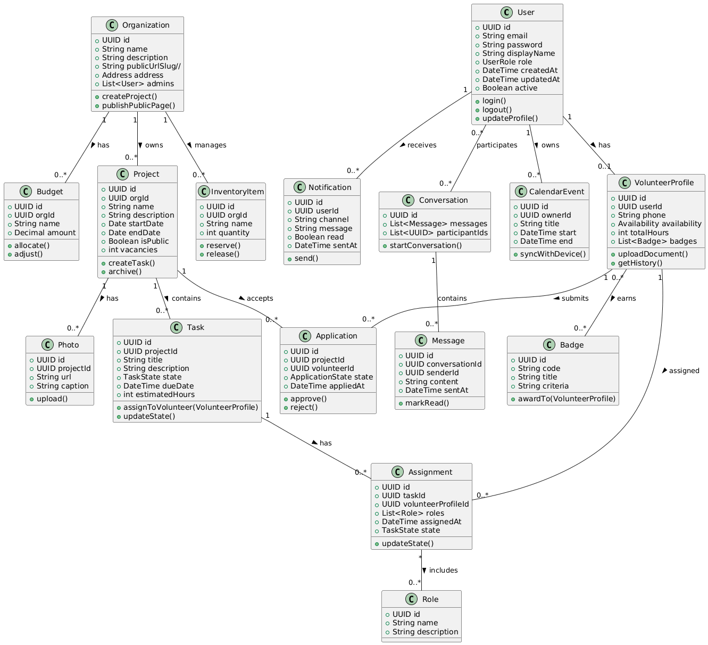

 

<h3>Universidad Peruana de Ciencias Aplicadas</h3>
<strong>Ingeniería de Software</strong> 
 

<strong>2025-20</strong> 
 
<strong> Desarrollo de Aplicaciones Open Source</strong> 
<strong>NRC: 7369</strong> 
 
<strong>Profesor: Wilder Julio Espinoza Bravo</strong> 
 <strong>Informe del Trabajo Final</strong>  
<strong>Startup: InnovaSocial </strong> 
 
<strong>Producto: VolunPath </strong> 
 
### Team Members:

|             Code              |    Member   |
|:-------------------------------:|:----------:|
| U202116018 | Mel Andree Orellana Rodriguez |
|  U20201E781 |    Jean Pool Huaman De La Cruz | 
 

<strong> Setiembre 2025</strong> 

# Registro de Versiones del Informe
| Versión  | Fecha       | Autor                              | Descripción de modificación                                                    |
|:----------:|:-------------:|:-------------------------------------:|:-------------------------------------------------------------------------------:|
| TB1      | 18/09/2025  | Orellana Rodriguez, Mel Andree| Creación de la Estructura del informe                       |
| TB1      | 19/09/2025  | Orellana Rodriguez, Mel Andree|   Desarrollo de General Style Guidelines  |
| TB1      | 19/09/2025  | Orellana Rodriguez, Mel Andree|Desarrollo de Web Style Guidelines|
| TB1      | 19/09/2025  | Orellana Rodriguez, Mel Andree|Desarrollo de SEO Tags and Meta Tags |
| TB1      | 20/09/2025  | Orellana Rodriguez, Mel Andree|Desarrollo de Navigation Systems |
| TB1      | 20/09/2025  | Orellana Rodriguez, Mel Andree|Incorporación del Database Diagram |
| TB1      | 20/09/2025  | Orellana Rodriguez, Mel Andree|Incorporación del Web Applications Wireframes |
| TB1      | 20/09/2025  | Orellana Rodriguez, Mel Andree|Incorporación del Web Applications Wireflow Diagrams |
| TB1      | 21/09/2025  | Huaman De La Cruz, Jean Pool       | Revisión inicial del planteamiento del problema y alcance del proyecto |
| TB1      | 22/09/2025  | Huaman De La Cruz, Jean Pool       | Organización de requerimientos derivados de entrevistas |
| TB1      | 22/09/2025  | Huaman De La Cruz, Jean Pool       | Alineación conceptual entre análisis de usuarios y solución |
| TB1      | 23/09/2025  | Huaman De La Cruz, Jean Pool       | Correcciones de estructura en Capítulo I |
| TB1      | 23/09/2025  | Huaman De La Cruz, Jean Pool       | Validación de segmentos objetivo |
| TB1      | 23/09/2025  | Huaman De La Cruz, Jean Pool       | Revisión editorial del informe en TB1 |

| Versión  | Fecha       | Autor                              | Descripción de modificación                                                    |
|:----------:|:-------------:|:-------------------------------------:|:-------------------------------------------------------------------------------:|
| TP      | 26/09/2025  | Orellana Rodriguez, Mel Andree| Configuración del entorno inicial del backend y estructura de carpetas  |
| TP      | 26/09/2025  | Orellana Rodriguez, Mel Andree|Configuración de servicios RESTful para aggregates |
| TP      | 27/09/2025  | Orellana Rodriguez, Mel Andree|Diseño responsivo del dashboard en frontend |
| TP      | 27/09/2025  | Orellana Rodriguez, Mel Andree|Implementación del módulo de autenticación y sesión (profile)  |
| TP      | 27/09/2025  | Orellana Rodriguez, Mel Andree|Conexión del frontend con la API           |
| TP      | 27/09/2025  | Orellana Rodriguez, Mel Andree|Documentación de endpoints del backend con Swagger  |
| TP       | 26/09/2025  | Huaman De La Cruz, Jean Pool       | Priorización inicial del backlog funcional |
| TP       | 26/09/2025  | Huaman De La Cruz, Jean Pool       | Registro y documentación de decisiones del Sprint Planning 1 |
| TP       | 27/09/2025  | Huaman De La Cruz, Jean Pool       | Observaciones para reforzar consistencia entre entrevistas y User Personas |
| TP       | 27/09/2025  | Huaman De La Cruz, Jean Pool       | Revisión técnica del Sprint 1 antes de su inclusión en el informe |
| TP       | 28/09/2025  | Huaman De La Cruz, Jean Pool       | Ajustes en el Capítulo II para mejorar el análisis de necesidades |
| TP       | 29/09/2025  | Huaman De La Cruz, Jean Pool       | Consolidación del material del Sprint Review 1 |

| Versión  | Fecha       | Autor                              | Descripción de modificación                                                    |
|:----------:|:-------------:|:-------------------------------------:|:-------------------------------------------------------------------------------:|
| TB2      | 01/11/2025  | Orellana Rodriguez, Mel Andree| Implementación de dashboard   |
| TB2      | 01/11/2025  | Orellana Rodriguez, Mel Andree| Integración de gestión de perfiles   |
| TB2      | 03/11/2025  | Orellana Rodriguez, Mel Andree| Optimización del backend con patrones DDD para aggregates   |
| TB2      | 03/11/2025  | Orellana Rodriguez, Mel Andree| Pruebas de carga sobre servicios   |
| TB2      | 05/11/2025  | Orellana Rodriguez, Mel Andree| Refactor del diseño visual para compatibilidad   |
| TB2      | 05/11/2025  | Orellana Rodriguez, Mel Andree| Integración con base de datos externa para recopilación de datos     |
| TB2      | 05/11/2025  | Orellana Rodriguez, Mel Andree| Configuración de variables de entorno para despliegue automatizado  |
| TB2      | 05/11/2025  | Orellana Rodriguez, Mel Andree| Optimización de experiencia de usuario en dispositivos  |
| TB2      | 01/11/2025  | Huaman De La Cruz, Jean Pool       | Ajustes en To-Be Scenario Mapping para mayor claridad |
| TB2      | 01/11/2025  | Huaman De La Cruz, Jean Pool       | Revisión de estructura del Capítulo III |
| TB2      | 02/11/2025  | Huaman De La Cruz, Jean Pool       | Actualización del Product Backlog |
| TB2      | 03/11/2025  | Huaman De La Cruz, Jean Pool       | Validación de la relación entre User Stories y Epics |
| TB2      | 04/11/2025  | Huaman De La Cruz, Jean Pool       | Revisión técnica de Impact Mapping |
| TB2      | 05/11/2025  | Huaman De La Cruz, Jean Pool       | Control de calidad editorial del documento |

| Versión  | Fecha       | Autor                              | Descripción de modificación                                                    |
|:----------:|:-------------:|:-------------------------------------:|:-------------------------------------------------------------------------------:|
| TF      |23/11/2025  | Orellana Rodriguez, Mel Andree| Mejoras de accesibilidad para usuarios |
| TF      |23/11/2025  | Orellana Rodriguez, Mel Andree| Reestructuración modular del frontend por componentes |
| TF      | 24/11/2025  | Orellana Rodriguez, Mel Andree| Corrección de errores en el sistema de notificaciones |
| TF      | 24/11/2025 | Orellana Rodriguez, Mel Andree| Mejora del rendimiento en cargas iniciales del dashboard|
| TF      | 29/11/2025  | Orellana Rodriguez, Mel Andree|Revisión general del sistema para entrega  |
| TF      | 29/11/2025  | Orellana Rodriguez, Mel Andree|Documentación final del sistema y arquitectura implementada|
| TF      | 29/11/2025  | Orellana Rodriguez, Mel Andree|Preparación del entregable final y presentación del sistema|
| TF       | 23/11/2025  | Huaman De La Cruz, Jean Pool       | Ejecución de pruebas funcionales del MVP |
| TF       | 24/11/2025  | Huaman De La Cruz, Jean Pool       | Registro de incidencias y análisis de errores |
| TF       | 25/11/2025  | Huaman De La Cruz, Jean Pool       | Revisión de capítulos IV y V del informe |
| TF       | 26/11/2025  | Huaman De La Cruz, Jean Pool       | Organización de evidencias de sprints y anexos |
| TF       | 27/11/2025  | Huaman De La Cruz, Jean Pool       | Correcciones de estilo y formato del informe |
| TF       | 29/11/2025  | Huaman De La Cruz, Jean Pool       | Validación final del documento para entrega |

    
# Project Report Collaboration Insights

- URL Project Report (Github): https://github.com/curso-nombre-startup-7369/report/tree/develop

  

## Tabla de contenidos
- [Student Outcome](#student-outcome)
- [Capítulo I: Introducción](#capítulo-i-introducción)
    - [1.1. Startup Profile](#11-startup-profile)
        - [1.1.1. Descripción de la Startup](#111-descripción-de-la-startup)
        - [1.1.2. Perfiles de integrantes del equipo](#112-perfiles-de-integrantes-del-equipo)
    - [1.2. Solution Profile](#12-solution-profile)
        - [1.2.1. Antecedentes y problemática](#121-antecedentes-y-problemática)
        - [1.2.2. Lean UX Process](#122-lean-ux-process)
            - [1.2.2.1. Lean UX Problem Statements](#1221-lean-ux-problem-statements)
            - [1.2.2.2. Lean UX Assumptions](#1222-lean-ux-assumptions)
            - [1.2.2.3. Lean UX Hypothesis Statements](#1223-lean-ux-hypothesis-statements)
            - [1.2.2.4. Lean UX Canvas](#1224-lean-ux-canvas)
    - [1.3. Segmentos objetivo](#13-segmentos-objetivo)
- [Capítulo II: Requirements Elicitation & Analysis](#capítulo-ii-requirements-elicitation--analysis)
    - [2.1. Competidores](#21-competidores)
        - [2.1.1. Análisis competitivo](#211-análisis-competitivo)
        - [2.1.2. Estrategias y tácticas frente a competidores](#212-estrategias-y-tácticas-frente-a-competidores)
    - [2.2. Entrevistas](#22-entrevistas)
        - [2.2.1. Diseño de entrevistas](#221-diseño-de-entrevistas)
        - [2.2.2. Registro de entrevistas](#222-registro-de-entrevistas)
        - [2.2.3. Análisis de entrevistas](#223-análisis-de-entrevistas)
    - [2.3. Needfinding](#23-needfinding)
        - [2.3.1. User Personas](#231-user-personas)
        - [2.3.2. User Task Matrix](#232-user-task-matrix)
        - [2.3.3. User Journey Mapping](#233-user-journey-mapping)
        - [2.3.4. Empathy Mapping](#234-empathy-mapping)
        - [2.3.5. As-is Scenario Mapping](#235-as-is-scenario-mapping)
    - [2.4. Ubiquitous Language](#24-ubiquitous-language)
- [Capítulo III: Requirements Specification](#capítulo-iii-requirements-specification)
    - [3.1. To-Be Scenario Mapping](#31-to-be-scenario-mapping)
    - [3.2. User Stories](#32-user-stories)
    - [3.3. Impact Mapping](#33-impact-mapping)
    - [3.4. Product Backlog](#34-product-backlog)
- [Capítulo IV: Product Design](#capítulo-iv-product-design)
    - [4.1. Style Guidelines](#41-style-guidelines)
        - [4.1.1. General Style Guidelines](#411-general-style-guidelines)
        - [4.1.2. Web Style Guidelines](#412-web-style-guidelines)
    - [4.2. Information Architecture](#42-information-architecture)
        - [4.2.1. Organization Systems](#421-organization-systems)
        - [4.2.2. Labeling Systems](#422-labeling-systems)
        - [4.2.3. SEO Tags and Meta Tags](#423-seo-tags-and-meta-tags)
        - [4.2.4. Searching Systems](#424-searching-systems)
        - [4.2.5. Navigation Systems](#425-navigation-systems)
    - [4.3. Landing Page UI Design](#43-landing-page-ui-design)
        - [4.3.1. Landing Page Wireframe](#431-landing-page-wireframe)
        - [4.3.2. Landing Page Mock-up](#432-landing-page-mock-up)
    - [4.4. Web Applications UX/UI Design](#44-web-applications-uxui-design)
        - [4.4.1. Web Applications Wireframes](#441-web-applications-wireframes)
        - [4.4.2. Web Applications Wireflow Diagrams](#442-web-applications-wireflow-diagrams)
        - [4.4.3. Web Applications Mock-ups](#443-web-applications-mock-ups)
        - [4.4.4. Web Applications User Flow Diagrams](#444-web-applications-user-flow-diagrams)
    - [4.5. Web Applications Prototyping](#45-web-applications-prototyping)
    - [4.6. Domain-Driven Software Architecture](#46-domain-driven-software-architecture)
        - [4.6.1. Software Architecture Context Diagram](#461-software-architecture-context-diagram)
        - [4.6.2. Software Architecture Container Diagrams](#462-software-architecture-container-diagrams)
        - [4.6.3. Software Architecture Components Diagrams](#463-software-architecture-components-diagrams)
    - [4.7. Software Object-Oriented Design](#47-software-object-oriented-design)
        - [4.7.1. Class Diagrams](#471-class-diagrams)
        - [4.7.2. Class Dictionary](#472-class-dictionary)
    - [4.8. Database Design](#48-database-design)
        - [4.8.1. Database Diagram](#481-database-diagram)
- [Capítulo V: Product Implementation, Validation & Deployment](#capítulo-v-product-implementation-validation--deployment)
    - [5.1. Software Configuration Management](#51-software-configuration-management)
        - [5.1.1. Software Development Environment Configuration](#511-software-development-environment-configuration)
        - [5.1.2. Source Code Management](#512-source-code-management)
        - [5.1.3. Source Code Style Guide & Conventions](#513-source-code-style-guide--conventions)
        - [5.1.4. Software Deployment Configuration](#514-software-deployment-configuration)
    - [5.2. Landing Page, Services & Applications Implementation](#52-landing-page-services--applications-implementation)
        - [5.2.1. Sprint 1](#521-sprint-1)
            - [5.2.1.1. Sprint Planning 1](#5211-sprint-planning-1)
            - [5.2.1.2. Aspect Leaders and Collaborators](#5212-aspect-leaders-and-collaborators)
            - [5.2.1.3. Sprint Backlog 1](#5213-sprint-backlog-1)
            - [5.2.1.4. Development Evidence for Sprint Review](#5214-development-evidence-for-sprint-review)
            - [5.2.1.5. Execution Evidence for Sprint Review](#5215-execution-evidence-for-sprint-review)
            - [5.2.1.6. Services Documentation Evidence for Sprint Review](#5216-services-documentation-evidence-for-sprint-review)
            - [5.2.1.7. Software Deployment Evidence for Sprint Review](#5217-software-deployment-evidence-for-sprint-review)
            - [5.2.1.8. Team Collaboration Insights during Sprint](#5218-team-collaboration-insights-during-sprint)
        - [5.2.2. Sprint 2](#522-sprint-2)
            - [5.2.2.1. Sprint Planning 2](#5221-sprint-planning-2)
            - [5.2.2.2. Aspect Leaders and Collaborators](#5222-aspect-leaders-and-collaborators)
            - [5.2.2.3. Sprint Backlog 2](#5223-sprint-backlog-2)
            - [5.2.2.4. Development Evidence for Sprint Review](#5224-development-evidence-for-sprint-review)
            - [5.2.2.5. Execution Evidence for Sprint Review](#5225-execution-evidence-for-sprint-review)
            - [5.2.2.6. Services Documentation Evidence for Sprint Review](#5226-services-documentation-evidence-for-sprint-review)
            - [5.2.2.7. Software Deployment Evidence for Sprint Review](#5227-software-deployment-evidence-for-sprint-review)
            - [5.2.2.8. Team Collaboration Insights during Sprint](#5228-team-collaboration-insights-during-sprint)
        - [5.2.3. Sprint 3](#523-sprint-3)
            - [5.2.3.1. Sprint Planning 3](#5231-sprint-planning-3)
            - [5.2.3.2. Aspect Leaders and Collaborators](#5232-aspect-leaders-and-collaborators)
            - [5.2.3.3. Sprint Backlog 3](#5233-sprint-backlog-3)
            - [5.2.3.4. Development Evidence for Sprint Review](#5234-development-evidence-for-sprint-review)
            - [5.2.3.5. Execution Evidence for Sprint Review](#5235-execution-evidence-for-sprint-review)
            - [5.2.3.6. Services Documentation Evidence for Sprint Review](#5236-services-documentation-evidence-for-sprint-review)
            - [5.2.3.7. Software Deployment Evidence for Sprint Review](#5237-software-deployment-evidence-for-sprint-review)
            - [5.2.3.8. Team Collaboration Insights during Sprint](#5238-team-collaboration-insights-during-sprint)
        - [5.2.4. Sprint 4](#524-sprint-4)
            - [5.2.4.1. Sprint Planning 4](#5241-sprint-planning-4)
            - [5.2.4.2. Aspect Leaders and Collaborators](#5242-aspect-leaders-and-collaborators)
            - [5.2.4.3. Sprint Backlog 4](#5243-sprint-backlog-4)
            - [5.2.4.4. Development Evidence for Sprint Review](#5244-development-evidence-for-sprint-review)
            - [5.2.4.5. Execution Evidence for Sprint Review](#5245-execution-evidence-for-sprint-review)
            - [5.2.4.6. Services Documentation Evidence for Sprint Review](#5246-services-documentation-evidence-for-sprint-review)
            - [5.2.4.7. Software Deployment Evidence for Sprint Review](#5247-software-deployment-evidence-for-sprint-review)
            - [5.2.4.8. Team Collaboration Insights during Sprint](#5248-team-collaboration-insights-during-sprint)
- [Conclusiones](#conclusiones)
- [Conclusiones y recomendaciones](#conclusiones-y-recomendaciones)
- [Video About-the-Team](#video-about-the-team)
- [Bibliografía](#bibliografía)
- [Anexos](#anexos)

# Student Outcome
### ABET – EAC - Student Outcome 3  
**Criterio:** Capacidad para comunicarse de manera efectiva con un rango diverso de audiencias, utilizando medios orales, escritos y visuales de forma clara y estructurada, adaptando el mensaje según el contexto, el propósito y las características del público objetivo.  

En el siguiente cuadro se presentan las acciones realizadas y las conclusiones formuladas por el grupo, las cuales evidencian y respaldan el cumplimiento de este resultado de aprendizaje.  

<table>
  <thead>
    <tr>
      <th>Criterio específico</th>
      <th>Nombre</th>
      <th>Acciones realizadas</th>
      <th>Conclusiones</th>
    </tr>
  </thead>
  <tbody>
    <!-- Criterio 1 -->
    <tr>
      <td>Comunica oralmente con efectividad a diferentes rangos de audiencia.</td>
      <td>Mel Andree Orellana Rodriguez</td>
      <td>
        TB1: Apoyé en la elaboración del análisis de entrevistas del segmento de líderes, colaborando en la redacción y organización de la información para resaltar necesidades y expectativas clave. 
        TP: Coordiné reuniones de seguimiento del Sprint 1, comunicando el progreso del desarrollo y facilitando la discusión sobre los próximos pasos del proyecto. 
        TB2: Lideré las presentaciones de los avances del Sprint 2, utilizando presentaciones estructuradas y respondiendo preguntas técnicas del equipo de manera efectiva. 
        TF: Realicé la presentación final del proyecto, integrando todos los componentes desarrollados y comunicando el valor entregado de manera clara y concisa para diferentes audiencias.
      </td>
      <td>He demostrado una comunicación oral efectiva a lo largo del proyecto. Utilicé códigos apropiados para la audiencia (técnicos para el equipo, más simples para stakeholders), empleé medios audiovisuales adecuados (presentaciones, diagramas, demos) y me enfoqué en objetivos específicos en cada presentación. La escucha objetiva antes del juicio crítico fue evidente en las reuniones de retrospectiva, donde busqué la conciliación y mejora continua.</td>
    </tr>
    <!-- Criterio 2 -->
    <tr>
      <td>Comunica por escrito con efectividad a diferentes rangos de audiencia </td>
      <td>Mel Andree Orellana Rodriguez</td>
      <td>
        TB1: Participé en las reuniones grupales, apoyé a mis compañeros en el desarrollo del trabajo y elaboré el análisis del segmento, asegurando una redacción clara, organizada y coherente con los objetivos del proyecto. 
        TP: Coordiné la documentación del Sprint 1, redactando reportes de avance y documentación técnica que cumplían con los estándares establecidos y facilitaban la comprensión del equipo. 
        TB2: Elaboré documentación detallada de los sprints, sintetizando los avances técnicos y funcionales de manera estructurada y accesible para diferentes audiencias. 
        TF: Redacté la documentación final completa del proyecto, integrando todos los componentes desarrollados y validando la calidad del contenido antes de la presentación final, asegurando coherencia y claridad en toda la documentación.
      </td>
      <td>He demostrado competencia en comunicación escrita a lo largo del proyecto. Preparé reportes técnicos según estándares establecidos, validando atributos de calidad antes de la presentación. Evidencié la capacidad de sintetizar ideas básicas y conceptos de manera empática para la audiencia objetivo, utilizando lenguaje y medios escritos apropiados de forma sistemática. La documentación del proyecto refleja un uso consistente de convenciones establecidas y una estructura clara que facilita la comprensión.</td>
    </tr>
  </tbody>
</table>

## Capítulo I: Introducción

### 1.1. Startup Profile

#### 1.1.1. Descripción de la Startup

En InnovaSocial, apostamos por la innovación tecnológica al servicio del voluntariado y las organizaciones sociales. Nuestro producto principal, VolunPath, es una plataforma web diseñada para ser un puente entre instituciones y personas que desean involucrarse en actividades solidarias.
Además de facilitar la conexión, la herramienta brinda a las organizaciones un espacio público para difundir su historia, proyectos, fotografías y eventos; junto con un panel privado que les permite gestionar de manera integral sus operaciones internas, como la asignación de roles, planificación de tareas, control de inventarios, manejo de calendarios y presupuestos. De esta manera, buscamos impulsar comunidades más organizadas y voluntarios con mayores oportunidades de desarrollo personal

**Misión**  
Desarrollar soluciones digitales que fortalezcan el vínculo entre voluntarios y organizaciones sociales, ofreciendo una plataforma confiable, intuitiva y práctica para la gestión de sus actividades, con el fin de promover la solidaridad, la participación activa y el bienestar colectivo.

**Visión**  
Ser reconocidos como un startup líder en América Latina en el desarrollo de plataformas digitales para el sector social, destacando por la innovación continua, el enfoque humano y la contribución a la modernización de los procesos en el ámbito del voluntariado.

#### 1.1.2. Perfiles de integrantes del equipo

| Estudiante | Descripción | Conocimientos |
|------------|-------------|---------------|
|     Aldair Joaquin Ramos Aguirre   U20201F051 | Soy estudiante de Ingeniería de software en la UPC, me gusta todo lo relacionado a la tecnología y desarrollo. Confió en que puedo aportar algo para el desarrollo de este proyecto.  | Conocimientos mayormente en C++, Python, CSS, HMTL Y SQL |
|    Alex Gabriel Cusimayta Lobo   U202019131 | Soy estudiante de Ingeniería de Software y productor musical con experiencia en proyectos de desarrollo web. Me interesa la innovación tecnológica y cómo aplicar la inteligencia artificial para optimizar procesos. | Tengo conocimientos en Javascript, python, c++, css+html, typescript, react, sql|
|    Bertha Roxmeri Román Rodriguez   u20211c654 | En estos momentos estoy cursando la carrera de ingeniería de software, en la cual obtengo conocimientos variados ya que integra distintas ciencias como computación, ciencias básicas y ciencias aplicadas. Puedo usar estos conocimientos para transformarlos en un producto industrial usando bases de la ingeniería para desarrollar algo innovador. | Conocimientos de HTML, CSS, C++ y Python |
|    Mel Andree Oreellana Rodriguez    U202116018 | Estudiante de Ingeniería de Software, comprometido con el trabajo en equipo, proactivo y orientado a resultados, con interés en aportar soluciones tecnológicas innovadoras. | HTML, CSS, JavaScript, SQL (frontend y bases de datos), Python (programación, automatización y análisis). |
|    Jean Pool Huaman De La Cruz   U20201E781 | Soy estudiante de la carrera de Ingeniería de Software en la UPC y tengo 22 años. A lo largo de mi formación me he destacado por mi compromiso con el aprendizaje constante, siempre buscando reforzar mis conocimientos y mejorar en las áreas que lo requieren. | Conocimientos en Python, C++ y otros lenguajes de programación. |

### 1.2. Solution Profile
#### 1.2.1. Antecedentes y problemática
El voluntariado ha representado a lo largo del tiempo una de las expresiones más significativas de la participación ciudadana, aportando al progreso social, al apoyo de comunidades en situación de vulnerabilidad y al fortalecimiento de la cultura solidaria. No obstante, en la actualidad numerosas organizaciones enfrentan serias complicaciones para coordinar y sostener sus programas. Entre las principales dificultades se encuentran la carencia de recursos suficientes para una gestión adecuada, la escasa visibilidad de sus iniciativas, la falta de estrategias efectivas para captar nuevos voluntarios y la ausencia de procedimientos claros para asignar funciones y responsabilidades. Estas deficiencias ocasionan una menor eficiencia, desánimo entre los participantes y una disminución en el verdadero impacto que los proyectos sociales podrían alcanzar. 
### 5W + 2H – VolunPath  

#### **WHAT (QUÉ)**  
**¿Cuál es el problema?**  
Las organizaciones sociales y de voluntariado experimentan serias dificultades para coordinar, organizar y dar seguimiento a sus actividades. La mayoría depende de registros manuales o de herramientas aisladas (como hojas de cálculo, correos electrónicos o redes sociales), lo que genera desorganización, pérdida de información y poca visibilidad de sus proyectos.  

**¿Qué consecuencias tiene?**  
Esto limita la eficiencia de los programas, complica la atracción y retención de voluntarios, desmotiva la participación, genera duplicidad de esfuerzos y reduce el impacto real en las comunidades beneficiadas.  

#### **WHEN (CUÁNDO)**  
**¿Cuándo sucede el problema?**  
Cada vez que las organizaciones intentan gestionar tareas, roles, calendarios o presupuestos sin contar con herramientas centralizadas. También al difundir iniciativas de voluntariado y no lograr alcanzar suficiente audiencia o confianza entre los potenciales voluntarios.  

**¿Cuándo utiliza el cliente el producto?**  
La plataforma se usaría de manera continua, en cualquier momento que la organización necesite coordinar proyectos, registrar actividades, asignar voluntarios o dar a conocer sus campañas sociales.  

#### **WHERE (DÓNDE)**  
**¿Dónde se presenta el problema?**  
En ONGs, fundaciones, colectivos comunitarios y asociaciones que operan en ámbitos como salud, educación, medio ambiente o asistencia social. El problema es más evidente en regiones como América Latina, donde los procesos de digitalización en el sector social aún son limitados.  

**¿Dónde se usa el producto?**  
VolunPath puede ser utilizado desde cualquier dispositivo con conexión a internet, ya sea en oficinas institucionales, centros comunitarios o de manera remota, facilitando la gestión de equipos distribuidos.  

#### **WHO (QUIÉN)**  
**¿Quién tiene este problema?**  
Las entidades sociales que requieren optimizar la coordinación de sus programas y los voluntarios que desean participar, pero carecen de información clara y espacios organizados para integrarse.  

**¿Quién se beneficia del producto?**  
- Las organizaciones sociales, al mejorar su gestión interna.  
- Los voluntarios, al acceder a oportunidades claras y confiables.  
- Las comunidades, al recibir un apoyo más eficiente y con mayor impacto.  

#### **WHY (POR QUÉ)**  
**¿Por qué ocurre el problema?**  
Porque muchas organizaciones sociales carecen de recursos para invertir en herramientas especializadas y siguen utilizando procesos manuales o soluciones poco adaptadas a sus necesidades.  

**¿Por qué es importante resolverlo?**  
Porque modernizar la gestión del voluntariado permite fortalecer la participación ciudadana, fomentar la confianza y aumentar el impacto de los proyectos sociales.  

Como señala la *Plataforma del Voluntariado de España (2023)*, uno de los principales desafíos actuales es avanzar hacia modelos de gestión más innovadores que logren atraer a nuevas generaciones de voluntarios.  

#### **HOW (CÓMO)**  
**¿Cómo soluciona el producto el problema?**  
VolunPath actúa como un espacio digital integral que centraliza la organización de roles, tareas, calendarios y presupuestos, al mismo tiempo que facilita la difusión de proyectos y la visibilidad de las iniciativas.  

De este modo, promueve la transparencia, la confianza y una colaboración más efectiva entre voluntarios y organizaciones.  

#### **HOW MUCH (CUÁNTO)**  
**¿Cuánto mejora el producto la situación actual?**  
La implementación de la plataforma disminuye significativamente el tiempo invertido en gestiones manuales, reduce los errores y pérdidas de información, mejora la comunicación y aumenta la eficiencia en la ejecución de los proyectos.  

**¿Qué beneficios se obtienen?**  
Un mayor orden interno, más motivación en los voluntarios, la capacidad de llegar a un número más amplio de personas interesadas y, como resultado, un impacto social más fuerte y sostenible.  

#### 1.2.2. Lean UX Process
##### 1.2.2.1. Lean UX Problem Statements
En el ámbito social y del voluntariado, muchas organizaciones (ONGs, fundaciones y colectivos) enfrentan grandes dificultades para coordinar y dar seguimiento a sus proyectos. La mayoría aún depende de herramientas manuales o dispersas, como hojas de cálculo, correos electrónicos o redes sociales, lo que genera desorganización, pérdida de información y baja visibilidad de sus iniciativas.  
Estas limitaciones se traducen en consecuencias directas: duplicidad de esfuerzos, poca transparencia, desmotivación en los voluntarios y un impacto reducido en las comunidades beneficiadas.  
**Ante ello, VolunPath se plantea responder a preguntas clave:**  
- ¿Cómo centralizar en una sola plataforma la gestión de voluntarios y actividades?  
- ¿De qué manera incrementar la motivación y retención de los voluntarios?  
- ¿Cómo evitar la pérdida de datos y fortalecer la transparencia de los proyectos sociales?  
- ¿Qué estrategias permiten dar mayor visibilidad a las iniciativas comunitarias?  
- ¿Cómo facilitar el acceso de nuevas personas al voluntariado mediante un sistema confiable y accesible?

##### 1.2.2.2. Lean UX Assumptions
**Business Assumptions**  

- Existe una necesidad creciente de profesionalizar la gestión del voluntariado en organizaciones sociales.  
- Una plataforma integral que centralice roles, tareas, calendarios y comunicación puede resolver estas necesidades.  
- Los primeros clientes serán ONGs pequeñas y medianas, así como colectivos comunitarios que aún dependen de procesos manuales.  
- El valor principal buscado es una herramienta que ahorre tiempo, reduzca la desorganización y aumente la participación de los voluntarios.  
- Entre los beneficios adicionales destacan: mayor visibilidad de proyectos, reportes automáticos y transparencia en la comunicación.  
- La adquisición de clientes se logrará a través de alianzas con redes de voluntariado, marketing digital y recomendaciones entre organizaciones.  
- El modelo de negocio estará basado en suscripciones mensuales con planes escalables.  
- La competencia incluye herramientas genéricas de gestión de proyectos (Trello, Asana, Google Sheets), pero VolunPath se diferenciará por estar diseñado específicamente para el voluntariado.  
- El mayor riesgo es que las organizaciones no perciban valor suficiente para pagar una suscripción; se mitigará con un plan gratuito básico y demostraciones de impacto.

**User Assumptions**
  
- ¿Quién es el usuario? Coordinadores de voluntariado y líderes de ONGs.  
- ¿Qué problemas resuelve? Falta de organización, pérdida de datos, baja retención de voluntarios y escasa visibilidad de actividades.  
- ¿Qué características son importantes? Interfaz simple, registro rápido de actividades, reportes automáticos y comunicación integrada.  
- ¿Dónde encaja en su vida/trabajo? Como herramienta central para coordinar voluntarios y proyectos.  
- ¿Cuándo y cómo se usa? A diario para asignar tareas; semanalmente para seguimiento; mensualmente para reportes de impacto.  
- ¿Cómo debe comportarse? Con un diseño intuitivo, notificaciones claras, acceso desde cualquier dispositivo y soporte colaborativo. 

##### 1.2.2.3. Lean UX Hypothesis Statements
**Hipótesis 01**  
Creemos que las organizaciones sociales mejorarán la coordinación de sus proyectos si utilizan una plataforma que centralice tareas, roles y calendarios.  
Sabremos que hemos tenido éxito cuando al menos el 70% de los usuarios registren y gestionen actividades directamente en VolunPath durante el primer mes.  

**Hipótesis 02**  
Creemos que los voluntarios estarán más motivados y activos si cuentan con un sistema que muestre sus tareas, logros e impacto en la comunidad.  
Sabremos que hemos tenido éxito cuando la retención de voluntarios activos aumente un 20% tras 3 meses de uso.  

**Hipótesis 03**  
Creemos que las organizaciones atraerán a más personas si sus proyectos son visibles públicamente a través de la plataforma.  
Sabremos que hemos tenido éxito cuando el número de voluntarios nuevos aumente un 30% respecto a los métodos tradicionales.  

**Hipótesis 04**  
Creemos que la adopción de la plataforma será mayor si ofrecemos un plan gratuito básico con funciones esenciales y planes de pago escalables para organizaciones más grandes.  
Sabremos que hemos tenido éxito cuando al menos el 25% de los usuarios gratuitos migren a un plan de pago en los primeros seis meses.  

##### 1.2.2.4. Lean UX Canvas

**Enlace al Lean UX Canvas:** [**Ver en Miro**](https://miro.com/app/board/uXjVJK4zkZs=/?share_link_id=341368825653)

### 1.3. Segmentos objetivo
**Primer segmento objetivo:**  
Las organizaciones sociales (ONGs, fundaciones y colectivos comunitarios) que aún gestionan sus proyectos de forma manual o con herramientas dispersas.  
Buscan una plataforma que centralice la coordinación de voluntarios, tareas y calendarios para mejorar su eficiencia e impacto social.  

**Segundo segmento objetivo:**  
Los voluntarios, principalmente jóvenes y adultos entre 18 y 45 años, interesados en causas sociales.  
Requieren un sistema accesible y confiable que les permita integrarse fácilmente, visualizar sus tareas y mantener la motivación en su participación.
## Capítulo II: Requirements Elicitation & Analysis

### 2.1. Competidores

En este apartado se describen las principales plataformas que hoy dominan el sector de voluntariado digital. Analizar sus características permite identificar fortalezas y vacíos que VolunPath puede aprovechar para posicionarse estratégicamente.

| **Competidor**       | **Descripción**                                                                                   | **Características principales**                                                                 |
|-----------------------|---------------------------------------------------------------------------------------------------|-----------------------------------------------------------------------------------------------|
| **Idealist.org**      | Plataforma global que conecta personas con oportunidades de voluntariado, empleo social y proyectos comunitarios. | - Buscador avanzado de oportunidades   - Perfil público de organizaciones   - Publicación de eventos y proyectos   - Gran comunidad internacional |
| **VolunteerMatch.org** | Plataforma estadounidense que vincula ONGs y voluntarios mediante listados detallados de actividades. | - Sistema de emparejamiento entre voluntarios y organizaciones   - Integración con programas de voluntariado corporativo   - Publicación gratuita de oportunidades   - Comunidad sólida en EE. UU. |
| **GoVolunteer.com**   | Plataforma europea que conecta voluntarios con proyectos sociales y comunitarios, con énfasis en Alemania. | - Perfiles de organizaciones y proyectos   - Buscador filtrado por intereses y disponibilidad   - Promoción de proyectos sociales locales   - Espacio de comunidad digital |

---

#### 2.1.1. Análisis competitivo

En esta sección se presenta una tabla comparativa que resume el **perfil, propuesta de valor, mercado objetivo y estrategias clave** de los competidores frente a **VolunPath**, destacando las diferencias y ventajas competitivas.

| **Perfil / Categoría** | **VolunPath** | **Idealist.org** | **VolunteerMatch.org** | **GoVolunteer.com** |
|-------------------------|---------------|------------------|------------------------|----------------------|
| **Overview** | Plataforma web que conecta voluntarios y organizaciones, con perfiles públicos y dashboards privados para gestión interna (roles, tareas, inventarios, presupuestos, calendarios y métricas). | Plataforma global que conecta organizaciones y voluntarios. | Plataforma líder en EE.UU. para conectar ONGs y voluntarios. | Plataforma europea enfocada en proyectos sociales locales (principalmente Alemania). |
| **Ventaja Competitiva / Valor ofrecido** | Gestión integral interna **+** visibilidad pública en un mismo sistema; diseñada específicamente para ONGs latinoamericanas. | Comunidad internacional y amplia visibilidad. | Emparejamiento avanzado y programas corporativos. | Enfoque local con cercanía cultural y lingüística. |
| **Mercado Objetivo** | ONGs pequeñas/medianas, universidades, grupos comunitarios y voluntarios en América Latina. | ONGs, universidades, voluntarios y grupos comunitarios. | ONGs, corporaciones y voluntarios en EE.UU. | Voluntarios y ONGs en Europa (sobre todo Alemania). |
| **Estrategias de Marketing** | Alianzas con universidades, redes de voluntariado y gobiernos locales; marketing digital y gamificación. | Comunidad digital global y alianzas estratégicas. | Programas de responsabilidad social corporativa. | Marketing local y redes comunitarias. |
| **Productos / Servicios** | Perfiles públicos, dashboards internos, métricas de impacto y reportes automáticos. | Perfiles públicos y gestión básica de actividades. | Listado de oportunidades y matching corporativo. | Perfiles de proyectos locales y comunidad digital. |
| **Precios y Costos** | MVP gratuito + planes premium escalables según tamaño de la organización. | Gratuito con opciones premium para ONGs. | Gratuito para voluntarios, pago para ONGs premium. | Generalmente gratuito (financiado por apoyos sociales). |
| **Canales de Distribución** | Web responsive y app móvil en desarrollo. | Web responsive y futura app móvil. | Web + integraciones corporativas. | Web (principalmente en alemán). |
| **Fortalezas** | Plataforma integral, diseñada para el sector social latinoamericano. | Alcance global y visibilidad. | Matching avanzado y enfoque corporativo. | Conexión local y relevancia cultural. |
| **Debilidades** | Startup nueva, sin base de usuarios inicial ni posicionamiento consolidado. | Limitado en gestión interna. | Poca presencia fuera de EE.UU. | Alcance muy localizado. |
| **Oportunidades** | Digitalización creciente en América Latina y necesidad de transparencia. | Digitalización y confianza para donantes. | Expansión a otros países. | Crecer fuera de Alemania. |
| **Amenazas** | Competidores globales con mayor base de usuarios y capital. | Competencia emergente. | Saturación de mercado en EE.UU. | Dificultad para escalar internacionalmente. |

---

#### 2.1.2. Estrategias y tácticas frente a competidores

En este punto se desarrolla una **matriz FODA** que analiza la situación actual de VolunPath, identificando fortalezas, debilidades, oportunidades y amenazas. A partir de ese análisis, se plantean estrategias FO, DO, FA y DA para guiar la toma de decisiones estratégicas.

| **Fortalezas** | **Debilidades** |
|-----------------|-----------------|
| **Las fortalezas son los aspectos internos positivos que diferencian a VolunPath.**   - Gestión interna integral (roles, inventarios, presupuestos, calendarios).   - Combina perfil público + panel privado.   - Transparencia con métricas de impacto.   - Enfoque en ONGs pequeñas y medianas en LATAM. | **Las debilidades son limitaciones internas que pueden afectar la competitividad.**   - Startup nueva, sin base de usuarios inicial.   - Recursos limitados frente a competidores globales.   - Dependencia de adopción tecnológica por ONGs con baja digitalización.   - Menor reconocimiento de marca. |

| **Oportunidades** | **Estrategia FO** |
|--------------------|-------------------|
| **Las oportunidades representan condiciones externas favorables en el entorno.**   - Digitalización creciente de ONGs en LATAM.   - Demanda de transparencia y métricas para donantes.   - Brechas de mercado poco cubiertas en la región.   - Alianzas con universidades y gobiernos locales.   - Tendencia de gamificación y aprendizaje digital. | **Las estrategias FO aprovechan fortalezas internas para capitalizar oportunidades externas.**   - Ofrecer dashboards integrales para ONGs.   - Posicionar la transparencia como valor diferenciador.   - Crear alianzas institucionales para acelerar adopción. |

| **Estrategia DO** | **Amenazas** |
|-------------------|--------------|
| **Las estrategias DO buscan superar debilidades internas aprovechando oportunidades externas.**   - Brindar capacitaciones gratuitas en digitalización.   - Modelo freemium para facilitar adopción inicial.   - Alianzas con universidades/gobiernos para soporte. | **Las amenazas son factores externos que representan riesgos para VolunPath.**   - Competidores globales con gran base de usuarios.   - Nuevos entrantes con más capital.   - Saturación de plataformas similares.   - Resistencia cultural a la digitalización. |

| **Estrategia FA** | **Estrategia DA** |
|-------------------|-------------------|
| **Las estrategias FA utilizan las fortalezas para enfrentar amenazas externas.**   - Diferenciarse con gestión interna única (no solo matching).   - Construir comunidad sólida con gamificación.   - Posicionarse como la plataforma más accesible en LATAM. | **Las estrategias DA buscan reducir debilidades internas mientras se enfrentan amenazas.**   - Fidelizar usuarios desde etapas iniciales.   - Reducir barreras de entrada con onboarding simple.   - Diversificar usuarios entre ONGs, universidades y voluntarios. |

### 2.2. Entrevistas

En esta sección se presenta la investigación realizada mediante entrevistas a representantes de los segmentos objetivo de la plataforma: organizaciones de voluntariado y voluntarios individuales.
El propósito de estas entrevistas fue comprender las necesidades, motivaciones, problemas y expectativas de los usuarios en relación a la gestión de voluntarios y la participación en actividades solidarias. Esta información es fundamental para orientar el diseño del MVP y asegurar que la plataforma responda a los retos reales que enfrentan los usuarios.

#### 2.2.1. Diseño de entrevistas

En esta sección se detalla el diseño de entrevistas realizadas a los segmentos objetivo de la plataforma: organizaciones de voluntariado y voluntarios individuales. Se incluyen tanto las preguntas principales, enfocadas en entender procesos, necesidades y problemas, como las preguntas complementarias, destinadas a recolectar información demográfica y conductual para construir arquetipos de usuario.

## A. Para organizaciones  

1. Nombre de la organización y antigüedad  
2. Ubicación (distrito, ciudad, país)  
3. Número de miembros activos y roles principales  
4. Canales digitales utilizados para comunicación y coordinación (WhatsApp, correo, redes sociales)  
5. Nivel de familiaridad con herramientas digitales de gestión y métricas  
6. Personalidad del equipo (proactivo, colaborativo, innovador)  
7. Habilidades clave del equipo para el voluntariado  
8. Plataformas, marcas o influencias que siguen para informarse o capacitarse  
9. Objetivos principales al gestionar voluntarios  
10. Frustraciones actuales en la coordinación de actividades y comunicación  
11. ¿Cómo coordinan actualmente a sus voluntarios y asignan roles durante las actividades?  
12. ¿Qué herramientas digitales utilizan para organizar tareas, eventos o proyectos? ¿Qué limitaciones encuentran en ellas?  
13. ¿Cómo gestionan inventarios, recursos y presupuestos para sus actividades de voluntariado?  
14. ¿Qué dificultades enfrentan al comunicar eventos y tareas a los voluntarios?  
15. Si existiera una plataforma que centralice todo esto, ¿qué funcionalidades serían imprescindibles para ustedes?  

## B. Para voluntarios  

1. ¿Cuál es tu nombre completo y cuántos años tienes?  
2. ¿Cómo te identificas en cuanto a género?  
3. ¿En qué distrito o ciudad resides actualmente?  
4. ¿Cuál es tu estado civil? (soltero/a, casado/a, conviviente, otro)  
5. ¿Vives solo/a, con tu familia o con compañeros?  
6. ¿Cuál es tu ocupación actual o nivel de estudios?  
7. ¿Cómo te describirías en cuanto a tu forma de relacionarte con los demás y tu nivel de compromiso o proactividad?  
8. ¿Qué habilidades, talentos o conocimientos consideras que podrías aportar al voluntariado?  
9. ¿Qué redes sociales, plataformas o influencias digitales sueles usar para informarte o mantenerte conectado/a?  
10. ¿Qué dispositivos utilizas con mayor frecuencia (móvil, laptop, tablet) y qué canales digitales prefieres para comunicarte o recibir información (WhatsApp, correo, apps, redes sociales)?  
11. ¿Cómo descubres actualmente oportunidades de voluntariado?  
12. ¿Qué dificultades encuentras al participar en actividades voluntarias?  
13. Cuando participas, ¿cómo organizas tus tareas y actividades?  
14. ¿Qué te motiva a seguir participando en voluntariados?  
15. ¿Qué tipo de reconocimiento o historial de participación te gustaría tener en una plataforma?  

#### 2.2.2. Registro de entrevistas

## Segmento 1: Líderes de la Organización

|Entrevistado 1|Luis Espiritu|
|-|-|
|Edad|24|
|Distrito|San Juan de Miraflores, Lima|
|Foto||
|Link de la Entrevista|[Entrevista a Luis Espiritu](https://youtu.be/og09EQwGQzM)|
|Time | 0:03 - 07:01 |
|Análisis de Entrevista| Luis, representante de Educere con 5 años de existencia, describe un voluntariado enfocado en talleres y reforzamiento educativo para niños de 7 a 13 años en dos distritos de Lima, con el objetivo de empoderarlos y fomentar liderazgo comunitario. La organización cuenta con aproximadamente 10-15 voluntarios por sede, proactivos y comprometidos socialmente, aunque algunos requieren tiempo para adaptarse. La coordinación interna se realiza principalmente por WhatsApp y la planificación por Excel y Word, con recursos autogestionados. Sus principales dificultades son la deserción de voluntarios y la coincidencia de horarios para reuniones. Luis resalta la importancia de una plataforma digital centralizada para convocatorias, comunicación, seguimiento de actividades y presentación atractiva de los proyectos de manera intuitiva, para captar y mantener el interés de los jóvenes voluntarios. |

---

|Entrevistado 2|Kevin|
|-|-|
|Edad|27|
|Distrito|Lima|
|Foto||
|Link de la Entrevista|[Entrevista a Kevin Co-Fundador de Educere](https://www.youtube.com/watch?v=7-Bnvm3Mgr0)|
|Time | 0:00 - 15:54 |
|Análisis de Entrevista| Kevin, presidente de Educere, detalla cómo la organización promueve la educación mediante proyectos sociales y voluntariados. La comunicación interna se realiza por WhatsApp y la difusión externa mediante Facebook, Instagram, TikTok y LinkedIn. Utilizan Zoom, Google Meet y OBS para capacitaciones, aunque los costos y restricciones son limitantes. Emplean Canvas y Excel para planificación y gestión de recursos, financiándose mediante rifas y actividades comunitarias. El equipo es proactivo y colaborativo, con algunos miembros inactivos por estudios o trabajo. Los objetivos principales incluyen democratizar la educación, promover el conocimiento y garantizar acceso a educación de calidad. Entre las dificultades destacan organización interna poco sistematizada, comunicación externa dispersa y limitaciones presupuestarias. Kevin subraya la necesidad de una plataforma centralizada para gestionar voluntarios, roles, tareas, eventos, finanzas básicas, experiencias con evidencias y, de ser posible, un sistema de videollamadas accesible y económicamente sostenible. |

## Segmento 2: Voluntarios

|Entrevistado 1|George|
|-|-|
|Edad|28|
|Distrito|Lima|
|Foto||
|Link de la Entrevista|[Entrevista a George](https://www.youtube.com/watch?v=G24DPcCZRKE)|
|Time | 0:00 - 15:58 |
|Análisis de Entrevista| George, voluntario de 28 años, residente en Lima, se muestra comprometido y constante, motivado por contribuir a la comunidad y desarrollar experiencia profesional. Descubre oportunidades de voluntariado a través de recomendaciones, correos universitarios y redes sociales (Facebook e Instagram), coordinándose mediante su celular con recordatorios y agenda. Sus principales dificultades incluyen falta de información clara sobre horarios y responsabilidades, así como problemas de coordinación inicial. Valora una plataforma que muestre sus logros, estadísticas de participación y certificados digitales, como respaldo para oportunidades laborales, y prefiere canales ágiles de comunicación como WhatsApp y correo electrónico. |

---

|Entrevistado 2|Carmen Rosa Quispe|
|-|-|
|Edad|27|
|Distrito|Lima|
|Foto||
|Link de la Entrevista|[Entrevista a Carmen Rosa Quispe](https://www.youtube.com/watch?v=klmW76gVbFQ)|
|Time | 0:00 - 16:06 |
|Análisis de Entrevista| Carmen Rosa, de 27 años, residente en Lima, es proactiva, organizada y comunicativa, disfruta planificar tareas y coordinar actividades. Se entera de voluntariados mediante Instagram, TikTok, Facebook, recomendaciones de amigos, grupos de WhatsApp y anuncios universitarios. Prefiere WhatsApp y correo electrónico para coordinarse. Sus principales dificultades son falta de tiempo por estudios y trabajo, y escasa coordinación en algunos proyectos. Para organizarse utiliza recordatorios, planificación diaria y reparto de responsabilidades con otros voluntarios. Busca una plataforma que registre historial de participaciones, horas dedicadas, proyectos colaborados, certificados digitales e insignias que reconozcan su esfuerzo y contribuyan a su desarrollo profesional. |

---

|Entrevistado 3|Romina Lopa|
|-|-|
|Edad|21|
|Distrito|San Juan de Lurigancho, Lima|
|Foto||
|Link de la Entrevista|[Entrevista a Romina Lopa](https://youtu.be/0qkLYH6JgH4)|
|Time | 0:00 - 16:13 |
|Análisis de Entrevista| Romina, residente en San Juan de Lurigancho, es social y proactiva, aportando habilidades comunicativas y expresivas a los voluntariados. Usa Instagram y TikTok para mantenerse informada y dispositivos como celular, laptop y ocasionalmente televisión para conectarse a los canales de difusión. Descubre oportunidades de voluntariado por Instagram. Sus principales dificultades incluyen falta de organización, olvidos y falta de tiempo en los voluntariados. Para organizarse usa libretas y apoyo de miembros encargados de recordar tareas y roles. Desea una plataforma que permita visibilizar sus logros y eventos en los que ha participado en las organizaciones. |

#### 2.2.3. Análisis de entrevistas

### Segmento 1: Líderes 

**Características Objetivas:**
- **Experiencia en voluntariado:** Luis y Kevin lideran una organización, con años de existencia, gestionando programas de voluntariado enfocados en educación para niños de 7 a 13 años.
- **Número de voluntarios:** Cada sede cuenta con aproximadamente 10-15 voluntarios activos.
- **Canales de coordinación:** Principalmente WhatsApp para comunicación interna; utilizan Word y Excel para planificación y gestión de recursos.
- **Uso de plataformas externas:** Kevin menciona uso de Zoom, Google Meet y OBS para capacitaciones, aunque con limitaciones de costo.
- **Gestión de recursos:** Financiamiento autogestionado mediante rifas, campeonatos y actividades comunitarias; uso de Canvas y Excel para planificación y presupuestos.

**Características Subjetivas:**
- **Actitud del equipo:** Los líderes destacan iniciativa, compromiso social y proactividad; algunos voluntarios presentan inactividad temporal debido a estudios, trabajo o salud.
- **Motivación:** Promover educación de calidad, empoderar a los niños y fomentar liderazgo comunitario.
- **Frustraciones:** Deserción de voluntarios, dificultades de comunicación interna y externa, costos de plataformas, falta de metodologías ágiles y registro sistematizado de experiencias.
- **Expectativas de plataforma:** Desean una plataforma centralizada para convocatorias, gestión de voluntarios, coordinación de eventos, administración básica de finanzas, sistematización de experiencias con evidencia de impacto y videollamadas accesibles.

**Conclusión:**
Los líderes de Educere muestran una fuerte orientación hacia la organización efectiva de voluntarios y la expansión de proyectos educativos. La principal oportunidad es desarrollar una plataforma centralizada que integre gestión de voluntarios, planificación de actividades y seguimiento del impacto, facilitando la coordinación interna y la comunicación externa de manera intuitiva y accesible.

---

### Segmento 2: Voluntarios 

**Características Objetivas:**
- **Perfil de los voluntarios:** George (28 años), Carmen Rosa (27 años) y Romina Lopa, residentes en Lima, comprometidos con el voluntariado y motivados por aportar a la comunidad y desarrollar experiencia profesional.
- **Canales de descubrimiento:** Redes sociales (Facebook, Instagram, TikTok), recomendaciones de amigos, correos universitarios y anuncios institucionales.
- **Herramientas de coordinación:** WhatsApp, correo electrónico, recordatorios y agendas personales.
- **Participación y roles:** Los voluntarios participan activamente en talleres y actividades, aunque algunos presentan limitaciones de tiempo o coordinación debido a estudios o trabajo.

**Características Subjetivas:**
- **Motivación:** Impacto positivo en la comunidad, desarrollo profesional, interacción con personas de intereses similares.
- **Dificultades:** Falta de información clara sobre horarios y responsabilidades, desorganización en algunas actividades, descoordinación inicial.
- **Preferencias de plataforma:** Desean visualizar logros, historial de participaciones, horas dedicadas, proyectos colaborativos, certificados digitales e insignias que reconozcan su esfuerzo y sirvan para oportunidades laborales o desarrollo profesional.

**Conclusión:**
Los voluntarios de Educere valoran la claridad, el reconocimiento y la facilidad de coordinación en sus actividades. Existe una oportunidad de ofrecer una plataforma digital que centralice información sobre tareas, logros, certificaciones y comunicación, facilitando la organización y aumentando la motivación para mantener su participación activa.

### 2.3. Needfinding
#### 2.3.1. User Personas

A través de perfiles detallados, esta sección describe a los diferentes User Personas, explorando sus características demográficas, motivaciones, necesidades, comportamientos y frustraciones. El análisis permite identificar patrones comunes y específicos en los segmentos objetivo, facilitando el diseño de soluciones alineadas con sus expectativas, optimizando su experiencia y resolviendo los desafíos más relevantes que enfrentan en su contexto.

Segmento 1 → Organizaciones de voluntariado

  

Segmento 2 → Voluntarios

  

#### 2.3.2. User Task Matrix

Segmento 1 → Organizaciones de voluntariado

**Nombre:** Kevin  
**Edad:** 27 años  
**Interés:** Tener una plataforma centralizada y asequible que les permita organizarse mejor, ahorrar recursos, aumentar su visibilidad y demostrar el impacto de su labor social.  

#### Tareas del Usuario

| Tarea | Frecuencia | Importancia | Comentarios |
|-------|------------|-------------|-------------|
| Coordinar voluntarios y asignar roles | Alta (semanal o diaria en eventos) | Muy alta | Actualmente usan WhatsApp y reuniones largas; buscan reducir el tiempo invertido y evitar confusiones. |
| Planificar actividades y proyectos | Media-alta (mensual/trimestral) | Muy alta | La planificación consume tiempo por la dispersión de herramientas; una plataforma integrada ayudaría a centralizar. |
| Gestionar recursos (tiempo, dinero, materiales) | Media (según proyecto) | Alta | Es clave para la sostenibilidad de las actividades; necesitan control de gastos y presupuestos. |
| Sistematizar experiencias y generar reportes | Media (al finalizar proyectos) | Alta | Recolectar evidencias es importante para transparencia y aprendizaje, pero actualmente es engorroso. |
| Difundir iniciativas y logros | Alta (semanal/mensual) | Alta | Necesitan mayor visibilidad para atraer voluntarios y aliados; hoy lo hacen en redes sociales de forma poco estructurada. |
| Usar plataformas de comunicación y gestión | Alta (diaria/semanal) | Media | Actualmente recurren a Zoom y Drive, pero buscan soluciones más económicas y adaptadas. |

---

Segmento 2 → Voluntarios

**Nombre:** Carmen  
**Edad:** 27 años  
**Interés:** Como voluntaria, participar en proyectos con impacto social claro, bien organizados y que reconozcan su esfuerzo.  

#### Tareas del Usuario

| Tarea | Frecuencia | Importancia | Comentarios |
|-------|------------|-------------|-------------|
| Descubrir oportunidades de voluntariado | Semanal | Alta | Usa redes sociales, publicaciones de amigos, páginas de organizaciones y WhatsApp. |
| Comunicarse y coordinar con voluntarios y líderes | Diaria | Alta | Prefiere WhatsApp para comunicación rápida y correo electrónico para lo formal. |
| Participar en actividades voluntarias (proyectos/eventos) | Mensual / Quincenal | Alta | Se motiva por el impacto social y la conexión con otras personas. |
| Organizar y planificar sus tareas personales y de voluntariado | Semanal | Alta | Usa recordatorios, divide actividades por días y reparte responsabilidades. |
| Manejar conflictos de tiempo (trabajo, estudios, voluntariado) | Frecuente | Alta | Dificultad principal: falta de tiempo y superposición de actividades. |
| Recibir reconocimiento y validar historial de participación | Ocasional | Media-Alta | Desea certificados digitales, insignias y un historial con horas y proyectos. |
| Informarse sobre proyectos e impacto del voluntariado | Mensual | Media | Le interesa ver los resultados y sentir que su aporte genera impacto positivo. |

#### 2.3.3. User Journey Mapping

#### Segmento 1 – Organizaciones
En el caso de las organizaciones de voluntariado, el User Journey Mapping refleja cómo coordinadores como Kevin interactúan con la gestión de voluntarios desde la planeación de actividades hasta la evaluación de resultados. Este recorrido permite identificar los puntos de dolor en procesos clave como la asignación de roles, el manejo de recursos, la comunicación con equipos y la necesidad de reportes de impacto. Así, se evidencia cómo la plataforma puede aportar valor al optimizar tiempos, centralizar información y dar mayor visibilidad frente a aliados y donantes.

  

#### Segmento 2 – Voluntarios
En el caso de los voluntarios individuales, el User Journey Mapping permite comprender cómo participantes como Carmen descubren, se inscriben y colaboran en actividades solidarias. Este análisis muestra sus motivaciones, expectativas y dificultades a lo largo del proceso: desde encontrar oportunidades confiables, organizar su tiempo entre trabajo/estudios y voluntariado, hasta recibir reconocimiento por su aporte. De esta manera, se identifican momentos críticos donde la plataforma puede generar confianza, motivación y sentido de pertenencia para aumentar la retención y el compromiso del voluntariado.

  

### 2.3.2. Empathy Mapping  

En esta sección se desarrolla el **Empathy Mapping** para los segmentos objetivo identificados. Esta herramienta permite visualizar cómo piensan, sienten, dicen y hacen los usuarios en relación con el voluntariado y el uso de herramientas digitales. Su propósito es profundizar en la comprensión de sus motivaciones, frustraciones y expectativas, generando insights que orienten el diseño del MVP.  

#### Empathy Mapping – Segmento 1 (Kevin, líder de organización)  

Este mapa se centra en comprender la perspectiva de un **líder organizacional** que gestiona voluntarios y proyectos sociales. Se busca identificar sus principales dolores en la coordinación, gestión de recursos y visibilidad, así como las aspiraciones que lo motivan a adoptar una plataforma digital centralizada.  

  

#### Empathy Mapping – Segmento 2 (Carmen, voluntaria)  

Este mapa explora la experiencia de una **voluntaria activa** que busca oportunidades claras, bien organizadas y con reconocimiento. El análisis se orienta a entender cómo vive su rol dentro de los proyectos sociales, qué la motiva a participar y qué barreras enfrenta al equilibrar su tiempo personal con el voluntariado.  

  

#### 2.3.5. As-is Scenario Mapping

El **As-is Scenario Mapping** permite describir y analizar los procesos actuales que siguen los usuarios en sus actividades cotidianas, antes de implementar una nueva solución tecnológica.  
Este mapeo ayuda a identificar los pasos, herramientas y canales que utilizan hoy tanto las organizaciones de voluntariado como los voluntarios individuales, así como las dificultades y puntos de fricción que experimentan en dichas interacciones.  

En el contexto de VolunPath, el objetivo de esta técnica es **comprender la situación actual de gestión y participación en voluntariado**, para luego diseñar un MVP que optimice estos procesos, reduzca barreras y mejore la experiencia de los usuarios.  

#### Segmento 1: Líder de organización (Kevin)  

En el caso de los líderes de organizaciones, el As-is Scenario Mapping busca detallar cómo gestionan actualmente a sus voluntarios, los recursos disponibles y la comunicación interna.  
Se analizan las herramientas que emplean (WhatsApp, reuniones presenciales, hojas de cálculo), las dificultades más frecuentes (duplicación de tareas, falta de centralización, baja trazabilidad) y los puntos críticos que generan sobrecarga de tiempo y recursos.  

  

#### Segmento 2: Voluntaria individual (Carmen)  

Para los voluntarios individuales, el As-is Scenario Mapping describe cómo descubren oportunidades, se comunican con los líderes y participan en actividades.  
Se examinan los medios utilizados (redes sociales, contactos directos, WhatsApp), los problemas habituales (falta de información clara, desorganización de horarios, baja visibilidad del impacto) y las expectativas no cubiertas que pueden afectar su motivación y continuidad en el voluntariado.  

  

### 2.4. Ubiquitous Language

El **Ubiquitous Language** es un concepto central en el diseño de software dentro del enfoque de *Domain-Driven Design (DDD)*.  
Consiste en construir un lenguaje común y compartido entre los miembros del equipo técnico, los stakeholders y los usuarios finales, evitando ambigüedades y garantizando que todos comprendan de la misma manera los términos clave del dominio.  

En el caso de VolunPath, el desarrollo de un lenguaje ubicuo resulta esencial para asegurar que las funcionalidades de la plataforma reflejen con precisión las necesidades del sector social.  
Este lenguaje común permitirá que conceptos como *voluntario, líder, tarea, inventario, presupuesto, métrica de impacto* o *dashboard* se definan claramente, facilitando la comunicación, la documentación y el diseño colaborativo de la solución.  

| **Término**              | **Definición en el contexto**                                                                 |
|---------------------------|-----------------------------------------------------------------------------------------------|
| **Voluntario / Voluntaria** | Persona que se une a los proyectos y asume roles según su disponibilidad.                   |
| **Rol**                   | Función o responsabilidad asignada dentro de un proyecto (ej. coordinador, facilitador, apoyo logístico). |
| **Proyecto**              | Iniciativa social, educativa, cultural o ambiental organizada por Educere.                   |
| **Actividad**             | Acciones concretas dentro de un proyecto (ej. rifa, capacitación, campaña).                  |
| **Asamblea**              | Reunión formal de los miembros para tomar decisiones.                                         |
| **Oportunidad de voluntariado** | Actividad o evento en el que los voluntarios pueden colaborar.                          |
| **Disponibilidad de tiempo** | Capacidad del voluntario para equilibrar estudios, trabajo, familia y voluntariado.         |
| **Planificación**         | Proceso de organizar recursos, tiempos y presupuestos.                                        |
| **Comunicación**          | Intercambio de información entre voluntarios y organizadores, normalmente a través de WhatsApp, Facebook o correo electrónico. |
| **Difusión**              | Publicación y comunicación de proyectos en redes sociales.                                    |
| **Métrica de impacto**    | Indicador para medir resultados (ej. seguidores, alcance, número de participantes, impacto social). |
| **Sistematización**       | Registro y organización de experiencias y aprendizajes de un proyecto.                       |
| **Repositorio digital**   | Espacio centralizado para almacenar documentos, evidencias y materiales.                      |
| **Certificado digital**   | Reconocimiento formal que valida la participación del voluntario en una actividad o proyecto. |
| **Historial de participación** | Registro de proyectos, horas y actividades en los que el voluntario ha colaborado.       |
| **Reconocimiento**        | Valoración al esfuerzo del voluntario mediante insignias, certificados o menciones.           |
| **Motivación**            | Razón principal que impulsa al voluntario a seguir participando (impacto positivo, comunidad, desarrollo personal). |
| **Dificultad / Dolor**    | Obstáculos que enfrenta el voluntario (falta de tiempo, desorganización, poca coordinación).  |
| **Impacto social**        | Resultado visible de las actividades, que refleja cómo las acciones del voluntariado benefician a la comunidad. |

## Capítulo III: Requirements Specification
---
### 3.1. To-Be Scenario Mapping

El To-Be Scenario Mapping es el proceso de crear una visión del futuro deseado para la experiencia del usuario. A diferencia del mapeo de escenarios actuales, este enfoque visualiza cómo debería ser la interacción con el producto una vez que se hayan implementado mejoras o nuevas funcionalidades. Ayuda a planificar los cambios necesarios para lograr una experiencia más eficiente, agradable y alineada con las necesidades de los usuarios.

Segmento Objetivo 1: Organizaciones sociales

Kevin Pachas

 

Segmento Objetivo 2: Voluntarios

Carmen Quispe

 

### 3.2. User Stories

#### Epic Story
| Epic ID | Título | Descripción |
|---------|--------|-------------|
| 1 | Gestión de Voluntarios y Roles | Como organización quiero registrar, editar y organizar a los voluntarios y asignarles roles y tareas para coordinar mejor las actividades y mantener un control centralizado de datos. |
|2 | Gestión de Proyectos y Actividades | Como organización quiero crear, administrar y monitorear proyectos sociales, definiendo responsables, objetivos, fechas y actividades asociadas, para planificar y dar seguimiento a los proyectos. |
| 3 | Reconocimiento y Motivación del Voluntariado | Como organización quiero hacer seguimiento al historial y logros de los voluntarios, otorgando insignias y reconocimientos para motivar su participación y compromiso. |
| 4 | Difusión y Visibilidad de Proyectos | Como organización quiero publicar proyectos en la web y compartirlos en redes sociales para atraer nuevos voluntarios y aumentar el impacto de los proyectos. |
| 5 | Comunicación y Notificaciones | Como organización y voluntario quiero recibir notificaciones y comunicarme internamente para coordinar tareas y mantener informado al equipo. |
| 6 | Landing Page Institucional | Como visitante quiero acceder a la información de la organización, conocer los servicios, registrarme y contactar, a través de una página web accesible y clara. |
| 7 | Gestión de Inventario y Recursos | Como administrador quiero registrar y controlar los recursos físicos o digitales usados en proyectos, visualizar el stock disponible y recibir alertas de bajo inventario. |
| 8 | Gestión Financiera y Donaciones | Como organización quiero registrar, visualizar y auditar donaciones económicas o en especie, vinculándolas a proyectos activos y generando reportes contables. |
| 9 | Analítica e Impacto Social | Como administrador quiero medir el impacto de los proyectos y desempeño de los voluntarios, generar métricas, reportes y estadísticas visuales para la toma de decisiones. |

#### Users Stories
| User Story ID | Título | Descripción | Epic ID | Criterios de Aceptación |
|---------------|--------|-------------|---------|------------------------|
| US01 | Registro de Voluntarios | Como organización, quiero registrar fácilmente a nuevos voluntarios para tener un control centralizado de sus datos. | 1 | Dado que el coordinador accede al módulo de voluntarios, cuando ingresa los datos del nuevo voluntario y guarda el registro, entonces el sistema crea un perfil con confirmación automática por correo. |
| US02 | Asignación de Roles y Tareas | Como coordinador, quiero asignar roles y tareas a los voluntarios para organizar mejor las actividades. | 1 | Dado que un voluntario tiene un perfil activo, cuando el coordinador asigna roles o tareas, entonces el sistema registra la asignación y envía una notificación. |
| US03 | Seguimiento de Actividades | Como coordinador, quiero hacer seguimiento al avance de tareas para verificar el progreso de los voluntarios. | 1 | Dado que existen tareas asignadas, cuando un voluntario actualiza su estado, entonces el coordinador visualiza el progreso y recibe alertas de tareas vencidas. |
| US04 | Registro de Organizaciones | Como representante, quiero registrar mi organización para gestionar proyectos y voluntarios. | 1 | Dado que un representante llena el formulario, cuando envía la solicitud, entonces el sistema crea el registro pendiente de validación. |
| US05 | Validación de Organizaciones | Como administrador, quiero aprobar solicitudes de nuevas organizaciones. | 1 | Dado que hay solicitudes pendientes, cuando el administrador revisa y aprueba, entonces la organización recibe una confirmación. |
| US06 | Gestión de Voluntarios | Como organización, quiero editar o eliminar datos de mis voluntarios. | 1 | Dado que el coordinador accede al perfil, cuando edita o elimina, entonces el sistema actualiza o borra la información. |
| US07 | Recuperación de Contraseña | Como usuario, quiero restablecer mi contraseña si la olvido. | 1 | Dado que el usuario solicita recuperación, cuando sigue el enlace enviado, entonces puede establecer una nueva contraseña. |
| US08 | Creación de Proyectos | Como organización, quiero crear proyectos con objetivos, responsables y fechas para planificar el trabajo. | 2 | Dado que el usuario accede al panel de proyectos, cuando crea uno nuevo con los datos requeridos, entonces el sistema lo guarda y muestra en la lista activa. |
| US09 | Calendario de Actividades | Como voluntario, quiero ver un calendario con mis actividades para organizarme mejor. | 2 | Dado que el voluntario tiene tareas asignadas, cuando accede al calendario, entonces se muestran las actividades según estado y proyecto. |
| US10 | Perfil con Historial de Participación | Como voluntario, quiero tener un historial de mis actividades realizadas para ver mi progreso. | 3 | Dado que un voluntario completa tareas, cuando consulta su perfil, entonces el sistema muestra su historial actualizado. |
| US11 | Sistema de Insignias y Logros | Como voluntario, quiero recibir insignias y reconocimientos al completar actividades para sentirme motivado. | 3 | Dado que un voluntario cumple un objetivo, cuando alcanza los criterios de un logro, entonces el sistema asigna una insignia visible en su perfil. |
| US12 | Página Pública de Proyectos | Como organización, quiero publicar proyectos visibles para que personas externas puedan inscribirse. | 4 | Dado que un proyecto es marcado como público, cuando un visitante accede a la web, entonces puede ver el detalle y postularse. |
| US13 | Integración con Redes Sociales | Como organización, quiero compartir los proyectos en redes sociales para atraer más voluntarios. | 4 | Dado que un proyecto está publicado, cuando se selecciona “Compartir”, entonces se genera un enlace directo a la red elegida. |
| US14 | Mensajería Interna | Como voluntario, quiero comunicarme con el coordinador dentro de la plataforma para resolver dudas. | 5 | Dado que el usuario está autenticado, cuando envía un mensaje, entonces el sistema lo guarda y notifica al destinatario. |
| US15 | Notificaciones de Actividades | Como voluntario, quiero recibir notificaciones sobre mis tareas para mantenerme informado. | 5 | Dado que una tarea cambia de estado, cuando se actualiza o vence, entonces el sistema envía una notificación. |
| US16 | Panel de Administración | Como administrador, quiero ver un panel con estadísticas generales. | 6 | Dado que hay datos registrados, cuando se accede al panel, entonces se visualizan métricas actualizadas. |
| US17 | Seguimiento de Impacto | Como organización, quiero medir el impacto de mis proyectos. | 9 | Dado que existen registros de proyectos, cuando se generan métricas, entonces el sistema calcula y muestra resultados. |
| US18 | Generación de Reportes | Como organización, quiero generar reportes PDF de actividades y voluntarios. | 9 | Dado que se selecciona un rango de fechas, cuando se solicita un reporte, entonces el sistema genera un PDF descargable. |
| US19 | Panel de Métricas Globales | Como administrador, quiero visualizar indicadores globales. | 9 | Dado que existen datos, cuando se accede al panel, entonces el sistema muestra gráficos y estadísticas actualizadas. |
| US20 | Control de Accesos | Como administrador, quiero definir roles y permisos. | 7 | Dado que existen usuarios, cuando se asignan roles, entonces se limita el acceso según privilegios. |
| US21 | Cifrado de Datos | Como desarrollador, quiero cifrar contraseñas y datos sensibles. | 7 | Dado que un usuario registra datos, cuando se almacenan, entonces el sistema los guarda cifrados. |
| US22 | Gestión de Donaciones | Como organización, quiero registrar y ver donaciones. | 8 | Dado que se ingresa una donación, cuando se guarda, entonces aparece en el historial y puede exportarse. |

#### Technical Epic
| Technical Epic ID | Título                      | Descripción                                                                                                                           |
| ----------------- | --------------------------- | ------------------------------------------------------------------------------------------------------------------------------------- |
| 1                 | API RESTful y Seguridad     | Endpoints, autenticación y manejo seguro de datos para garantizar interoperabilidad y seguridad.                                      |
| 2                 | Monitoreo y Auditoría       | Auditoría de acciones y generación de reportes para seguimiento del sistema y usuarios.                                               |
| 3                 | Mantenimiento y Performance | Backups automáticos, pruebas unitarias, optimización de rendimiento y control de versiones de API para confiabilidad y mantenimiento. |

#### Technical Story
| Technical Story ID | Título                   | Descripción                                              | Criterios de Aceptación                                                | Technical Epic ID |
| ------------------ | ------------------------ | -------------------------------------------------------- | ----------------------------------------------------------------------- | ----------------- |
| TS01               | API de Autenticación      | Endpoints para login y registro de usuarios.  | El sistema valida credenciales y permite el acceso al endpoint correspondiente. | 1                 |
| TS02               | Generación de Token JWT   | Gestión y emisión de tokens JWT.              | Cuando las credenciales son válidas, el sistema genera y devuelve un JWT.       | 1                 |
| TS03               | API de Proyectos         | CRUD de proyectos con endpoints REST.                   | Las operaciones CRUD impactan correctamente la base de datos.          | 1                 |
| TS04               | API de Voluntarios       | Gestión de voluntarios con validación por token.        | Operaciones válidas solo si el token es correcto.                      | 1                 |
| TS05               | API de Mensajes          | Envío y recepción de mensajes en tiempo real.           | El receptor recibe el mensaje si está activo.                          | 1                 |
| TS06               | API de Reportes          | Generación de reportes en JSON o PDF.                   | Si existen datos, el reporte se genera y se exporta correctamente.     | 2                 |
| TS07               | Auditoría de Acciones    | Registro de logs del sistema.                           | Cada acción genera un log con la información correspondiente.          | 2                 |
| TS08               | Versionado de API        | Documentación y control de versiones de endpoints.       | Cada cambio actualiza la versión y documentación de la API.            | 3                 |
| TS09               | API de Organizaciones            | CRUD para organizaciones con validación básica.             | Las operaciones CRUD se ejecutan correctamente si los datos son válidos.| 1                 |
| TS10               | API de Publicaciones             | Endpoints para publicaciones y sistema de likes.            | Las publicaciones se crean y los likes se registran correctamente.       | 1                 |
| TS11               | API de Notificaciones            | Gestión de notificaciones con lectura y marcación masiva.   | El usuario ve, marca y borra notificaciones sin errores.                | 1                 |
| TS12               | Gestión de Imágenes Base64       | Procesamiento y almacenamiento de imágenes en Base64.       | Las imágenes válidas se guardan y se visualizan correctamente.           | 2                 |
| TS13               | Configuración CORS               | Permitir peticiones desde frontend autorizado.              | El backend acepta solicitudes de la URL configurada sin errores CORS.   | 3                 |
| TS14               | Documentación Swagger/OpenAPI    | Documentar todos los endpoints REST.                        | Swagger muestra endpoints, modelos y ejemplos.                          | 3                 |
| TS15               | Integración Frontend-Backend     | Conexión mediante servicios REST y manejo de errores.       | Las peticiones llegan correctamente al backend con su JWT correspondiente.| 2                 |
| TS16               | Filtro de Seguridad JWT          | Verificar token en cada petición protegida.                 | Si el token es inválido, se retorna 401 automáticamente.                | 1                 |
| TS17               | Configuración de MySQL/JPA       | Seteo de datasource, dialecto y ddl-auto.                   | La app se conecta e inicializa la BD sin errores.                       | 3                 |
| TS18               | Manejo de Sesiones en Frontend   | Guardar y leer token desde localStorage.                    | El usuario mantiene sesión tras recargar la página.                     | 2                 |
| TS19               | API de Actividades               | Gestión de actividades de organizaciones.                   | Las actividades se crean, listan y actualizan correctamente.            | 1                 |
| TS20               | Confirmación de Actividades      | Aceptar o rechazar participación de voluntarios.           | Los cambios de estado se guardan y notifican al usuario.                | 1                 |

### 3.3. Impact Mapping

**Impact Mapping** es una técnica de planificación estratégica y visualización que ayuda a conectar los objetivos del negocio con las funcionalidades del software. Esta metodología fue desarrollada por Gojko Adzic y permite alinear el trabajo del equipo de desarrollo con los objetivos estratégicos del producto, asegurando que cada feature entregue valor real y medible.

Segmento Objetivo 1: Organizaciones sociales

Kevin Pachas

 

Segmento Objetivo 2: Voluntarios

Carmen Quispe

 

### 3.4. Product Backlog

| Orden | User Story ID | Título | Descripción | Story Points |
|:------:|:--------------|:--------|:-------------|:-------------:|
| 1 | US01 | Página Principal Atractiva | Como visitante, quiero visualizar una página inicial con diseño atractivo para entender la misión de VolunPath. | 3 |
| 2 | US02 | Encabezado con Menú de Navegación | Como visitante, quiero navegar fácilmente entre secciones desde el menú superior. | 2 |
| 3 | US03 | Sección “Acerca de Nosotros” | Como visitante, quiero conocer la misión, visión y valores de VolunPath para entender su impacto social. | 2 |
| 4 | US04 | Sección de Voluntariados Destacados | Como visitante, quiero visualizar proyectos destacados para motivarme a participar. | 3 |
| 5 | US05 | Botón “Únete Ahora” | Como visitante, quiero un botón visible que me dirija al registro de voluntarios. | 2 |
| 6 | US06 | Testimonios de Voluntarios | Como visitante, quiero leer experiencias reales de voluntarios para sentir confianza. | 3 |
| 7 | US07 | Sección de Impacto Social | Como visitante, quiero ver estadísticas del impacto logrado por la comunidad. | 3 |
| 8 | US08 | Sección de Alianzas y Colaboradores | Como visitante, quiero ver las instituciones asociadas para validar la credibilidad de VolunPath. | 2 |
| 9 | US09 | Formulario de Contacto | Como visitante, quiero enviar un mensaje directamente desde la web para resolver dudas o proponer colaboración. | 3 |
| 10 | US10 | Pie de Página (Footer) | Como visitante, quiero acceder fácilmente a redes sociales, políticas y datos de contacto desde el pie de página. | 2 |
| 11 | US11 | Diseño Responsivo | Como visitante, quiero que la landing page se vea correctamente en dispositivos móviles. | 5 |
| 12 | US12 | SEO Básico | Como visitante potencial, quiero encontrar la página fácilmente en buscadores. | 5 |
| 13 | US13 | Sección de Newsletter | Como visitante, quiero suscribirme a un boletín informativo para recibir noticias del proyecto. | 3 |
| 14 | US14 | Registro de Voluntarios | Como organización, quiero registrar fácilmente a nuevos voluntarios para tener un control centralizado de sus datos. | 5 |
| 15 | US15 | Asignación de Roles y Tareas | Como coordinador, quiero asignar roles y tareas a los voluntarios para organizar mejor las actividades. | 5 |
| 16 | US16 | Creación de Proyectos | Como organización, quiero crear proyectos con objetivos, responsables y fechas para planificar el trabajo. | 5 |
| 17 | US17 | Calendario de Actividades | Como voluntario, quiero ver un calendario con mis actividades para organizarme mejor. | 3 |
| 18 | US18 | Perfil con Historial de Participación | Como voluntario, quiero tener un historial de mis actividades realizadas para ver mi progreso. | 3 |
| 19 | US19 | Mensajería Interna | Como voluntario, quiero comunicarme con el coordinador dentro de la plataforma para resolver dudas. | 5 |
| 20 | US20 | Notificaciones de Actividades | Como voluntario, quiero recibir notificaciones sobre mis tareas para mantenerme informado. | 3 |

## Capítulo IV: Product Design
---
### 4.1. Style Guidelines
Los conjuntos de reglas y sugerencias que se establecieron para estandarizar la presentación, el estilo y la accesibilidad de la Landing Page y las aplicaciones web se conocen como guías de estilo.
#### 4.1.1. General Style Guidelines
La gama de colores que se eligió para la página de aterrizaje y la aplicación web es:

Los colores azules expresan seriedad, profesionalismo y confianza. El amarillo muestra motivación, optimismo y energía; el verde representa la comunidad, la sostenibilidad y el crecimiento.

En general, esta paleta transmite un equilibrio entre la credibilidad institucional, el propósito social y la energía de la juventud, lo que fortalece la identidad de VolunPath como una plataforma de confianza e innovadora.

Las fuentes elegidas para la identidad visual son:

Dongle proporciona un estilo moderno y tecnológico, con un diseño liviano y minimalista que mejora la legibilidad en ambientes digitales.Con un diseño fuerte y singular, Angkor comunica seriedad, propósito y fuerza, a la vez que le brinda a la marca una tonalidad institucional y cultural. Chango, con sus líneas expresivas y redondeadas, brinda un matiz optimista, jovial y próximo, lo que ayuda a vincularse con la comunidad de donantes y voluntarios.

La mezcla de estos tipos de letra establece un balance entre lo institucional y lo humano, presentando a VolunPath como una plataforma confiable e inclusiva.

La forma de comunicarse que se utiliza en VolunPath es tranquila y amistosa.

Esta tonalidad es coherente con el tipo de plataforma que se trata: un espacio diseñado para organizaciones sociales y voluntarios, donde son esenciales la empatía, la confianza y la claridad.

El objetivo del carácter amigable es crear cercanía con el usuario empleando un lenguaje positivo, motivador y accesible que fomente la acción y potencie el concepto de comunidad. Por otro lado, la tranquilidad en el diseño y la redacción ayuda a comunicar profesionalismo, orden y calma, elementos cruciales en una herramienta de gestión organizacional.

#### 4.1.2. Web Style Guidelines
Para la creación de la landing page y de la aplicación web de VolunPath, se estableció una paleta cromática que consta esencialmente de colores verdes y azules, a los que se les añadieron toques amarillos. Estos colores posibilitan que se transmita dinamismo, crecimiento y confianza, conservando la coherencia con la identidad de la plataforma.

Se eligieron las fuentes tipográficas de Angkor, Chango y Dongle, cada una con un rol particular en la jerarquía visual. Se utiliza Chango para secciones clave de comunicación, ya que aporta un toque juvenil y próximo; Angkor es reservado para títulos con una naturaleza institucional y sólida; mientras que Dongle se usa en la mayoría de los textos debido a su legibilidad en ambientes digitales y a su estilo minimalista.

El diseño asegura una experiencia fluida para el usuario en todos los dispositivos al enfocarse en la accesibilidad, la adaptabilidad y la sencillez. Se dio preferencia a los principios de usabilidad y diseño adaptable, asegurando que los componentes visuales y textuales mantengan su nitidez e impacto en pantallas móviles y computadoras de escritorio.

### 4.2. Information Architecture
En esta sección explicaremos cómo organizar, estructurar y etiquetar el contenido de Volunpath Landing Page y la aplicación web de manera que sea fácil de entender y usar para los usuarios. Nos concentramos en el diseño de sistemas de información como sitios web y sistemas de gestión de contenido con el objetivo de mejorar la usabilidad y la experiencia del usuario.

#### 4.2.1. Organization Systems
**Organización jerárquica (visual hierarchy)**

El dashboard principal de VolunPath organiza la aplicación web de manera jerárquica, lo que facilita el acceso a las funciones más importantes: la gestión de voluntarios y miembros, la creación de eventos, la administración del inventario y la generación de reportes. En un nivel secundario, los usuarios tienen acceso a datos de soporte como estadísticas pormenorizadas, registro de actividades y de interacciones dentro de la organización. Finalmente, en una etapa más avanzada, los administradores tienen la posibilidad de realizar configuraciones de perfiles, permisos personalizados y controlar las notificaciones. Esta jerarquía visual hace más fácil la navegación y posibilita que los usuarios, de forma intuitiva, prioricen sus quehaceres, lo cual optimiza la gestión del impacto social.

**Organización secuencial (step-by-step to accomplish)**

En VolunPath, se utiliza la organización secuencial en procedimientos que necesitan ser llevados a cabo siguiendo una sucesión de pasos ordenados. Un ejemplo es el registro de nuevos voluntarios u organizaciones, que dirige a los usuarios por medio de un proceso gradual: creación de cuenta, configuración del perfil, definición de roles y aceptación de términos. La creación de eventos es otro caso, en el que los administradores siguen una serie de pasos: determinar objetivos, documentar recursos, asignar responsabilidades y hacer público el evento. Esta perspectiva secuencial facilita la experiencia, disminuye el esfuerzo cognitivo y garantiza que los procedimientos esenciales se realicen de manera estructurada y clara.

**Organización de tipo matricial**

En las áreas de VolunPath donde se cruzan varias categorías al mismo tiempo, se emplea la estructura matricial. Por ejemplo, cuando se trata de gestionar a los voluntarios y miembros, es posible estructurar los datos cruzando dimensiones como la experiencia, las habilidades y la disponibilidad. Otro ejemplo es el apartado de informes, en el cual se pueden poner filtros según el tipo de evento, la duración de tiempo o las métricas de impacto social. Esta organización matricial posibilita que los usuarios hallen con rapidez conexiones entre datos, lo cual favorece el análisis de información compleja y optimiza la toma de decisiones estratégicas.

#### 4.2.2. Labeling Systems
La aplicación web utiliza un sistema de etiquetado para asegurar la claridad y optimizar la experiencia de uso, lo que permite a los usuarios distinguir con rapidez las funciones principales y secundarias. A continuación, se explican las etiquetas empleadas y su finalidad:

| Etiqueta | Descripción |
|----------|-------------|
|Perfil de Usuario|Facilita que el usuario administre su información personal, intereses, competencias, antecedentes de voluntariado, preferencias comunicativas y ajustes de privacidad.|
| Dashboard | Ofrece una perspectiva centralizada de los voluntariados en funcionamiento, así como de las labores asignadas, roles, agenda de actividades y reportes de avance dentro de cada proyecto u organización.|
| Comunidad | Lugar en el que voluntarios y organizaciones pueden interactuar, compartir vivencias, exhibir historias con impacto y participar en foros temáticos vinculados a diferentes causas sociales.|
|Mensajes|Incorpora mensajes directos entre usuarios, anuncios oficiales de las organizaciones y mensajes grupales organizacionales. Permite la coordinación de actividades y una comunicación en tiempo real.|
|Soporte y Ayuda|Sección que incluye recursos de autoayuda, como tutoriales y preguntas frecuentes (FAQ), la posibilidad de comunicarse directamente con el soporte técnico y la opción de informar sobre problemas o incidentes en la plataforma.|
|Búsqueda Global|Una barra de búsqueda universal para buscar oportunidades de voluntariado, filtrar organizaciones, localizar usuarios y acceder a recursos o documentos importantes con rapidez.|
|Donaciones (opcional)|Lugar en el que los usuarios tienen la posibilidad de observar campañas de recaudación, hacer contribuciones monetarias o en especie y verificar la transparencia de las metas logradas y los fondos.|
|Gamificación (opcional)|Sistema de recompensas, insignias y logros que incentiva la participación activa, al reconocer el compromiso y el esfuerzo de las organizaciones y los voluntarios.|

#### 4.2.3. SEO Tags and Meta Tags
Los metatags y las etiquetas de optimización para motores de búsqueda (SEO) son fundamentales, ya que posibilitan que la plataforma obtenga mayor visibilidad, credibilidad y un mejor lugar en los resultados de búsqueda. Para VolunPath, estos componentes están enfocados en comunicar confianza, comunidad e impacto social, de acuerdo con la meta de unir a los voluntarios con las entidades.

**Landing Page:**

Título: VolunPath — Conecta. Organiza. Potencia tu impacto.

Descripción: VolunPath es la plataforma que conecta voluntarios con organizaciones. Gestiona perfiles, proyectos, inventario y reportes en un solo lugar, potenciando tu impacto social.

Palabras clave: voluntariado, impacto social, gestión de organizaciones, dashboard, reportes, voluntarios, proyectos sociales, ONG, comunidad solidaria.

Autores: Equipo de VolunPath

**Aplicación web:**

Título: VolunPath — Conecta. Organiza. Potencia tu impacto.

Descripción: Herramienta digital para gestionar perfiles, coordinar tareas, administrar inventario, generar reportes y fortalecer comunidades solidarias.

Palabras clave: voluntarios, organizaciones, gestión de proyectos, dashboard colaborativo, tareas, inventario, reportes, comunidad, impacto social, solidaridad, ONG.

Autor: Equipo de VolunPath

#### 4.2.4. Searching Systems

El sistema de búsqueda de VolunPath tiene como objetivo simplificar que tanto los voluntarios como las instituciones tengan acceso a información fundamental. Este sistema se enlaza a una base de datos central donde hay información acerca de perfiles de usuarios, proyectos en curso, voluntariados que están disponibles, eventos y organizaciones que están registradas.

El buscador posibilita filtrar y llegar rápidamente a:

Perfiles de organizaciones o voluntarios, que simplifican la comunicación entre las partes.

Eventos y proyectos activos en los que los usuarios tienen la posibilidad de registrarse o pedir colaboración.

Roles y tareas que se asignan en el tablero de control, con el fin de mejorar la administración interna de los equipos.

Comunidades y mensajes, lo que posibilita la localización de grupos o diálogos específicos.

Los usuarios podrán acceder fácilmente a la información que necesiten, ya que este sistema de búsqueda estará presente en las secciones principales de la plataforma: Dashboard, Comunidad, Mensajes e Inventario.

Así, el buscador de VolunPath no solo hace más rápida la navegación, sino que también mejora la interacción entre los usuarios y el manejo de recursos en la plataforma.

#### 4.2.5. Navigation Systems

Los sistemas de navegación que se emplean en VolunPath son los siguientes:

Landing Page: barra de navegación para entrar a secciones importantes como Cómo funciona, Funcionalidades, Registro, Planes y Entrar.

Aplicación web: menú centralizado con secciones tales como Dashboard, comunidad, perfil, mensajes, notificaciones y asistencia.

Tarjetas interactivas: empleadas en Dashboard, Comunidad y Planes para examinar de modo visual y veloz proyectos, voluntariados y recursos.

Estos sistemas garantizan una navegación que es clara, intuitiva y adaptable a cualquier dispositivo.

### 4.3. Landing Page UI Design
#### 4.3.1. Landing Page Wireframe

 

 

 

 

#### 4.3.2. Landing Page Mock-up

 

 

 

 

### 4.4. Web Applications UX/UI Design
#### 4.4.1. Web Applications Wireframes

 

 

 

 

 

 

 

 

 

 

#### 4.4.2. Web Applications Wireflow Diagrams

#### 4.4.3. Web Applications Mock-ups

 

 

 

 

 

 

 

 

 

#### 4.4.4. Web Applications User Flow Diagrams

Este documento describe los **User Flow Diagrams** (Diagramas de Flujo de Usuario) principales de la aplicación web VolunPath, siguiendo el formato estándar de documentación de flujos de usuario.

## 1. Autenticación y Acceso al Sistema

**User Goal:** Acceder de forma segura a la plataforma VolunPath

**Descripción:** Este flujo muestra cómo los usuarios inician sesión en el sistema, con validación de credenciales y redirección al dashboard principal. También incluye el proceso de registro para nuevos usuarios (voluntarios y organizaciones) y la recuperación de contraseña.

 

## 2. Creación de Publicación (Organización)

**User Goal:** Crear y publicar contenido para la comunidad de voluntarios

**Descripción:** Permite que las organizaciones creen y publiquen contenido sobre sus actividades, proyectos y oportunidades de voluntariado. Las publicaciones pueden incluir texto, imágenes y tags para mejor categorización.

 

## 3. Exploración de la Organización 

**User Goal:** Explorar publicaciones, organizaciones y contenido de la comunidad

**Descripción:** Permite que los usuarios exploren el contenido publicado por las organizaciones, ver detalles de publicaciones, interactuar con ellas mediante likes, y descubrir nuevas organizaciones y oportunidades de voluntariado.

 

## 4. Edición de Perfil

**User Goal:** Actualizar información del perfil personal o de organización

**Descripción:** Permite que los usuarios actualicen su información de perfil en cualquier momento. Los cambios se reflejan inmediatamente en la plataforma y son visibles para otros usuarios.

 

### 4.5. Web Applications Prototyping

Link de Figma: https://www.figma.com/design/aM9rO7pEqiztLkzXoCDExr/Volunpath?node-id=0-1&t=OmI73NqEb7ZuBqSi-1

### 4.6. Domain-Driven Software Architecture
#### 4.6.1. Software Architecture Context Diagram

  

#### 4.6.2. Software Architecture Container Diagrams

  

#### 4.6.3. Software Architecture Components Diagrams

  

### 4.7. Software Object-Oriented Design
#### 4.7.1. Class Diagrams

#### 4.7.2. Class Dictionary

Este **Class Dictionary** describe las principales entidades de dominio, sus atributos, métodos clave y relaciones.  
---
### User
- **Responsabilidad:** Autenticación, autorización y datos base del actor (voluntario, coordinador, admin).  
- **Atributos:** id, email, passwordHash, displayName, role (enum: VOLUNTEER, COORDINATOR, ORG_ADMIN, SUPER_ADMIN), createdAt, updatedAt, active.  
- **Métodos:** login(), logout(), changePassword(), updateProfile().  
- **Relaciones:**  
  - 1 → 1 VolunteerProfile (opcional)  
  - 1 → * Notification  
  - Miembro de Conversation

---

### VolunteerProfile
- **Responsabilidad:** Información específica de voluntarios (disponibilidad, historial).  
- **Atributos:** id, userId (FK), phone, availability (Value Object: días/horas), totalHours, bio, skills.  
- **Métodos:** getHistory(), addHours(), uploadDocument().  
- **Relaciones:** → Assignment, → Badge, → Application

---

### Organization
- **Responsabilidad:** Entidad organizadora; publica página pública; gestiona proyectos y recursos.  
- **Atributos:** id, name, description, publicUrlSlug, address (VO), contactEmail, createdAt.  
- **Métodos:** createProject(), publishPage(), addAdmin().  
- **Relaciones:** 1 → * Project, 1 → * InventoryItem, 1 → * Budget

---

### Project
- **Responsabilidad:** Agrupa tareas, vacantes, página pública y panel administrativo.  
- **Atributos:** id, orgId (FK), name, description, startDate, endDate, isPublic, vacancies, status.  
- **Métodos:** createTask(), archive(), publish().  
- **Relaciones:** 1 → * Task, 1 → * Photo, 1 → * Application

---

### Task
- **Responsabilidad:** Unidad de trabajo a asignar y trackear.  
- **Atributos:** id, projectId, title, description, state (enum: PENDING, IN_PROGRESS, COMPLETED), dueDate, estimatedHours, createdBy, priority.  
- **Métodos:** assignTo(volunteer), updateState(), addComment().  
- **Relaciones:** 1 → * Assignment

---

### Assignment
- **Responsabilidad:** Vínculo entre Task y VolunteerProfile, con roles en esa tarea.  
- **Atributos:** id, taskId, volunteerProfileId, roles (many-to-many via join), assignedAt, state, hoursContributed.  
- **Métodos:** updateState(), logHours().  
- **Relaciones:** many-to-many con Role

---

### Role
- **Responsabilidad:** Roles operativos (ej. Líder de equipo, Auxiliar logístico).  
- **Atributos:** id, name, description.  
- **Métodos:** n/a

---

### Badge
- **Responsabilidad:** Gamificación (recompensas).  
- **Atributos:** id, code, title, description, criteria (expresión), iconUrl.  
- **Métodos:** awardTo(volunteer) (invocado por regla de negocio)

---

### Notification
- **Responsabilidad:** Notificar por canales (in-app, email, push).  
- **Atributos:** id, userId, channel *(EMAIL, IN_APP, PUSH)*, payload, read, sentAt.  
- **Métodos:** send(), markRead()

---

### Conversation / Message
- **Responsabilidad:** Mensajería interna.  
- **Conversation Atributos:** id, participantIds, createdAt  
- **Message Atributos:** id, conversationId, senderId, content, sentAt, readBy  
- **Métodos:** sendMessage(), fetchHistory()  
- **Relaciones:**  
  - **User** *miembro de* **Conversation**  
  - **Conversation** 1 → * **Message**

---

### CalendarEvent
- **Responsabilidad:** Representa eventos (tareas, reuniones) y sincronización con calendarios externos.  
- **Atributos:** id, ownerId(User), title, start, end, location, `externalSyncId.  
- **Métodos:** syncWithDevice()

---

### InventoryItem
- **Responsabilidad:** Control de inventario para proyectos.  
- **Atributos:** id, orgId, name, quantity, unit, reserved.  
- **Métodos:** `reserve(q), release(q)

---

### Budget
- **Responsabilidad:** Control de presupuestos por organización/proyecto.  
- **Atributos:** id, orgId, name, amount, spent.  
- **Métodos:** allocate(), adjust()

---

### Photo
- **Responsabilidad:** Recursos multimedia de proyectos (públicos o privados).  
- **Atributos:** id, projectId, url, uploadedBy, createdAt.  
- **Métodos:** *n/a*

---

### Application
- **Responsabilidad:** Proceso de postulación para vacantes públicas.  
- **Atributos:** id, projectId, volunteerId, state *(APPLIED, APPROVED, REJECTED)*, appliedAt, notes.  
- **Métodos:** approve(), reject()

---

### Consideraciones de Diseño OO
- **Domain Services:**  
  - BadgeService (evaluación y otorgamiento de insignias)  
  - NotificationService` 
  - AssignmentService
- **Repositorios por agregado:** ProjectRepository, VolunteerRepository, TaskRepository.  
- **Value Objects:** Address, Availability (inmutables).  
- **Transacciones:** Operaciones multi-aggregate (asignar tarea + notificar + log) mediante **Application Service** con patrón **Unit of Work**.

### 4.8. Database Design
#### 4.8.1. Database Diagram

=======

## Capítulo V: Product Implementation, Validation & Deployment
---
### 5.1. Software Configuration Management
#### 5.1.1. Software Development Environment Configuration

En esta sección se describen las herramientas utilizadas por nuestro equipo de EMSafe para colaborar de manera efectiva durante todo el ciclo de vida del producto digital. Estas herramientas se organizan según las actividades que soportan: gestión del proyecto, diseño de producto, desarrollo de software, despliegue y documentación.

#### Project Management y Requirements Management

- [**Trello**](https://trello.com/): Herramienta visual utilizada para la planificación y seguimiento de tareas del proyecto. Facilita el trabajo en equipo mediante tableros compartidos.
- [**Google Drive**](https://drive.google.com/) & [**Google Docs**](https://docs.google.com/): Plataforma de trabajo colaborativo para almacenar documentación, redactar informes y gestionar entregables todo en la nube.

---

#### Product UX/UI Design

- [**Figma**](https://www.figma.com/): Herramienta principal para diseñar interfaces, crear wireframes y prototipos interactivos. Soporta colaboración en tiempo real.
- [**Miro**](https://miro.com/): Plataforma para crear mapas mentales, flujos de usuario y esquemas de navegación, útil en fases iniciales del diseño y planificación.

---

#### Software Development

- [**IntelliJ IDEA**](https://www.jetbrains.com/idea/): Entorno de desarrollo utilizado para programar el backend en Spring Boot. Ofrece herramientas avanzadas para depuración, testing y gestión de proyectos en Java.
- [**Visual Studio Code (VS Code)**](https://code.visualstudio.com/): Editor de código utilizado para desarrollar la aplicación frontend en Angular. Ligero, extensible y con terminal integrada.
- [**Angular**](https://angular.io/): Framework para construir la interfaz web del sistema. Permite desarrollar aplicaciones SPA modernas y mantenibles.
- [**Angular Material**](https://material.angular.io/): Librería de componentes basada en Material Design que permite mantener un diseño coherente, accesible y profesional en la interfaz.
- [**Spring Boot**](https://spring.io/projects/spring-boot): Framework Java para el desarrollo del backend. Facilita la creación de APIs RESTful que se comunican con el frontend y la base de datos.
- [**Git**](https://git-scm.com/) + [**GitHub**](https://github.com/): Sistema de control de versiones distribuido para gestionar el código fuente, colaborar entre miembros del equipo y mantener el historial de cambios.

---

#### Software Deployment

- [**GitHub Pages**](https://pages.github.com/): Servicio utilizado para el despliegue de la Landing Page estática del proyecto directamente desde un repositorio GitHub.
- [**Railway**](https://railway.app/): Servicio en la nube empleado para desplegar tanto el frontend en Angular como el backend en Spring Boot. Estos entornos permiten exponer los servicios web y la aplicación de forma pública.

---

#### Software Documentation

- [**Notion**](https://www.notion.so/): Espacio centralizado para almacenar documentación técnica y funcional del sistema, como manuales de usuario, decisiones de arquitectura y guías de uso.
- [**Swagger**](https://swagger.io/): Herramienta para documentar y visualizar la API REST del backend desarrollado en Spring Boot. Permite probar endpoints desde una interfaz gráfica.

#### 5.1.2. Source Code Management

Para la gestión del código fuente del proyecto  VolunPath, nuestro equipo utiliza [**GitHub**](https://github.com/) como plataforma central, aprovechando el sistema de control de versiones [**Git**](https://git-scm.com/) para facilitar la colaboración, el seguimiento de cambios y la integración de nuevas funcionalidades de forma ordenada y segura.

---

#### Repositorios del Proyecto

- **Landing Page**:  
  [https://github.com/OpenSource-VolunPath-7369/landing](https://github.com/OpenSource-VolunPath-7369/landing)

- **Frontend Web Application (Angular)**:  
  [https://github.com/OpenSource-VolunPath-7369/frontend](https://github.com/OpenSource-VolunPath-7369/frontend)

- **Web Services (Spring Boot – Backend)**:  
  [https://github.com/OpenSource-VolunPath-7369/backend](https://github.com/OpenSource-VolunPath-7369/backend)

---

#### Modelo de Ramas - GitFlow

Para el desarrollo colaborativo y el control de versiones, adoptamos el workflow **GitFlow**, basado en la estructura propuesta por *Vincent Driessen*. Este modelo permite desarrollar múltiples funcionalidades en paralelo, controlar versiones estables y facilitar correcciones en producción.

##### Ramas principales

- **`main`**: Contiene el código en estado estable, listo para producción o despliegue. Solo se fusionan cambios aprobados, verificados y testeados.
- **`develop`**: Rama de integración donde se combinan todas las nuevas funcionalidades antes de ser consideradas para una nueva versión estable.

##### Ramas de soporte

- **feature/**: Se crean a partir de `develop` para desarrollar nuevas funcionalidades.
- **release/**: Se crean desde `develop` cuando se prepara una nueva versión del sistema. Se realizan ajustes menores, documentación y pruebas finales antes de integrarse a `main`.
- **hotfix/**: Se crean directamente desde `main` para corregir errores críticos en producción. Una vez resuelto el problema, se fusionan tanto en `main` como en `develop`.

---

#### Semantic Versioning (SemVer)

EMSafe aplica la convención [**Semantic Versioning 2.0.0**](https://semver.org/), donde los números de versión siguen el formato `MAJOR.MINOR.PATCH`:

- **MAJOR**: Se incrementa cuando se introducen cambios incompatibles con versiones anteriores.
- **MINOR**: Se incrementa cuando se agregan nuevas funcionalidades de forma retrocompatible.
- **PATCH**: Se incrementa al aplicar correcciones menores o ajustes retrocompatibles.

---

#### Convención de Commits – Conventional Commits

Para mantener un historial claro y significativo de los cambios, el equipo utiliza la convención [**Conventional Commits**](https://www.conventionalcommits.org/), lo que facilita:

- la lectura del historial de versiones,
- el uso de herramientas de integración continua,
- la generación automática de changelogs.

##### Tipos de commits utilizados:

- `feat`: Nueva funcionalidad  
- `fix`: Corrección de errores  
- `docs`: Cambios en documentación  
- `style`: Cambios en formato/estilo sin afectar la lógica  
- `refactor`: Reestructuración del código sin cambio funcional  
- `test`: Cambios en tests  
- `build`: Cambios que afectan al sistema de compilación o dependencias  
- `ci`: Configuraciones de integración continua  
- `chore`: Tareas menores de mantenimiento  
- `perf`: Mejoras de rendimiento  
- `revert`: Reversión de un commit anterior  

#### 5.1.3. Source Code Style Guide & Conventions

Con el objetivo de mantener un código legible, limpio, coherente y fácilmente mantenible, se aplicarán guías de estilo y convenciones específicas para cada uno de los lenguajes y tecnologías utilizadas en el desarrollo del sistema.  
Todas las variables, funciones, clases y elementos del sistema se nombrarán en inglés, siguiendo las convenciones estándar de nomenclatura y formato para cada lenguaje.

---

#### HTML / CSS

- **Guía adoptada**: [Google HTML/CSS Style Guide](https://google.github.io/styleguide/htmlcssguide.html)
- **Estructura**:
  - El código HTML será indentado con 2 espacios (sin tabulaciones).
  - Se dejarán líneas en blanco entre secciones para mejorar la legibilidad.
- **Etiquetas**:
  - Todas las etiquetas se cerrarán correctamente.
  - Se evitará el uso de atributos innecesarios.
  - Se usarán comillas dobles (`"`) para todos los valores de atributos.
- **Nomenclatura CSS**:
  - Se aplicará la metodología **BEM (Block Element Modifier)** para nombrar clases, mejorando la organización, escalabilidad y reutilización de estilos.

---

#### JavaScript / TypeScript

- **Guías adoptadas**:
  - [Google JavaScript Style Guide](https://google.github.io/styleguide/jsguide.html)
  - [Google TypeScript Style Guide](https://google.github.io/styleguide/tsguide.html)

- **Formato**:
  - `camelCase` para variables y funciones.
  - `PascalCase` para clases y componentes.
  - Uso exclusivo de `let` y `const` (evitar `var`).
  - Inclusión de espacios alrededor de operadores y después de comas.

- **Comentarios**:
  - Se usarán comentarios claros y concisos.
  - Los bloques complejos estarán documentados con `/* */`.

- **Scope**:
  - Las variables se definirán en el **scope más reducido posible**.

---

#### Angular (Frontend)

- **Guía adoptada**: [Angular Style Guide](https://angular.io/guide/styleguide)

- **Estructura del proyecto**:
  - Cada componente tendrá su propio directorio con archivos: `.ts`, `.html`, `.css`, y `.spec.ts`.
  - Se seguirá la convención: `feature-name.component.ts`.

- **Nomenclatura**:
  - Componentes: `PascalCase`
  - Variables: `camelCase`
  - Módulos: `PascalCase`

- **Modularización**:
  - El código se organizará por características (**feature-based folders**) para facilitar el mantenimiento y escalabilidad.

---

#### Java + Spring Boot (Backend)

- **Guía adoptada**: [Google Java Style Guide](https://google.github.io/styleguide/javaguide.html) + buenas prácticas de Spring Boot.

- **Estructura del proyecto**:
  - Separación por capas: `controller`, `service`, `repository`, `dto`, `model`.
  - Uso adecuado de anotaciones: `@Service`, `@RestController`, `@Repository`.

- **Nomenclatura**:
  - Clases: `PascalCase`
  - Variables y métodos: `camelCase`
  - Constantes: `MAYÚSCULAS_CON_GUIONES`

#### 5.1.4. Software Deployment Configuration

La estrategia de despliegue está diseñada para asegurar que las aplicaciones funcionen correctamente y de forma estable en los entornos de producción. Para ello, se aplicarán herramientas y prácticas que permitan un proceso ágil, seguro y automatizado.

---

#### Landing Page

La Landing Page está desarrollada como un sitio web estático utilizando HTML, CSS y JavaScript, y es desplegada mediante **GitHub Pages**, aprovechando la integración directa con el repositorio de código.

- **Repositorio**:  
  [https://github.com/OpenSource-VolunPath-7369/landing](https://github.com/OpenSource-VolunPath-7369/landing)

- **Plataforma de despliegue**: GitHub Pages  
- **Dominio de publicación**:  
  [https://opensource-volunpath-7369.github.io/landing/](https://opensource-volunpath-7369.github.io/landing/)

- **Modo de despliegue**:  
  Automático, activado desde la rama `main`, con el contenido publicado desde la carpeta raíz del repositorio.

Cada vez que se realiza un `push` a la rama `main`, la Landing Page se actualiza automáticamente en producción, permitiendo mantener siempre en línea la última versión del contenido público.

---

#### Frontend Web Application (Angular)

La aplicación web de VolunPath, desarrollada con **Angular**, es desplegada mediante **Railway**, una plataforma que permite conectar directamente con GitHub y automatizar todo el proceso de compilación y publicación del proyecto.

- **Repositorio**:  
  [https://github.com/OpenSource-VolunPath-7369/frontend](https://github.com/OpenSource-VolunPath-7369/frontend)

- **Comando de build**:  
  `ng build --configuration=production`

- **Despliegue**:  
  Railway detecta los cambios en la rama `main`, compila el proyecto y publica automáticamente la nueva versión.

- **Configuración adicional**:  
  Las variables de entorno necesarias para la conexión con la API del backend serán gestionadas desde el panel de Railway.

Este enfoque permite mantener el frontend actualizado sin necesidad de despliegues manuales, garantizando eficiencia y rapidez en la entrega de nuevas versiones.

---

#### Web Services (Spring Boot)

El backend, desarrollado con **Spring Boot**, también se desplegará en **Railway**, permitiendo exponer la API REST de forma pública y controlada. Railway gestiona el servidor, los puertos, las variables de entorno y el acceso a la base de datos.

- **Repositorio**:  
  [https://github.com/OpenSource-VolunPath-7369/backend](https://github.com/OpenSource-VolunPath-7369/backend)

- **Compilación del proyecto**:  
  `./mvnw clean package`  
  o  
  `./gradlew build`

- **Despliegue**:  
  Automático mediante integración con GitHub. Railway se encarga de detectar cambios en `main`, construir el `.jar`, y ejecutar el servicio en su entorno cloud.

- **API Documentation**:  
  Al desplegarse, el backend expone la interfaz de prueba **Swagger UI**, útil para validar los endpoints y probar funcionalidades.

 

### 5.2. Landing Page, Services & Applications Implementation
#### 5.2.1. Sprint 1
En esta sección se expone el avance correspondiente al Sprint 1, planificando el desarrollo y despliegue del Landing Page de la startup y su correcto funcionamiento para el desenvolvimiento del usuario. Se incorporan el Sprint Planning, el Sprint Backlog, evidencias del desarrollo y ejecución para la Sprint Review, documentación relacionada con los servicios, y conclusiones sobre la dinámica de colaboración del equipo a lo largo de este sprint.

##### 5.2.1.1. Sprint Planning 1

En esta sección se especifican los aspectos principales del Sprint Planning Meeting del Sprint 1. El objetivo principal de este sprint fue desarrollar y desplegar el Landing Page de la plataforma VolunPath, estableciendo la primera impresión y punto de entrada para los usuarios potenciales (tanto organizaciones sociales como voluntarios).

Durante la reunión de planificación, se discutieron las prioridades del sprint, se establecieron los objetivos y el alcance para el desarrollo del Landing Page. El equipo se comprometió a crear una página de inicio completa, informativa y atractiva que comunique efectivamente el valor de la plataforma y motive a los visitantes a registrarse y utilizar los servicios de VolunPath.

A continuación, se muestra un cuadro resumen que estructura los datos importantes debatidos durante la reunión de planificación del sprint, siguiendo la estructura establecida para ofrecer claridad sobre las tareas y metas pactadas.

| Sprint # | 1 |
|---|---|
| **Sprint Planning Background**  |
| Date | 18/09/2025 |
| Time | 03:00 PM |
| Location | virtual |
| Prepared By | Mel Andree Orellana |
| Attendees (to planning meeting) | Mel Andree Orellana Rodriguez|
| **Sprint 0 Review Summary** | Este es el primer sprint del proyecto, por lo que no hay un sprint anterior del cual hacer revisión. El equipo inició el desarrollo del Landing Page como punto de partida para establecer la presencia online de VolunPath y comunicar el propósito de la plataforma a los usuarios potenciales. |
| **Sprint 0 Retrospective Summary** | Al ser el sprint inicial, no hay retrospectiva previa. El equipo estableció las bases para la colaboración, definiendo roles y responsabilidades para el desarrollo del Landing Page. Se acordó mantener comunicación constante y documentar adecuadamente el progreso del trabajo. |
| **Sprint 1 Goal** | Nos centramos en ofrecer una página de destino completa y funcional para VolunPath que comunique la propuesta de valor, los beneficios y el funcionamiento de la plataforma. Creemos que ofrece claridad, confianza y motivación a las organizaciones que buscan optimizar sus programas de voluntariado y a los voluntarios que buscan oportunidades de participación significativas. Esto se confirmará cuando los visitantes puedan navegar por todas las secciones de la página de destino, comprender el propósito de la plataforma a primera vista y acceder a los enlaces de registro para unirse. |
| **Sprint 1 Velocity** | 80 |
| **Sum of Story Points** | 80 |

##### 5.2.1.2. Aspect Leaders and Collaborators

En este Sprint se prioriza el desarrollo del Landing Page para la plataforma VolunPath. Este componente es clave para la presentación inicial del producto, ya que permite comunicar de manera clara y atractiva el propósito, beneficios y funcionamiento de la solución, orientado tanto a organizaciones sociales que buscan optimizar la gestión de sus programas de voluntariado como a voluntarios comprometidos que desean encontrar oportunidades de participación significativas y bien organizadas.

El Sprint se enfoca en definir y construir el layout principal, la estructura de navegación y los contenidos esenciales que transmitan el valor de la plataforma, garantizando una experiencia intuitiva, accesible y coherente con la identidad del proyecto. A continuación, se presenta un cuadro a detalle.

| Team Member | GitHub Username | Landing Page HTML (L/C) | Landing Page CSS (L/C) | Landing Page JS (L/C) |
|-------------|-----------------|-------------------------|------------------------|----------------------|
| Orellana Rodriguez, Mel Andree | melandree8 | L          | C                     | C                     | 
| Cusimayta Lobo, Alex Gabriel | Alexsioh | L          | C                     | C                     | 

| **Aspecto**               | **Descripción** |
|---------------------------|--------------------------------------------------------------------------------------------------------------------------------------------------------------------------------------------------------------------------------------------------------------------------------------------------------------------------------------------------------------------------------------------------------------------------------------------------------------------------------------------------------------------------------------------------------------------------------------------------------------------------------------------------------------------------------------------------------------------------------------------------------------------------------------------------|
| **Feature**               | Diseño, desarrollo y despliegue del Landing Page de la plataforma VolunPath. |
| **Objetivo Principal**    | Crear una landing page informativa, atractiva y fácil de navegar que comunique el valor del producto, destacando cómo VolunPath conecta organizaciones sociales con voluntarios, facilita la gestión de actividades de voluntariado y mejora la comunicación entre ambos actores del ecosistema solidario. |
| **Elementos incluidos**   | • Layout principal con diseño responsive • Menú de navegación superior con enlaces a secciones clave • Sección Hero con mensaje principal y llamada a la acción • Sección "Acerca de Nosotros" (misión, visión, valores) • Sección de Funcionalidades principales • Sección "Cómo Funciona" (pasos del proceso) • Sección de Beneficios para organizaciones y voluntarios • Sección de Problemática (antecedentes y necesidad) • Sección de Testimonios de usuarios • Sección de Planes/Pricing (Gratis y Pro) • Sección de Impacto Social (estadísticas y logros) • Sección de Alianzas y Colaboradores • Formulario de Contacto • Sección de Newsletter (suscripción) • Pie de página (Footer) con enlaces a redes sociales, políticas y contacto • Botones de CTA: "Únete Ahora", "Probar gratis", "Registrarse" |
| **Criterios de aceptación** | • Navegación fluida y sin errores entre todas las secciones • Contenidos claros y comprensibles • Identificación fácil del propósito de la plataforma desde el primer vistazo • Diseño visual atractivo y coherente con la identidad de marca (azul, verde, amarillo; fuentes Angkor, Chango, Dongle) • Diseño responsive para móvil, tablet y desktop • Optimización SEO básica (meta tags) • Tiempos de carga rápidos y optimización de imágenes • Accesibilidad web básica (contraste, alt en imágenes) • Formularios funcionales con validación • Enlaces a redes sociales operativos • Botones de registro redirigen correctamente a la aplicación |
| **Resultado esperado**    | Un Landing Page funcional y validado, accesible y entendible para los usuarios objetivo (organizaciones y voluntarios), que comunique efectivamente el valor de VolunPath, motive el registro de nuevos usuarios y sirva como punto de entrada profesional y confiable a la plataforma. Debe reflejar la identidad de VolunPath y facilitar la conversión de visitantes en usuarios registrados. |

##### 5.2.1.3. Sprint Backlog 1

En esta primera iteración, el objetivo fue desarrollar el diseño y la implementación completa de nuestra Landing Page para VolunPath. Esto implica que, al concluir el Sprint, todas las secciones principales del landing page tales como Hero, Acerca de Nosotros, Funcionalidades, Cómo Funciona, Beneficios, Problemática, Testimonios, Impacto Social, Alianzas, Planes/Pricing, Contacto, Newsletter, Footer e Iniciar Sesión, debían estar completamente implementadas y funcionales. Además, se utilizó una tabla en Trello para gestionar los Work-Items de manera eficiente, permitiendo un seguimiento detallado del progreso de cada tarea y facilitando la coordinación entre los miembros del equipo.

| Sprint # | Sprint 1 |
|----------|----------|

| **User Story** | **Work-Item / Task** | **Id** | **Title** | **Description** | **Estimation (Hours)** | **Assigned To** | **Status** |
|---------------|-----------------------|--------|-----------|------------------|-------------------------|------------------|------------|
| US14 | Desarrollo de estructura HTML del Landing Page | 01 | Implementación de la estructura HTML del Landing Page | Como developer de VolunPath, quiero implementar la estructura básica del landing page usando HTML para establecer el layout principal, el header con menú de navegación y las secciones principales. | 4 | Alexsioh | Done |
| US14 | Desarrollo de estilos CSS del Landing Page | 02 | Implementación de estilos CSS para el Landing Page | Como developer, quiero aplicar estilos usando la paleta de colores (azul, verde, amarillo) y las tipografías Angkor, Chango y Dongle, para que el diseño sea atractivo y coherente. | 5 | Alexsioh | Done |
| US15 | Desarrollo de funcionalidad con JavaScript | 03 | Implementación de funcionalidades JavaScript | Como desarrollador, quiero implementar navegación suave, validación de formularios y efectos de scroll para mejorar la experiencia del usuario. | 3 | Alexsioh | Done |
| US14 | Implementación de la Sección Hero | 04 | Navegar y visualizar la sección Hero | Como developer, quiero desarrollar la sección Hero para presentar el mensaje principal de VolunPath con un CTA claro. | 3 | Alexsioh | Done |
| US03 | Sección "Acerca de Nosotros" | 05 | Navegar y visualizar la sección Acerca de Nosotros | Como developer, quiero mostrar misión, visión y valores para comunicar el propósito de la plataforma. | 3 | Alexsioh | Done |
| US16 | Sección Funcionalidades | 06 | Navegar y visualizar la sección Funcionalidades | Como developer, quiero presentar las funcionalidades principales del sistema de forma clara y organizada. | 4 | Alexsioh | Done |
| US17 | Sección "Cómo Funciona" | 07 | Navegar y visualizar la sección Cómo Funciona | Como developer, quiero mostrar los pasos del proceso: registrarse, organizar y medir el impacto. | 3 | Alexsioh | Done |
| US18 | Sección Planes/Pricing | 08 | Visualizar Planes/Pricing | Como developer, quiero mostrar los planes Gratis y Pro con claridad. | 3 | Alexsioh | Done |
| US07 | Sección Impacto Social | 10 | Navegar y visualizar Impacto Social | Como developer, quiero mostrar métricas como voluntarios, organizaciones y proyectos completados. | 3 | Alexsioh | Done |
| US24 | Sección Problemática | 11 | Navegar y visualizar la sección Problemática | Como developer, quiero comunicar la necesidad que resuelve el sistema. | 3 | Alexsioh | Done |
| US06 | Sección Testimonios | 12 | Navegar y visualizar la sección Testimonios | Como developer, quiero mostrar testimonios reales para fortalecer la credibilidad. | 3 | Alexsioh | Done |
| US09 | Sección Contacto | 14 | Navegar y visualizar la sección Contacto | Como developer, quiero implementar un formulario funcional de contacto. | 4 | Alexsioh | Done |
| US20 | Pie de Página (Footer) | 16 | Navegar y visualizar el Footer | Como developer, quiero desarrollar el Footer con enlaces, políticas y redes sociales. | 3 | Alexsioh | Done |
| US19 | Botones CTA | 17 | Implementación de botones CTA | Como developer, quiero implementar botones “Únete Ahora” y “Probar gratis” que redirijan al registro. | 2 | Alexsioh | Done |
| US21 | Diseño Responsivo | 18 | Adaptación responsive | Como developer, quiero asegurar que todo se adapte a móviles, tablets y desktop. | 5 | Alexsioh | Done |
| US22 | SEO Básico | 19 | Optimización SEO | Como developer, quiero agregar meta tags y estructura semántica para mejorar visibilidad. | 3 | Alexsioh | Done |
| US28 | Sección Iniciar Sesión | 20 | Navegar y visualizar Iniciar Sesión | Como developer, quiero implementar una sección intuitiva con enlace a la app web. | 4 | Alexsioh | Done |
| TS07 | Despliegue en GitHub | 21 | Añadir Landing Page al repositorio | Como developer, quiero subir el código al repositorio para control de versiones. | 2 | Alexsioh | Done |

##### 5.2.1.4. Development Evidence for Sprint Review

En esta sección se mostrará la evidencia del progreso alcanzado en el desarrollo del software. Se detallarán las características implementadas durante el sprint actual, resaltando los avances más relevantes en la Landing Page.

A continuación, se muestra una tabla que documenta los commits clave asociados con la implementación de cada repositorio del proyecto, lo que facilita la visualización del progreso del desarrollo técnico a lo largo de este sprint.

| Repository     | Branch | Commit Id | Commit Message              | Commit Message Body | Committed on (Date) |
|----------------|--------|-----------|------------------------------|----------------------|----------------------|
| landing/Alexsioh  | Main   | 86b4d24   | chore: first commit       | empty               | 16/04/2025           |

##### 5.2.1.5. Execution Evidence for Sprint Review

En este primer Sprint del proyecto, hemos logrado implementar y desplegar una Landing Page completa de VolunPath, nuestra plataforma de gestión de voluntariado. Utilizando tecnologías esenciales como HTML, CSS y JavaScript, construimos una interfaz atractiva, funcional y responsive, diseñada para comunicar de manera clara y efectiva el propósito, beneficios y funcionamiento de la plataforma, orientada tanto a organizaciones sociales que buscan optimizar la gestión de sus programas de voluntariado como a voluntarios comprometidos que desean encontrar oportunidades de participación significativas y bien organizadas.

La estructura de la página se desarrolló con HTML semántico, siguiendo las mejores prácticas de accesibilidad y SEO. Los estilos personalizados se aplicaron mediante CSS, utilizando la paleta de colores establecida (azul, verde y amarillo) y las tipografías seleccionadas (Angkor, Chango y Dongle) para mantener la coherencia con la identidad visual de VolunPath. Se incorporaron interacciones dinámicas con JavaScript para brindar una experiencia de usuario más fluida, incluyendo navegación suave entre secciones, validación de formularios, efectos de scroll y animaciones sutiles que mejoran la usabilidad y el engagement.

##### 5.2.1.6. Services Documentation Evidence for Sprint Review

Aquí se presentará la documentación relacionada con los servicios web ofrecidos a través de la plataforma VolunPath. Esto puede incluir servicios de gestión de voluntarios, administración de organizaciones, creación y gestión de publicaciones, sistema de mensajería interna, notificaciones en tiempo real, y reportes de impacto social, orientados tanto a organizaciones sociales que buscan optimizar la gestión de sus programas de voluntariado como a voluntarios comprometidos que desean encontrar oportunidades de participación significativas y bien organizadas.

Los servicios web de VolunPath están diseñados para facilitar la conexión entre organizaciones y voluntarios, permitiendo la gestión eficiente de perfiles, proyectos, inventario, reportes y comunicación, todo en un solo lugar. Estos servicios incluirán funcionalidades como:

- **Servicios de Autenticación y Autorización**: Registro de usuarios, inicio de sesión, gestión de tokens JWT, y control de acceso basado en roles (voluntario, organización, administrador).

- **Servicios de Gestión de Voluntarios**: Creación y actualización de perfiles de voluntarios, gestión de habilidades, historial de participación, y seguimiento de horas de voluntariado.

- **Servicios de Gestión de Organizaciones**: Administración de perfiles organizacionales, creación y edición de información institucional, gestión de categorías, y verificación de organizaciones.

- **Servicios de Publicaciones**: Creación, edición, eliminación y visualización de publicaciones de actividades de voluntariado, sistema de likes, filtrado por organización, y gestión de estados (borrador, publicado, archivado).

- **Servicios de Mensajería**: Envío y recepción de mensajes entre usuarios, marcado de mensajes como leídos, eliminación de mensajes, y notificaciones automáticas para nuevos mensajes.

- **Servicios de Notificaciones**: Gestión de notificaciones en tiempo real, marcado de notificaciones como leídas, filtrado por tipo (nueva actividad, nuevo mensaje, actividad confirmada, actividad cancelada), y navegación a acciones relacionadas.

- **Servicios de Reportes e Impacto Social**: Generación de reportes de actividades, estadísticas de participación, métricas de impacto, y visualización de logros de la comunidad.

##### 5.2.1.7. Software Deployment Evidence for Sprint Review

En esta sección se describe el proceso de implementación de la plataforma en un entorno de producción. Además, se presentarán los hitos más importantes que marcarán el despliegue del proyecto y garantizarán su disponibilidad para los usuarios finales.

**URL de despliegue del Landing Page:** [Landing Page Desplegado](https://opensource-volunpath-7369.github.io/landing/)

1.Para la Landing Page, nuestro equipo creó una rama denominada “main” dentro del repositorio, en la cual se organizaron y almacenaron todos los archivos correspondientes al desarrollo de la Landing Page.

2.Posteriormente, nos dirigimos a configuración y empleamos GitHub Pages, el servicio de alojamiento para sitios estáticos de GitHub, para publicar y poner en línea nuestra Landing Page.

3.Finalmente, obtuvimos el enlace de publicación, que nos permite acceder y visualizar la Landing Page en línea.

##### 5.2.1.8. Team Collaboration Insights during Sprint

Se proporcionará información detallada sobre la colaboración y comunicación entre los miembros del equipo de desarrollo durante el sprint. Esto incluirá la coordinación de actividades, la gestión de tareas asignadas y la resolución de inconvenientes surgidos en el proceso. Las responsabilidades se distribuyeron equitativamente entre los integrantes del equipo. A continuación, se presenta un análisis general de los commits realizados por cada aportante, reflejando su participación en el proyecto.

#### 5.2.2. Sprint 2

Esta sección presenta el progreso realizado durante el Sprint 2, detallando tanto el avance del producto como el trabajo en equipo. Se incluyen los resultados del Sprint Planning, el Sprint Backlog, evidencias del desarrollo y la ejecución para la Sprint Review, la documentación de los servicios desarrollados y reflexiones sobre la colaboración del equipo a lo largo del sprint.

##### 5.2.2.1. Sprint Planning 2

En esta sección se especifican los aspectos principales del Sprint Planning Meeting del Sprint 2. El objetivo principal de este sprint fue desarrollar las funcionalidades principales del frontend de la aplicación web VolunPath, enfocándose en la implementación de las interfaces de usuario, componentes interactivos y la integración con el backend para permitir una experiencia de usuario completa y funcional.

Durante la reunión de planificación, se discutieron las prioridades del sprint, se revisaron los resultados del Sprint 1 (desarrollo del Landing Page) y se establecieron los objetivos y el alcance para el Sprint 2. El equipo se comprometió a desarrollar las funcionalidades fundamentales del frontend que permitan a los usuarios (tanto voluntarios como organizaciones) interactuar con la plataforma de manera efectiva.

A continuación, se muestra un cuadro resumen que estructura los datos importantes debatidos durante la reunión de planificación del sprint, siguiendo la estructura establecida para ofrecer claridad sobre las tareas y metas pactadas.

| Sprint # | 2 |
|---|---|
| **Sprint Planning Background** | |
| Date | 14/11/2025 |
| Time | 05:00 PM |
| Location | virtual |
| Prepared By | Mel Andree Orellana |
| Attendees (to planning meeting) | Mel Andree Orellana Rodriguez|
| **Sprint 1 Review Summary** | En el Sprint 1 se completó exitosamente el desarrollo del Landing Page de VolunPath. Se logró implementar todas las secciones principales del landing page, incluyendo Hero, Acerca de Nosotros, Funcionalidades, Cómo Funciona, Beneficios, Problemática, Testimonios, Impacto Social, Alianzas, Planes/Pricing, Contacto, Newsletter, Footer e Iniciar Sesión. El landing page fue desplegado en GitHub Pages y está disponible públicamente en https://opensource-volunpath-7369.github.io/landing/. Este logro estableció la base para el desarrollo del frontend de la aplicación web, ya que el landing page sirve como punto de entrada y permite a los usuarios acceder a la aplicación principal. Los miembros del equipo expresaron satisfacción con el resultado y el product owner destacó la importancia de mantener la calidad visual y la coherencia con la identidad de marca. |
| **Sprint 1 Retrospective Summary** | El equipo identificó que el trabajo individual fue efectivo para el desarrollo del landing page estático. Se reconoció la importancia de mantener una comunicación constante y de documentar adecuadamente los commits. Como oportunidad de mejora, se acordó mejorar la coordinación entre miembros del equipo para futuros sprints, especialmente para el desarrollo del frontend que requerirá una mayor colaboración. Se estableció que para el Sprint 2 será importante definir claramente las responsabilidades y mantener reuniones de sincronización más frecuentes. El equipo acordó implementar mejores prácticas de desarrollo colaborativo y establecer canales de comunicación más efectivos. |
| **Sprint 2 Goal** |Nos centramos en ofrecer una aplicación web frontend completamente funcional que permita a las organizaciones gestionar sus programas de voluntariado y a los voluntarios descubrir y participar en oportunidades significativas. Creemos que ofrece una experiencia de usuario completa con registro, gestión de perfiles, navegación y creación de publicaciones, mensajería y notificaciones, tanto para las organizaciones que buscan optimizar la gestión de sus voluntarios como para los que buscan oportunidades de participación. Esto se confirmará cuando las organizaciones puedan crear cuentas, gestionar sus perfiles, publicar actividades de voluntariado y comunicarse con los voluntarios, y cuando estos puedan registrarse, explorar las oportunidades disponibles, expresar su interés mediante "Me gusta" y comunicarse con las organizaciones a través del sistema de mensajería. |
| **Sprint 2 Velocity** | 80 |
| **Sum of Story Points** | 80 |

##### 5.2.2.2. Aspect Leaders and Collaborators

En este Sprint 2, el equipo se enfocó en desarrollar las funcionalidades principales del frontend de la aplicación web VolunPath. Los aspectos principales que se tomaron en cuenta para este sprint incluyen: el desarrollo de las interfaces de registro y autenticación, la gestión de perfiles de usuarios (voluntarios y organizaciones), la visualización y creación de publicaciones, el sistema de mensajería interna, el sistema de notificaciones, y la integración con el backend mediante servicios web.

A continuación, se presenta la matriz de Liderazgo y Colaboración (LACX) que indica, para cada aspecto del Sprint, quién es el líder (L) y quiénes son los colaboradores (C), con el fin de brindar mayor claridad y efectividad en la comunicación al interior del equipo.

| Team Member (Last Name, First Name) | GitHub Username | Organizations (L/C) | Notifications (L/C) | Volunteers (CTA) (L/C) | Messages (L/C) |
|------------------------------------|------------------|------------------------------------|------------------|----------------------------------|-------------|
| Orellana Rodriguez, Mel Andree                 | melandree8      | L                                 | L                | L                     | L            |        

##### 5.2.2.3. Sprint Backlog 2

En esta segunda iteración, el objetivo fue desarrollar las funcionalidades principales del frontend de la aplicación web VolunPath. Esto implica que, al concluir el Sprint, los usuarios deberían poder registrarse (tanto como voluntarios como organizaciones), gestionar sus perfiles, visualizar y crear publicaciones, comunicarse a través del sistema de mensajería, y recibir notificaciones. Además, se utilizó una tabla en Trello para gestionar los Work-Items de manera eficiente, permitiendo un seguimiento detallado del progreso de cada tarea y facilitando la coordinación entre los miembros del equipo.

| **User Story** | **Work-Item / Task** | **Id** | **Title** | **Description** | **Estimation (Hours)** | **Assigned To** | **Status** |
|---------------|-----------------------|--------|-----------|------------------|-------------------------|------------------|------------|
| US01 | Configuración inicial del proyecto Frontend | 01 | Setup inicial de Angular | Como developer, quiero configurar el proyecto Angular con todas las dependencias necesarias para comenzar el desarrollo del frontend. | 4 | melandree8 | Done |
| US02 | Registro de usuarios | 02 | Implementación de formularios de registro | Como developer, quiero implementar formularios de registro para voluntarios y organizaciones con validación de campos. | 8 | melandree8 | Done |
| US03 | Autenticación | 03 | Sistema de login y gestión de sesión | Como developer, quiero implementar el sistema de autenticación con JWT y protección de rutas. | 6 | melandree8 | Done |
| US04 | Gestión de perfiles | 04 | Páginas de perfil y edición | Como developer, quiero implementar las páginas de visualización y edición de perfiles para voluntarios y organizaciones. | 10 | melandree8 | Done |
| US05 | Visualización de publicaciones | 05 | Página de comunidad | Como developer, quiero implementar la página de comunidad que muestre todas las publicaciones disponibles. | 8 | melandree8 | Done |
| US06 | Creación de publicaciones | 06 | Formulario de creación/edición de publicaciones | Como developer, quiero implementar el formulario para que las organizaciones puedan crear y editar publicaciones. | 8 | melandree8 | Done |
| US07 | Dashboard de organizaciones | 07 | Panel de control para organizaciones | Como developer, quiero implementar el dashboard donde las organizaciones pueden gestionar sus publicaciones. | 6 | melandree8 | Done |
| US08 | Sistema de mensajería | 08 | Página de mensajes y envío | Como developer, quiero implementar el sistema de mensajería que permita a usuarios enviar y recibir mensajes. | 10 | melandree8 | Done |
| US09 | Sistema de notificaciones | 09 | Página de notificaciones | Como developer, quiero implementar el sistema de notificaciones para alertar a usuarios sobre nuevas actividades y mensajes. | 6 | melandree8 | Done |
| US10 | Internacionalización | 10 | Selector de idioma | Como developer, quiero implementar el selector de idioma para soportar español e inglés. | 4 | melandree8 | Done |
| US11 | Integración con backend | 11 | Servicios y comunicación con API | Como developer, quiero implementar los servicios Angular para comunicarse con el backend mediante HTTP. | 8 | melandree8 | Done |
| US12 | Diseño responsive | 12 | Adaptación a diferentes dispositivos | Como developer, quiero asegurar que todas las páginas sean responsive y se adapten a móviles, tablets y desktop. | 6 | melandree8 | Done |

**URL del Board de Trello:** [Sprint 2 Board](https://trello.com/b/[board-id]/sprint-2)

##### 5.2.2.4. Development Evidence for Sprint Review
En esta sección se presenta el progreso alcanzado en el desarrollo de la aplicación web durante el sprint, enfocado principalmente en la implementación de las interfaces y funciones fundamentales. El trabajo se centró en construir una experiencia de usuario sólida mediante la creación de elementos visuales, componentes interactivos y una navegación coherente.

Durante este Sprint 2, se realizaron múltiples commits que reflejan el desarrollo continuo y las mejoras iterativas del frontend. Se implementaron funcionalidades clave como el sistema de autenticación, gestión de perfiles, visualización de publicaciones, sistema de mensajería y notificaciones.

La tabla que se muestra a continuación recopila los commits clave realizados en cada repositorio del proyecto, lo cual permite hacer un seguimiento del avance técnico logrado en este sprint.

| Repository                    | Branch  | Commit Id | Commit Message                                                   | Commit Message Body | Commited on (Date) |
|------------------------------|---------|-----------|------------------------------------------------------------------|---------------------|--------------------|
| Frontend/melandree8   | develop | df0a847   | chore(project): initial frontend setup                                   | empty                  | 14/11/2025      |
| Frontend/melandree8   | main    | 204f745   | chore(config): update frontend API baseUrl to Railway backend endpoint | Configuración de la URL base de la API para conectar con el backend desplegado en Railway | 19/11/2025      |
| Frontend/melandree8   | main    | 7aefb97   | chore(): add api service                                                | Implementación del servicio API para comunicación con el backend | 19/11/2025      |
| Frontend/melandree8   | main    | 632978b   | Merge remote-tracking branch 'origin/main'                              | Merge de cambios desde la rama remota main | 19/11/2025      |
| Frontend/melandree8   | main    | 8eeafec   | fix(messages): use authenticated user ID instead of hardcoded value      | Corrección para usar el ID del usuario autenticado en lugar de valores hardcodeados | 26/11/2025      |
| Frontend/melandree8   | main    | 868a3ba   | feat(messages): add bold styling for unread messages and fix message loading | Implementación de estilos en negrita para mensajes no leídos y corrección de carga de mensajes | 26/11/2025      |
| Frontend/melandree8   | main    | 2cba476   | fix(messages): improve message mapping and add debug logging             | Mejora del mapeo de mensajes y adición de logging para depuración | 26/11/2025      |
| Frontend/melandree8   | main    | d3641f4   | fix: use getMessagesByUserId instead of getMessages to fetch from backend | Corrección para usar getMessagesByUserId en lugar de getMessages para obtener mensajes del backend | 28/11/2025      |
| Frontend/melandree8   | main    | 507fe0c   | fix: ensure volunteer messages are found by searching both userId and volunteerId | Corrección para buscar mensajes de voluntarios usando tanto userId como volunteerId | 28/11/2025      |
| Frontend/melandree8   | main    | 19580ce   | fix: improve error handling for connection errors (Error 0)              | Mejora del manejo de errores para errores de conexión | 28/11/2025      |
| Frontend/melandree8   | main    | a762248   | feat: add detailed logging for messages and notifications debugging     | Implementación de logging detallado para depuración de mensajes y notificaciones | 28/11/2025      |
| Frontend/melandree8   | main    | 792f3d0   | fix: improve message filtering and add detailed logging                 | Mejora del filtrado de mensajes y adición de logging detallado | 28/11/2025      |
| Frontend/melandree8   | main    | 40f85f4   | fix: load messages using multiple userId queries to handle volunteer.id vs volunteer.userId mismatch | Corrección para cargar mensajes usando múltiples consultas de userId para manejar discrepancias entre volunteer.id y volunteer.userId | 28/11/2025      |
| Frontend/melandree8   | main    | be32fc9   | fix: normalize all IDs to strings for consistent comparison in message filtering | Normalización de todos los IDs a strings para comparación consistente en el filtrado de mensajes | 28/11/2025      |
| Frontend/melandree8   | main    | 4a44572   | fix: simplify message filtering to show all messages returned by backend | Simplificación del filtrado de mensajes para mostrar todos los mensajes devueltos por el backend | 28/11/2025      |
| Frontend/melandree8   | main    | 843afc2   | fix: simplify message loading to use single backend call                 | Simplificación de la carga de mensajes para usar una sola llamada al backend | 28/11/2025      |
| Frontend/melandree8   | main    | 69a126c   | fix: improve error handling for user profile updates                     | Mejora del manejo de errores para actualizaciones de perfil de usuario | 29/11/2025      |
| Frontend/melandree8   | main    | 2e0369e   | fix: map scheduledDate and scheduledTime from backend to date and time   | Corrección del mapeo de scheduledDate y scheduledTime del backend a date y time | 29/11/2025      |
| Frontend/melandree8   | main    | b565512   | fix: correctly convert date and time when updating publications          | Corrección de la conversión de fecha y hora al actualizar publicaciones | 29/11/2025      |
| Frontend/melandree8   | main    | 1c86a11   | fix: send date and time correctly when updating publications             | Corrección para enviar fecha y hora correctamente al actualizar publicaciones | 29/11/2025      |
| Frontend/melandree8   | main    | 75b9ed6   | fix: convert date and time to scheduledDate and scheduledTime when creating publications | Corrección para convertir date y time a scheduledDate y scheduledTime al crear publicaciones | 29/11/2025      |
| Frontend/melandree8   | main    | b478884   | fix: handle automatic volunteer creation in registration flow            | Corrección para manejar la creación automática de voluntarios en el flujo de registro | 29/11/2025      |

##### 5.2.2.5. Execution Evidence for Sprint Review

En este segundo Sprint del proyecto, hemos logrado implementar las funcionalidades principales del frontend de la aplicación web VolunPath. Utilizando Angular como framework principal, construimos una aplicación web completa, funcional y responsive, que permite a los usuarios (tanto voluntarios como organizaciones) interactuar con la plataforma de manera efectiva.

La estructura de la aplicación se desarrolló siguiendo las mejores prácticas de Angular, con una arquitectura modular basada en componentes, servicios y rutas protegidas. Se implementó un sistema completo de autenticación y autorización utilizando JWT, protección de rutas según roles de usuario, y gestión de sesiones. Se desarrollaron interfaces intuitivas para el registro de usuarios, gestión de perfiles, visualización y creación de publicaciones, sistema de mensajería interna, y sistema de notificaciones en tiempo real.

###  Registro de Usuarios
- **Registro de Voluntarios**: Formulario completo para registro de nuevos voluntarios con campos como nombre, email, contraseña, habilidades, intereses, ubicación, biografía y avatar
- **Registro de Organizaciones**: Formulario para registro de organizaciones con campos como nombre, email, contraseña, descripción, sitio web, teléfono, dirección, año de fundación, categorías, redes sociales y logo
- **Selección de Tipo de Usuario**: Radio buttons horizontales para seleccionar entre "Voluntario" y "Organización"
- **Validación de Campos**: Validación en tiempo real de todos los campos del formulario
- **Carga de Imágenes**: Funcionalidad para cargar y previsualizar avatares/logos en formato base64
- **Integración con Backend**: Creación de usuario y perfil correspondiente en el backend

###  Perfil de Usuario
- **Visualización de Perfil**: Página dedicada para visualizar y editar el perfil del usuario autenticado
- **Edición de Perfil para Voluntarios**: Permite actualizar información personal como nombre, email, teléfono, biografía, habilidades, intereses, ubicación y avatar
- **Edición de Perfil para Organizaciones**: Permite actualizar información de la organización como nombre, email, teléfono, descripción, sitio web, dirección, año de fundación, categorías, redes sociales y logo
- **Actualización en Tiempo Real**: Los cambios se reflejan inmediatamente en el backend
- **Validación de Formularios**: Validación de campos antes de guardar cambios
- **Manejo de Imágenes**: Actualización de avatares y logos con almacenamiento en base64

### Página de Comunidad
- **Visualización de Publicaciones**: Muestra todas las publicaciones de las organizaciones en un feed
- **Filtrado por Organización**: Permite ver publicaciones de organizaciones específicas
- **Sistema de Likes**: Los voluntarios pueden dar like a las publicaciones que les interesan
- **Información de Organizaciones**: Muestra detalles de las organizaciones que publican
- **Navegación a Perfiles**: Enlaces para ver el perfil completo de cada organización
- **Imágenes de Publicaciones**: Visualización de imágenes asociadas a cada publicación

###  Dashboard de Organizaciones
- **Gestión de Publicaciones**: Las organizaciones pueden ver todas sus publicaciones en un panel centralizado
- **Crear Nueva Publicación**: Botón para acceder al formulario de creación de publicaciones
- **Editar Publicaciones**: Opción para editar publicaciones existentes
- **Eliminar Publicaciones**: Funcionalidad para eliminar publicaciones
- **Estadísticas**: Visualización de likes y estadísticas de cada publicación

### Crear/Editar Publicación
- **Formulario de Publicación**: Formulario completo para crear nuevas publicaciones con título, descripción e imagen
- **Carga de Imágenes**: Funcionalidad para cargar imágenes en formato base64
- **Estados de Publicación**: Gestión de estados (borrador, publicado, archivado)
- **Edición de Publicaciones Existentes**: Permite modificar publicaciones ya creadas
- **Validación de Campos**: Validación de campos requeridos antes de publicar

### Página de Mensajes
- **Lista de Conversaciones**: Visualización de todos los mensajes recibidos y enviados
- **Búsqueda de Mensajes**: Funcionalidad para buscar mensajes específicos
- **Filtrado por Remitente**: Opción para filtrar mensajes por remitente
- **Visualización de Mensajes**: Muestra el contenido, remitente, destinatario y timestamp de cada mensaje
- **Fotos de Perfil**: Muestra las fotos de perfil de los remitentes en los mensajes
- **Mensajes No Leídos**: Indicador visual para mensajes no leídos
- **Marcar como Leído**: Funcionalidad para marcar mensajes individuales como leídos
- **Marcar Todos como Leídos**: Opción para marcar todos los mensajes como leídos de una vez

### Envío de Mensajes
- **Enviar Mensaje a Organizaciones**: Los voluntarios pueden enviar mensajes a organizaciones
- **Enviar Mensaje a Voluntarios**: Las organizaciones pueden enviar mensajes a voluntarios
- **Selección Múltiple de Destinatarios**: Permite seleccionar múltiples destinatarios para enviar el mismo mensaje
- **Seleccionar Todos**: Opción para seleccionar todos los destinatarios disponibles
- **Formulario de Mensaje**: Campos para asunto, contenido y URL opcional
- **Creación Automática de Notificaciones**: Al enviar un mensaje, se crea automáticamente una notificación para el destinatario
- **Manejo de IDs**: Gestión correcta de userIds para organizaciones y voluntarios

### Página de Notificaciones
- **Lista de Notificaciones**: Visualización de todas las notificaciones del usuario
- **Notificaciones No Leídas**: Indicador visual para notificaciones no leídas
- **Filtrado por Tipo**: Diferentes tipos de notificaciones (nuevo mensaje, nueva actividad, actividad confirmada, actividad cancelada, general)
- **Marcar como Leída**: Funcionalidad para marcar notificaciones individuales como leídas
- **Marcar Todas como Leídas**: Opción para marcar todas las notificaciones como leídas
- **Navegación desde Notificaciones**: Enlaces para navegar a la acción relacionada (mensajes, publicaciones, etc.)
- **Notificaciones para Organizaciones**: Gestión especial de notificaciones para organizaciones usando userId correcto
- **Ordenamiento por Fecha**: Notificaciones ordenadas por fecha (más recientes primero)

### Opciones del Menú
- **Comunidad**: Acceso a la página de comunidad (para voluntarios)
- **Dashboard**: Acceso al panel de control (para organizaciones)
- **Mensajes**: Acceso al sistema de mensajería
- **Notificaciones**: Acceso a las notificaciones
- **Perfil**: Acceso a la página de perfil
- **Soporte**: Acceso a la página de soporte y FAQ

### Selector de Idioma
- **Cambio de Idioma**: Selector visual para cambiar entre español e inglés
- **Persistencia de Idioma**: El idioma seleccionado se guarda en localStorage
- **Traducción Completa**: Todas las páginas y componentes están traducidos
- **Integración con ngx-translate**: Uso de la librería ngx-translate para gestión de traducciones

### Autenticación y Autorización
- **Protección de Rutas**: Rutas protegidas que requieren autenticación
- **Gestión de Sesión**: Manejo seguro de sesiones de usuario
- **Tokens JWT**: Uso de tokens JWT para autenticación segura
- **Redirección por Rol**: Redirección automática según el rol del usuario

**Enlace al video demostrativo:** [Video Sprint 2 - Frontend Implementation](https://upcedupe-my.sharepoint.com/:v:/g/personal/u202116018_upc_edu_pe/[video-id])

##### 5.2.2.6. Services Documentation Evidence for Sprint Review

Durante este Sprint 2, el enfoque estuvo centrado exclusivamente en el desarrollo del frontend de la aplicación web. Aunque el frontend consume servicios web del backend, estos servicios fueron desarrollados en el Sprint 3. Por lo tanto, en esta etapa no se generó documentación de servicios web nuevos, ya que el trabajo se enfocó en la implementación de las interfaces de usuario y la integración con los servicios existentes del backend.

Los servicios web que el frontend consume incluyen:
- Servicios de autenticación (sign-in, sign-up)
- Servicios de gestión de usuarios, voluntarios y organizaciones
- Servicios de publicaciones
- Servicios de mensajería
- Servicios de notificaciones

La documentación completa de estos servicios web se presentará en el Sprint 3, donde se desarrolló el backend completo.

A continuación, se presentan capturas de pantalla que muestran la interacción del frontend con los servicios del backend:

##### 5.2.2.7. Software Deployment Evidence for Sprint Review

En esta sección se describe el proceso de despliegue del frontend de la aplicación web VolunPath durante el Sprint 2. El frontend, desarrollado con Angular, fue desplegado en netlify, una plataforma que permite conectar directamente con GitHub y automatizar todo el proceso de compilación y publicación del proyecto.

**URL de despliegue del Frontend:** [Frontend Desplegado](https://volunpath.netlify.app)

1. Para el Frontend, nuestro equipo configuró el proyecto en netlify, conectándolo directamente con el repositorio de GitHub. netlify detecta automáticamente los cambios en la rama `main` y ejecuta el proceso de build.

2. Se configuró el comando de build para producción: `ng build --configuration=production`, que compila el proyecto Angular optimizado para producción.

3. netlify compila automáticamente el proyecto y publica la nueva versión en cada push a la rama principal. Las variables de entorno necesarias para la conexión con la API del backend fueron configuradas desde el panel de Railway.

4. Finalmente, se obtuvo el enlace de publicación, que permite acceder y visualizar la aplicación web en línea, completamente funcional e integrada con el backend.

##### 5.2.2.8. Team Collaboration Insights during Sprint

Durante el Sprint 2, trabaje de manera coordinada para desarrollar las funcionalidades principales del frontend. Las responsabilidades se distribuyeron de manera que se pudiera avanzar eficientemente en todas las áreas del desarrollo frontend.

A continuación, se presenta un análisis de la colaboración del equipo durante este sprint, incluyendo capturas de los analíticos de colaboración en GitHub que reflejan la participación de cada miembro del equipo.

| **Integrante** | **Tareas Asignadas** |
|----------------|----------------------|
| **Orellana Rodriguez, Mel Andree** | Idea conceptual de Proyecto, Frontend Web Application Development, Configuración inicial del proyecto Angular, Sistema de autenticación y autorización, Registro de usuarios (voluntarios y organizaciones), Gestión de perfiles de usuario, Página de comunidad y visualización de publicaciones, Dashboard de organizaciones, Creación y edición de publicaciones, Sistema de mensajería interna, Sistema de notificaciones, Internacionalización (i18n), Integración con backend mediante servicios HTTP, Diseño responsive, Backend Web Services Development, Configuración inicial del proyecto Spring Boot, Configuración de base de datos MySQL y JPA, Servicios de autenticación con JWT, Servicios de gestión de usuarios, Servicios de gestión de voluntarios, Servicios de gestión de organizaciones, Servicios de publicaciones, Servicios de mensajería, Servicios de notificaciones, Documentación OpenAPI/Swagger, Configuración CORS, Despliegue del backend en Railway, Software Configuration Management, Source Code Management, Source Code Style Guide & Conventions, Software Deployment Configuration |
| **Cusimayta Lobo, Alex Gabriel** | Idea conceptual de Proyecto, Landing Page Development, Estructura HTML del Landing Page, Estilos CSS del Landing Page, Funcionalidades JavaScript, Sección Hero, Sección "Acerca de Nosotros", Sección Funcionalidades, Sección "Cómo Funciona", Sección Planes/Pricing, Sección Impacto Social, Sección Problemática, Sección Testimonios, Sección Contacto, Pie de Página (Footer), Botones CTA, Diseño Responsivo, SEO Básico, Sección Iniciar Sesión, Despliegue en GitHub Pages |
| **Ramos, Aldair** | Idea conceptual de Proyecto, Requirements Elicitation & Analysis, Diseño de entrevistas, Registro de entrevistas, Análisis de entrevistas, User Personas, User Task Matrix, User Journey Mapping, Empathy Mapping, As-is Scenario Mapping, To-Be Scenario Mapping, User Stories, Impact Mapping, Product Backlog |
| **Román Rodriguez, Bertha Roxmeri** | Idea conceptual de Proyecto, Competitors Analysis, Estrategias y tácticas frente a competidores, Needfinding, Ubiquitous Language, Product Design, Style Guidelines, Information Architecture, Landing Page UI Design, Web Applications UX/UI Design, Domain-Driven Software Architecture, Software Object-Oriented Design, Database Design |
| **Huaman De La Cruz, Jean Pool** | Idea conceptual de Proyecto, Project Management, Requirements Management, Software Documentation, Testing and Validation, Quality Assurance |

#### 5.2.3. Sprint 3

En esta sección se detallan los aspectos clave del Sprint Planning Meeting del Sprint 3. Se inicia con una introducción que explica la orientación del sprint y los objetivos principales, enfocándose en la creación de la primera versión del backend y la rectificación de detalles en el frontend.

##### 5.2.3.1. Sprint Planning 3

En esta sección se especifican los aspectos principales del Sprint Planning Meeting del Sprint 3. El objetivo principal de este sprint fue desarrollar el backend completo de la aplicación web VolunPath, incluyendo todos los servicios web necesarios para soportar las funcionalidades del frontend desarrollado en el Sprint 2.

Durante la reunión de planificación, se discutieron las prioridades del sprint, se revisaron los resultados del Sprint 2 (desarrollo del frontend) y se establecieron los objetivos y el alcance para el Sprint 3. El equipo se comprometió a desarrollar una arquitectura backend robusta utilizando Spring Boot, implementando todos los endpoints necesarios para autenticación, gestión de usuarios, voluntarios, organizaciones, publicaciones, mensajería y notificaciones.

A continuación, se muestra un cuadro resumen que estructura los datos importantes debatidos durante la reunión de planificación del sprint, siguiendo la estructura establecida para ofrecer claridad sobre las tareas y metas pactadas.

| Sprint # | 3 |
|---|---|
| **Sprint Planning Background** | |
| Date | 14/11/2025 |
| Time | 05:00 PM |
| Location | virtual |
| Prepared By | Mel Andree Orellana |
| Attendees (to planning meeting) | Mel Andree Orellana Rodriguez|
| **Sprint 2 Review Summary** | En el Sprint 2 se completó exitosamente el desarrollo del frontend de la aplicación web VolunPath. Se logró implementar todas las funcionalidades principales del frontend, incluyendo registro de usuarios (voluntarios y organizaciones), gestión de perfiles, visualización y creación de publicaciones, sistema de mensajería interna, sistema de notificaciones, e internacionalización (español e inglés). El frontend fue desplegado en Railway/Netlify y está disponible públicamente en https://volunpath.netlify.app, completamente funcional e integrado con el backend. Los miembros del equipo expresaron satisfacción con la experiencia de usuario lograda y el product owner destacó la importancia de mantener la consistencia en el diseño y la funcionalidad. |
| **Sprint 2 Retrospective Summary** | El equipo identificó que el desarrollo del frontend fue efectivo y se logró una buena integración con el backend. Se reconoció la importancia de mantener una arquitectura modular y escalable basada en Angular. Como oportunidad de mejora, se acordó mejorar la documentación de los servicios web consumidos, establecer mejores prácticas de testing, y optimizar el manejo de errores y estados de carga. El equipo acordó que para el Sprint 3 será crucial desarrollar un backend robusto que soporte todas las funcionalidades del frontend y que esté bien documentado mediante OpenAPI/Swagger. |
| **Sprint 3 Goal** | Nos centramos en ofrecer una infraestructura backend completa y robusta con todos los servicios web necesarios para la autenticación, la gestión de usuarios, los perfiles de voluntarios y organizaciones, las publicaciones, la mensajería y las notificaciones. Creemos que ofrece persistencia de datos fiable, autenticación segura y una comunicación API fluida, tanto con la aplicación frontend como con futuras integraciones, lo que permite a las organizaciones gestionar eficientemente sus programas de voluntariado y a los voluntarios descubrir y aprovechar las oportunidades. Esto se confirmará cuando todos los endpoints estén documentados con OpenAPI/Swagger, probados e implementados, el frontend pueda comunicarse eficazmente con el backend sin errores y los usuarios puedan realizar todas las operaciones correctamente, incluyendo el registro, la gestión de perfiles, la creación de publicaciones, la mensajería y la recepción de notificaciones. |
| **Sprint 3 Velocity** | 80 |
| **Sum of Story Points** | 80 |

##### 5.2.3.2. Aspect Leaders and Collaborators

En este Sprint 3, el equipo se enfocó en desarrollar el backend completo de la aplicación web VolunPath. Los aspectos principales que se tomaron en cuenta para este sprint incluyen: la configuración inicial del proyecto Spring Boot, el desarrollo de servicios de autenticación y autorización, la gestión de usuarios, voluntarios y organizaciones, el sistema de publicaciones, el sistema de mensajería, el sistema de notificaciones, la configuración de la base de datos, y el despliegue del backend.

A continuación, se presenta la matriz de Liderazgo y Colaboración (LACX) que indica, para cada aspecto del Sprint, quién es el líder (L) y quiénes son los colaboradores (C), con el fin de brindar mayor claridad y efectividad en la comunicación al interior del equipo.

| Team Member (Last Name, First Name) | GitHub Username | Backend Setup (L/C) | Authentication Services (L/C) | User Management (L/C) | Publications Services (L/C) | Messages Services (L/C) | Notifications Services (L/C) | Database Setup (L/C) |
|------------------------------------|------------------|---------------------|-------------------------------|---------------------|---------------------------|----------------------|---------------------------|---------------------|
| Orellana Rodriguez, Mel Andree | melandree8 | L | L | L | L | L | L | L |                             

##### 5.2.3.3. Sprint Backlog 3

En esta tercera iteración, el objetivo fue desarrollar el backend completo de la aplicación web VolunPath. Esto implica que, al concluir el Sprint, todos los servicios web necesarios deberían estar implementados, documentados y desplegados. Además, se utilizó una tabla en Trello para gestionar los Work-Items de manera eficiente, permitiendo un seguimiento detallado del progreso de cada tarea y facilitando la coordinación entre los miembros del equipo.

**URL del Board de Trello:** [Sprint 3 Board](https://trello.com/b/[board-id]/sprint-3)

A continuación, se presenta la tabla de control de estado para el Sprint 3:

| **User Story** | **Work-Item / Task** | **Id** | **Title** | **Description** | **Estimation (Hours)** | **Assigned To** | **Status** |
|---------------|-----------------------|--------|-----------|------------------|-------------------------|------------------|------------|
| TS01 | Configuración inicial del proyecto Backend | 01 | Setup inicial de Spring Boot | Como developer, quiero configurar el proyecto Spring Boot con todas las dependencias necesarias para comenzar el desarrollo del backend. | 4 | melandree8 | Done |
| TS02 | Configuración de base de datos | 02 | Setup de MySQL y JPA | Como developer, quiero configurar la conexión a la base de datos MySQL y configurar JPA para el mapeo de entidades. | 6 | melandree8 | Done |
| TS03 | Servicios de autenticación | 03 | Implementación de sign-in y sign-up | Como developer, quiero implementar los endpoints de autenticación con JWT para registro e inicio de sesión. | 8 | melandree8 | Done |
| TS04 | Servicios de gestión de usuarios | 04 | CRUD de usuarios | Como developer, quiero implementar los endpoints para crear, leer, actualizar y eliminar usuarios. | 6 | melandree8 | Done |
| TS05 | Servicios de gestión de voluntarios | 05 | CRUD de voluntarios | Como developer, quiero implementar los endpoints para gestionar voluntarios. | 8 | melandree8 | Done |
| TS06 | Servicios de gestión de organizaciones | 06 | CRUD de organizaciones | Como developer, quiero implementar los endpoints para gestionar organizaciones. | 8 | melandree8 | Done |
| TS07 | Servicios de publicaciones | 07 | CRUD de publicaciones | Como developer, quiero implementar los endpoints para crear, leer, actualizar y eliminar publicaciones, incluyendo el sistema de likes. | 10 | melandree8 | Done |
| TS08 | Servicios de mensajería | 08 | CRUD de mensajes | Como developer, quiero implementar los endpoints para enviar, recibir y gestionar mensajes entre usuarios. | 8 | melandree8 | Done |
| TS09 | Servicios de notificaciones | 09 | CRUD de notificaciones | Como developer, quiero implementar los endpoints para crear y gestionar notificaciones. | 6 | melandree8 | Done |
| TS10 | Documentación OpenAPI | 10 | Swagger/OpenAPI | Como developer, quiero configurar Swagger para documentar todos los endpoints del backend. | 4 | melandree8 | Done |
| TS11 | Configuración CORS | 11 | CORS para frontend | Como developer, quiero configurar CORS para permitir la comunicación con el frontend. | 2 | melandree8 | Done |
| TS12 | Despliegue del backend | 12 | Deployment en Railway | Como developer, quiero desplegar el backend en Railway para que esté disponible públicamente. | 4 | melandree8 | Done |

##### 5.2.3.4. Development Evidence for Sprint Review

En esta sección se detallan los avances logrados en la implementación del producto durante el sprint, centrados en el desarrollo de la primera versión del backend de la aplicación web y en la corrección de detalles en el frontend. El enfoque principal ha sido avanzar en la construcción de las funcionalidades esenciales del backend y optimizar las interfaces de usuario, cumpliendo con los objetivos establecidos. Se ha trabajado en aspectos clave como la gestión de dispositivos, la interacción del usuario y la navegación, lo que permitirá una experiencia más robusta para los usuarios. A continuación, se presenta una tabla que documenta los commits relevantes relacionados con la implementación de cada repositorio del proyecto, lo que permite visualizar el progreso del desarrollo técnico durante este sprint.

| Repository                    | Branch  | Commit Id | Commit Message                                                   | Commit Message Body | Commited on (Date) |
|------------------------------|---------|-----------|------------------------------------------------------------------|---------------------|--------------------|
| Backend/melandree8   | develop | 5bf8b61   | chore(project): backend structure setup in progress | Configuración inicial de la estructura del proyecto Spring Boot | 14/11/2025         |
| Backend/melandree8   | main    | 2a35514   | chore(config): update MySQL datasource credentials and connection URL | Actualización de credenciales y URL de conexión a MySQL | 19/11/2025         |
| Backend/melandree8   | main    | b067612   | chore(config): update CORS allowed origins for frontend access | Actualización de orígenes permitidos en CORS para acceso del frontend | 19/11/2025         |
| Backend/melandree8   | main    | cb74938   | Merge remote-tracking branch 'origin/main' | Merge de cambios desde la rama remota main | 19/11/2025         |
| Backend/melandree8   | main    | 6eb3717   | chore(config): adjust environment settings | Ajuste de configuraciones de entorno | 20/11/2025         |
| Backend/melandree8   | main    | d030071   | perf(build): optimize Docker build with multi-stage and dockerignore | Optimización del build de Docker con multi-stage y dockerignore | 21/11/2025         |
| Backend/melandree8   | main    | 2a87bef   | fix(railway): configure build to use Java 17 and remove non-existent production profile | Corrección de configuración de build para usar Java 17 y eliminar perfil de producción inexistente | 25/11/2025         |
| Backend/melandree8   | main    | da27722   | fix(railway): fix startup command to properly execute JAR file | Corrección del comando de inicio para ejecutar correctamente el archivo JAR | 25/11/2025         |
| Backend/melandree8   | main    | f02b712   | fix(railway): use Dockerfile ENTRYPOINT instead of start.sh script | Corrección para usar ENTRYPOINT del Dockerfile en lugar del script start.sh | 26/11/2025         |
| Backend/melandree8   | main    | f6f42ad   | fix(cors): add volunpath.netlify.app to allowed origins | Corrección para agregar volunpath.netlify.app a los orígenes permitidos en CORS | 26/11/2025         |
| Backend/melandree8   | main    | c3c3986   | fix(auth): allow sign-in with email or username | Corrección para permitir inicio de sesión con email o nombre de usuario | 26/11/2025         |
| Backend/melandree8   | main    | 1a9c8e4   | feat(messages): create notification when message is sent | Implementación de creación automática de notificaciones al enviar mensajes | 26/11/2025         |
| Backend/melandree8   | main    | b2b0064   | feat(messages): add comprehensive logging for message queries | Implementación de logging comprehensivo para consultas de mensajes | 26/11/2025         |
| Backend/melandree8   | main    | 70fa9ad   | fix(messages): use separate queries and combine results instead of findByRecipientIdOrSenderId | Corrección para usar consultas separadas y combinar resultados en lugar de findByRecipientIdOrSenderId | 26/11/2025         |
| Backend/melandree8   | main    | 57f2acd   | fix: search messages by both userId and volunteer.id for volunteers | Corrección para buscar mensajes usando tanto userId como volunteer.id para voluntarios | 28/11/2025         |
| Backend/melandree8   | main    | 1862144   | fix: search notifications by both userId and volunteer.id for volunteers | Corrección para buscar notificaciones usando tanto userId como volunteer.id para voluntarios | 28/11/2025         |
| Backend/melandree8   | main    | 1febd6a   | fix: improve CORS configuration with proper origin parsing and logging | Mejora de la configuración de CORS con parsing correcto de orígenes y logging | 28/11/2025         |
| Backend/melandree8   | main    | 3ab0648   | fix: add WebMvcConfigurer for CORS and set highest priority for CorsFilter | Corrección para agregar WebMvcConfigurer para CORS y establecer prioridad más alta para CorsFilter | 28/11/2025         |
| Backend/melandree8   | main    | 6249991   | fix: explicitly allow OPTIONS requests in Spring Security for CORS preflight | Corrección para permitir explícitamente requests OPTIONS en Spring Security para CORS preflight | 28/11/2025         |
| Backend/melandree8   | main    | 5fd51c2   | fix: search messages by both userId and organization.id for organizations | Corrección para buscar mensajes usando tanto userId como organization.id para organizaciones | 28/11/2025         |
| Backend/melandree8   | main    | aedfe51   | feat: add enhanced logging for message queries | Implementación de logging mejorado para consultas de mensajes | 28/11/2025         |
| Backend/melandree8   | main    | b3c6058   | feat: add detailed logging for message creation | Implementación de logging detallado para la creación de mensajes | 28/11/2025         |
| Backend/melandree8   | main    | a89b481   | feat: add PUT endpoint for updating users | Implementación de endpoint PUT para actualizar usuarios | 29/11/2025         |
| Backend/melandree8   | main    | 30e6d08   | feat: add date, time, location, and volunteer fields to Publication | Implementación de campos date, time, location y volunteer en Publication | 29/11/2025         |
| Backend/melandree8   | main    | 99feb0d   | feat: add PUT endpoint for updating publications | Implementación de endpoint PUT para actualizar publicaciones | 29/11/2025         |
| Backend/melandree8   | main    | 346e844   | feat: add logging and validation for scheduledDate and scheduledTime | Implementación de logging y validación para scheduledDate y scheduledTime | 29/11/2025         |
| Backend/melandree8   | main    | d3ffcc0   | feat: add DataSynchronizer to sync users with volunteers and organizations | Implementación de DataSynchronizer para sincronizar usuarios con voluntarios y organizaciones | 29/11/2025         |
| Backend/melandree8   | main    | 5flacce   | fix: use Year.now() instead of deprecated Date.getYear() | Corrección para usar Year.now() en lugar del método deprecado Date.getYear() | 29/11/2025         |
| Backend/melandree8   | main    | ae4f221   | feat: automatically create Volunteer/Organization when user is created | Implementación de creación automática de Volunteer/Organization cuando se crea un usuario | 29/11/2025         |
| Backend/melandree8   | main    | 8cfc076   | fix: handle duplicate volunteer creation gracefully | Corrección para manejar graciosamente la creación duplicada de voluntarios | 29/11/2025         |

##### 5.2.3.5. Execution Evidence for Sprint Review

En este tercer Sprint del proyecto, hemos logrado implementar el backend completo de la aplicación web VolunPath. Utilizando Spring Boot como framework principal, construimos una API REST robusta, escalable y bien documentada, que soporta todas las funcionalidades del frontend desarrollado en el Sprint 2.

La arquitectura del backend se desarrolló siguiendo Domain-Driven Design (DDD) y principios de Clean Architecture, con una separación clara entre capas: dominio, aplicación, infraestructura e interfaces. Se implementó un sistema completo de autenticación y autorización utilizando JWT, gestión de usuarios con roles (voluntario, organización, administrador), y servicios para gestionar voluntarios, organizaciones, publicaciones, mensajería y notificaciones.

Se configuró una base de datos MySQL con JPA/Hibernate para el mapeo objeto-relacional, se implementó CORS para permitir la comunicación con el frontend, y se configuró Swagger/OpenAPI para documentar todos los endpoints. El backend fue desplegado en Railway, permitiendo que esté disponible públicamente y se integre perfectamente con el frontend.

A continuación, se presentan capturas de pantalla de la documentación de los endpoints generados vía Swagger:

##### 5.2.3.6. Services Documentation Evidence for Sprint Review

Esta sección recopila los endpoints desarrollados y validados durante el Sprint 3, enfocados en la gestión de autenticación, usuarios, voluntarios, organizaciones, publicaciones, mensajería y notificaciones en la plataforma VolunPath. Se documenta el uso de los métodos HTTP correspondientes (GET, POST, PUT, DELETE) junto con ejemplos de llamadas, respuestas y validaciones funcionales. La documentación se ha generado mediante OpenAPI/Swagger, permitiendo una visualización clara y organizada de los servicios.

**URL del repositorio de Web Services:** [Backend Repository](https://github.com/OpenSource-VolunPath-7369/backend)

**URL de la documentación Swagger desplegada:** [Swagger UI](https://backend-production-edc9.up.railway.app/swagger-ui.html)

**Commits relacionados con documentación:**
- `5bf8b61` - chore(project): backend structure setup in progress
- `[commit-id-2]` - feat(api): add OpenAPI/Swagger configuration
- `[commit-id-3]` - docs(api): document all endpoints with OpenAPI annotations

A continuación, se presenta una tabla detallada de los endpoints implementados:

| Endpoint | Método HTTP | Descripción | Parámetros | Response |
|----------|-------------|-------------|------------|----------|
| `/api/v1/authentication/sign-in` | POST | Iniciar sesión de usuario | `username` (String), `password` (String) | Token JWT y datos del usuario |
| `/api/v1/authentication/sign-up` | POST | Registro de nuevo usuario | `username`, `email`, `password`, `name`, `roles` | Usuario creado |
| `/api/v1/volunteers` | GET | Obtener todos los voluntarios | Ninguno | Lista de voluntarios |
| `/api/v1/volunteers/{id}` | GET | Obtener voluntario por ID | `id` (Long) | Datos del voluntario |
| `/api/v1/volunteers/user/{userId}` | GET | Obtener voluntario por User ID | `userId` (Long) | Datos del voluntario |
| `/api/v1/volunteers` | POST | Crear nuevo voluntario | Body: datos del voluntario | Voluntario creado |
| `/api/v1/volunteers/{id}` | PUT | Actualizar voluntario | `id` (Long), Body: datos actualizados | Voluntario actualizado |
| `/api/v1/volunteers/{id}` | DELETE | Eliminar voluntario | `id` (Long) | 204 No Content |
| `/api/v1/organizations` | GET | Obtener todas las organizaciones | Ninguno | Lista de organizaciones |
| `/api/v1/organizations/{id}` | GET | Obtener organización por ID | `id` (Long) | Datos de la organización |
| `/api/v1/organizations/user/{userId}` | GET | Obtener organización por User ID | `userId` (Long) | Datos de la organización |
| `/api/v1/organizations` | POST | Crear nueva organización | Body: datos de la organización | Organización creada |
| `/api/v1/organizations/{id}` | PUT | Actualizar organización | `id` (Long), Body: datos actualizados | Organización actualizada |
| `/api/v1/organizations/{id}` | DELETE | Eliminar organización | `id` (Long) | 204 No Content |
| `/api/v1/publications` | GET | Obtener todas las publicaciones | Ninguno | Lista de publicaciones |
| `/api/v1/publications/{id}` | GET | Obtener publicación por ID | `id` (Long) | Datos de la publicación |
| `/api/v1/publications/organization/{organizationId}` | GET | Obtener publicaciones por organización | `organizationId` (Long) | Lista de publicaciones |
| `/api/v1/publications` | POST | Crear nueva publicación | Body: datos de la publicación | Publicación creada |
| `/api/v1/publications/{id}` | PUT | Actualizar publicación | `id` (Long), Body: datos actualizados | Publicación actualizada |
| `/api/v1/publications/{id}/like` | PUT | Dar like a una publicación | `id` (Long) | Publicación con likes actualizados |
| `/api/v1/publications/{id}` | DELETE | Eliminar publicación | `id` (Long) | 204 No Content |
| `/api/v1/messages/user/{userId}` | GET | Obtener mensajes por User ID | `userId` (Long) | Lista de mensajes |
| `/api/v1/messages/{id}` | GET | Obtener mensaje por ID | `id` (Long) | Datos del mensaje |
| `/api/v1/messages` | POST | Crear nuevo mensaje | Body: datos del mensaje | Mensaje creado |
| `/api/v1/messages/{id}/read` | PUT | Marcar mensaje como leído | `id` (Long) | Mensaje actualizado |
| `/api/v1/messages/{id}` | DELETE | Eliminar mensaje | `id` (Long) | 204 No Content |
| `/api/v1/notifications/user/{userId}` | GET | Obtener notificaciones por User ID | `userId` (Long) | Lista de notificaciones |
| `/api/v1/notifications/{id}` | GET | Obtener notificación por ID | `id` (Long) | Datos de la notificación |
| `/api/v1/notifications` | POST | Crear nueva notificación | Body: datos de la notificación | Notificación creada |
| `/api/v1/notifications/{id}/read` | PUT | Marcar notificación como leída | `id` (Long) | Notificación actualizada |
| `/api/v1/notifications/user/{userId}/read-all` | PUT | Marcar todas las notificaciones como leídas | `userId` (Long) | 200 OK |
| `/api/v1/notifications/{id}` | DELETE | Eliminar notificación | `id` (Long) | 204 No Content |

Además, se incluyen capturas de pantalla que demuestran la interacción con los servicios web a través de Swagger UI:

#### 5.2.3.6. Services Documentation Evidence for Sprint Review 

Esta sección recopila los endpoints desarrollados y validados durante el Sprint 3, enfocados en la gestión de autenticación, usuarios, voluntarios, organizaciones, publicaciones, mensajería y notificaciones en la plataforma VolunPath. Se documenta el uso de los métodos HTTP correspondientes (GET, POST, PUT, DELETE) junto con ejemplos de llamadas, respuestas y validaciones funcionales. La documentación se ha generado mediante OpenAPI/Swagger, permitiendo una visualización clara y organizada de los servicios.

**URL del repositorio de Web Services:** [Backend Repository](https://github.com/OpenSource-VolunPath-7369/backend)

**URL de la documentación Swagger desplegada:** [Swagger UI](https://backend-production-edc9.up.railway.app/swagger-ui.html)

A continuación, se presenta una tabla detallada de los endpoints implementados:

| Endpoint | Método HTTP | Descripción | Parámetros | Response |
|----------|-------------|-------------|------------|----------|
| `/api/v1/authentication/sign-in` | POST | Iniciar sesión de usuario | `username` (String), `password` (String) | Token JWT y datos del usuario |
| `/api/v1/authentication/sign-up` | POST | Registro de nuevo usuario | `username`, `email`, `password`, `name`, `roles` | Usuario creado |
| `/api/v1/volunteers` | GET | Obtener todos los voluntarios | Ninguno | Lista de voluntarios |
| `/api/v1/volunteers/{id}` | GET | Obtener voluntario por ID | `id` (Long) | Datos del voluntario |
| `/api/v1/volunteers/user/{userId}` | GET | Obtener voluntario por User ID | `userId` (Long) | Datos del voluntario |
| `/api/v1/volunteers` | POST | Crear nuevo voluntario | Body: datos del voluntario | Voluntario creado |
| `/api/v1/volunteers/{id}` | PUT | Actualizar voluntario | `id` (Long), Body: datos actualizados | Voluntario actualizado |
| `/api/v1/volunteers/{id}` | DELETE | Eliminar voluntario | `id` (Long) | 204 No Content |
| `/api/v1/organizations` | GET | Obtener todas las organizaciones | Ninguno | Lista de organizaciones |
| `/api/v1/organizations/{id}` | GET | Obtener organización por ID | `id` (Long) | Datos de la organización |
| `/api/v1/organizations/user/{userId}` | GET | Obtener organización por User ID | `userId` (Long) | Datos de la organización |
| `/api/v1/organizations` | POST | Crear nueva organización | Body: datos de la organización | Organización creada |
| `/api/v1/organizations/{id}` | PUT | Actualizar organización | `id` (Long), Body: datos actualizados | Organización actualizada |
| `/api/v1/organizations/{id}` | DELETE | Eliminar organización | `id` (Long) | 204 No Content |
| `/api/v1/publications` | GET | Obtener todas las publicaciones | Ninguno | Lista de publicaciones |
| `/api/v1/publications/{id}` | GET | Obtener publicación por ID | `id` (Long) | Datos de la publicación |
| `/api/v1/publications/organization/{organizationId}` | GET | Obtener publicaciones por organización | `organizationId` (Long) | Lista de publicaciones |
| `/api/v1/publications` | POST | Crear nueva publicación | Body: datos de la publicación | Publicación creada |
| `/api/v1/publications/{id}` | PUT | Actualizar publicación | `id` (Long), Body: datos actualizados | Publicación actualizada |
| `/api/v1/publications/{id}/like` | PUT | Dar like a una publicación | `id` (Long) | Publicación con likes actualizados |
| `/api/v1/publications/{id}` | DELETE | Eliminar publicación | `id` (Long) | 204 No Content |
| `/api/v1/messages/user/{userId}` | GET | Obtener mensajes por User ID | `userId` (Long) | Lista de mensajes |
| `/api/v1/messages/{id}` | GET | Obtener mensaje por ID | `id` (Long) | Datos del mensaje |
| `/api/v1/messages` | POST | Crear nuevo mensaje | Body: datos del mensaje | Mensaje creado |
| `/api/v1/messages/{id}/read` | PUT | Marcar mensaje como leído | `id` (Long) | Mensaje actualizado |
| `/api/v1/messages/{id}` | DELETE | Eliminar mensaje | `id` (Long) | 204 No Content |
| `/api/v1/notifications/user/{userId}` | GET | Obtener notificaciones por User ID | `userId` (Long) | Lista de notificaciones |
| `/api/v1/notifications/{id}` | GET | Obtener notificación por ID | `id` (Long) | Datos de la notificación |
| `/api/v1/notifications` | POST | Crear nueva notificación | Body: datos de la notificación | Notificación creada |
| `/api/v1/notifications/{id}/read` | PUT | Marcar notificación como leída | `id` (Long) | Notificación actualizada |
| `/api/v1/notifications/user/{userId}/read-all` | PUT | Marcar todas las notificaciones como leídas | `userId` (Long) | 200 OK |
| `/api/v1/notifications/{id}` | DELETE | Eliminar notificación | `id` (Long) | 204 No Content |

Además, se incluyen capturas de pantalla que demuestran la interacción con los servicios web a través de Swagger UI:

#### 5.2.3.7. Software Deployment Evidence for Sprint Review 

En esta sección se resume los procesos realizados en relación con Deployment durante este Sprint. La sección inicia con una introducción explicando qué se ha realizado con respecto a despliegue durante este Sprint. Abarca actividades de creación de cuentas, configuración de recursos en cloud providers, configuración de proyectos de desarrollo para integración o automatización de labor de Deployment, entre otros.

Durante este Sprint 4, se realizó la verificación y optimización del despliegue completo de la plataforma VolunPath. Se verificó que tanto el frontend como el backend estén correctamente desplegados y funcionando sin problemas. Se realizaron ajustes en las configuraciones de despliegue para optimizar el rendimiento y asegurar la estabilidad del sistema.

**URL de despliegue del Frontend:** [Frontend Desplegado](https://volunpath.netlify.app)

**URL de despliegue del Backend:** [Backend API](https://backend-production-edc9.up.railway.app)

A continuación, se detallan los pasos realizados durante la verificación y optimización del despliegue:

**Paso 1:** Verificación del despliegue del Frontend
Se verificó que el frontend desplegado en Netlify esté funcionando correctamente y que todas las funcionalidades estén operativas.

**Paso 2:** Verificación del despliegue del Backend
Se verificó que el backend desplegado en Railway esté funcionando correctamente y que todos los endpoints estén disponibles.

**Paso 3:** Verificación de la integración
Se verificó que la integración entre frontend y backend funcione correctamente, probando todas las funcionalidades principales.

#### 5.2.3.8. Team Collaboration Insights during Sprint

En esta sección el equipo explica cómo se han desarrollado las actividades de implementación y se presenta capturas en imagen de los analíticos de colaboración y commits en GitHub, realizados por los miembros del equipo. Todos los miembros del equipo deben tener participación en la implementación de cada uno de los productos según corresponda en el Sprint: Landing Page, Web Applications, Web Services.

Durante el Sprint 4, el equipo trabajó de manera coordinada para finalizar y optimizar todas las funcionalidades de la plataforma VolunPath. Las responsabilidades se distribuyeron de manera que se pudiera avanzar eficientemente en todas las áreas: optimización del backend, corrección de errores en el frontend, mejora de la integración, y validación completa del sistema.

La comunicación se mantuvo constante a través de reuniones virtuales y herramientas de gestión de proyectos como Trello para coordinar las actividades y asegurar que todas las mejoras y correcciones fueran implementadas correctamente. Se establecieron reuniones de seguimiento regulares para revisar el progreso y resolver cualquier inconveniente que surgiera durante el proceso de optimización.

A continuación, se presenta un análisis de la colaboración del equipo durante este sprint, incluyendo capturas de los analíticos de colaboración en GitHub que reflejan la participación de cada miembro del equipo.

**Análisis de Commits por Miembro del Equipo:**

**Gráfico de Actividad durante el Sprint 4:**

**Resumen de Colaboración:**

Durante este sprint, el trabajo se concentró principalmente en la optimización y finalización del sistema completo. Se realizaron mejoras en el rendimiento del backend, correcciones de errores en el frontend, optimización de la integración entre componentes, y validación completa de todas las funcionalidades. La comunicación se mantuvo constante a través de reuniones virtuales y el uso de herramientas de gestión de proyectos como Trello.

El equipo identificó que las mejoras implementadas en este sprint mejoraron significativamente la estabilidad y el rendimiento del sistema. Se establecieron buenas prácticas de optimización, incluyendo la optimización de consultas de base de datos, el mejoramiento del manejo de errores, y la validación completa de todas las funcionalidades antes del despliegue final.

#### 5.2.4. Sprint 4

En esta sección se registra y explica el avance en términos de producto y trabajo colaborativo para el Sprint 4. Se detallan los aspectos clave del Sprint Planning Meeting del Sprint 4, enfocándose en la finalización y optimización del backend, la corrección de detalles en el frontend, y el despliegue completo del servicio web para garantizar una experiencia de usuario fluida y sin errores.

##### 5.2.4.1. Sprint Planning 4

En esta sección se especifican los aspectos principales del Sprint Planning Meeting del Sprint 4. Se inicia la sección con una introducción y a continuación se coloca el cuadro de resumen del sprint planning meeting.

En esta sección se detallan los aspectos clave del Sprint Planning Meeting del Sprint 4. Se inicia con una introducción que explica la orientación del sprint y los objetivos principales, enfocándose en la finalización y optimización del backend, la corrección de detalles en el frontend, y el despliegue completo del servicio web para garantizar una experiencia de usuario fluida y sin errores.

Durante la reunión de planificación, se discutieron las prioridades del sprint, se revisaron los resultados del Sprint 3 (desarrollo del backend completo) y se establecieron los objetivos y el alcance para el Sprint 4. El equipo se comprometió a finalizar todas las funcionalidades pendientes, optimizar el rendimiento del sistema, corregir errores identificados en el frontend, y asegurar que todos los componentes estén completamente integrados y funcionando correctamente.

A continuación, se muestra un cuadro resumen que estructura los datos importantes debatidos durante la reunión de planificación del sprint, siguiendo la estructura establecida para ofrecer claridad sobre las tareas y metas pactadas.

| Sprint # | 4 |
|---|---|
| **Sprint Planning Background** | |
| Date | 29/11/2025 |
| Time | 08:00 PM |
| Location | Reunión virtual mediante llamada Discord |
| Prepared By | Mel Andree Orellana Rodriguez |
| Attendees (to planning meeting) | Mel Andree Orellana Rodriguez |
| **Sprint 3 Review Summary** | En el Sprint 3 se completó exitosamente el desarrollo del backend completo de la aplicación web VolunPath. Se logró implementar todos los servicios web necesarios, incluyendo autenticación, gestión de usuarios, voluntarios, organizaciones, publicaciones, mensajería y notificaciones. El backend fue desplegado en Railway y está disponible públicamente en https://backend-production-edc9.up.railway.app, con documentación completa mediante Swagger/OpenAPI. Este logro estableció la base para la integración completa con el frontend y permitió que todas las funcionalidades desarrolladas en el Sprint 2 funcionaran correctamente. Los miembros del equipo expresaron satisfacción con la arquitectura implementada y el product owner destacó la importancia de mantener la calidad del código y la documentación. |
| **Sprint 3 Retrospective Summary** | El equipo identificó que el desarrollo del backend fue efectivo y se logró una buena estructura basada en Domain-Driven Design. Se reconoció la importancia de mantener una arquitectura modular y escalable. Como oportunidad de mejora, se acordó optimizar el rendimiento de las consultas, mejorar el manejo de errores en el frontend, corregir detalles de UI/UX, y asegurar que todas las funcionalidades estén completamente integradas. El equipo acordó que para el Sprint 4 será crucial finalizar todas las funcionalidades pendientes, corregir errores identificados, y asegurar que el despliegue completo funcione sin problemas. |
| **Sprint 4 Goal** | Nos centramos en la entrega final y la optimización de la plataforma completa de VolunPath, donde conectamos todas las funcionalidades principales del backend con el frontend y mejoramos la experiencia general del usuario. Creemos que ofrece una plataforma fiable, pulida e intuitiva que facilita una navegación fluida y un flujo de datos fluido en todas las funciones. Esto se confirmará cuando los usuarios puedan acceder sin problemas a las diferentes secciones de la plataforma sin problemas de navegación, carga de datos ni errores de integración, y cuando todas las funciones (registro, perfiles, publicaciones, mensajería y notificaciones) funcionen a la perfección. |
| **Sprint 4 Velocity** | 80 |
| **Sum of Story Points** | 80 |

##### 5.2.4.2. Aspect Leaders and Collaborators

En esta sección el equipo incluye la elaboración de un artefacto Leadership-and-Collaboration Matrix (LACX), que indique por cada aspecto dentro del alcance del Sprint, quién es el líder y quién o quiénes son colaboradores en dicho aspecto, con el fin de brindar mayor claridad y efectividad en la comunicación al interior del equipo.

En este Sprint 4, el equipo se enfocó en finalizar y optimizar todas las funcionalidades de la plataforma VolunPath. Los aspectos principales que se tomaron en cuenta para este sprint incluyen: la optimización del backend, la corrección de errores en el frontend, la mejora de la integración entre frontend y backend, la optimización de consultas y rendimiento, la corrección de detalles de UI/UX, y el despliegue completo del sistema.

A continuación, se presenta la matriz de Liderazgo y Colaboración (LACX) que indica, para cada aspecto del Sprint, quién es el líder (L) y quiénes son los colaboradores (C), con el fin de brindar mayor claridad y efectividad en la comunicación al interior del equipo.

| Team Member (Last Name, First Name) | GitHub Username | Backend Optimization (L/C) | Frontend Bug Fixes (L/C) | Integration Testing (L/C) | Performance Optimization (L/C) | UI/UX Improvements (L/C) | Final Deployment (L/C) |
|------------------------------------|------------------|---------------------------|--------------------------|---------------------------|-------------------------------|--------------------------|----------------------|
| Orellana Rodriguez, Mel Andree | melandree8 | L | L | L | L | L | L |

##### 5.2.4.3. Sprint Backlog 4

Una sección de Sprint Backlog debe iniciar con una introducción que resuma el objetivo principal del Sprint y a continuación presente un screenshot del Board para el Sprint en la herramienta de control indicada (por ejemplo, Trello), junto con el URL público del Board.

En esta cuarta iteración, el objetivo fue finalizar y optimizar todas las funcionalidades de la plataforma VolunPath. Esto implica que, al concluir el Sprint, todas las funcionalidades desarrolladas en sprints anteriores deben estar completamente integradas, optimizadas y funcionando sin errores. Además, se utilizó una tabla en Trello para gestionar los Work-Items de manera eficiente, permitiendo un seguimiento detallado del progreso de cada tarea y facilitando la coordinación entre los miembros del equipo.

**URL del Board de Trello:** [Sprint 4 Board](https://trello.com/b/[board-id]/sprint-4)

| Sprint # | **Sprint 4** | **Status** |
|----------|--------------|------------|
| **User Story Id** | **User Story Title** | **Work-Item Id** | **Work-Item Title** | **Description** | **Est. (Hours)** | **Assigned To** | **Status** |
| TS13 | Optimización del backend | 01 | Optimización de consultas y rendimiento | Como developer, quiero optimizar las consultas de la base de datos y mejorar el rendimiento general del backend. | 6 | melandree8 | Done |
| TS14 | Corrección de errores en frontend | 02 | Fix de bugs y errores identificados | Como developer, quiero corregir todos los errores identificados en el frontend para mejorar la estabilidad. | 8 | melandree8 | Done |
| TS15 | Mejora de integración frontend-backend | 03 | Optimización de comunicación API | Como developer, quiero mejorar la integración entre frontend y backend para asegurar una comunicación fluida. | 6 | melandree8 | Done |
| TS16 | Optimización de UI/UX | 04 | Mejoras visuales y de experiencia de usuario | Como developer, quiero mejorar la interfaz de usuario y la experiencia general de la plataforma. | 8 | melandree8 | Done |
| TS17 | Testing y validación completa | 05 | Pruebas integrales del sistema | Como developer, quiero realizar pruebas completas de todas las funcionalidades para asegurar que todo funcione correctamente. | 6 | melandree8 | Done |
| TS18 | Documentación final | 06 | Documentación completa del sistema | Como developer, quiero completar la documentación final del sistema, incluyendo guías de usuario y documentación técnica. | 4 | melandree8 | Done |
| TS19 | Despliegue final | 07 | Despliegue completo y verificación | Como developer, quiero asegurar que el despliegue completo funcione correctamente y verificar que todos los servicios estén operativos. | 4 | melandree8 | Done |

##### 5.2.4.4. Development Evidence for Sprint Review

En esta sección se explica y presenta los avances en implementación con relación a los productos de la solución según el alcance del Sprint: Landing Page, Web Applications, Web Services. La sección inicia con una introducción que resume los principales avances en la implementación.

En esta sección se detallan los avances logrados en la implementación del producto durante el sprint, centrados en la optimización del backend, la corrección de errores en el frontend, y la mejora de la integración entre ambos componentes. El enfoque principal ha sido finalizar todas las funcionalidades pendientes, optimizar el rendimiento del sistema, y asegurar que todos los componentes estén completamente integrados y funcionando correctamente.

Durante este Sprint 4, se realizaron múltiples commits que reflejan las mejoras continuas y las correcciones implementadas. Se trabajó en la optimización de consultas de base de datos, corrección de errores en el frontend, mejora de la integración entre frontend y backend, optimización de UI/UX, y validación completa del sistema. Además, se realizaron mejoras importantes relacionadas con el rendimiento, la estabilidad, y la experiencia de usuario.

A continuación, se muestra una tabla que documenta los commits clave asociados con la implementación de cada repositorio del proyecto, lo que facilita la visualización del progreso del desarrollo técnico a lo largo de este sprint.

| Repository | Branch | Commit Id | Commit Message | Commit Message Body | Committed on (Date) |
|------------|--------|-----------|----------------|---------------------|---------------------|
| Frontend/melandree8 | main | [commit-id-1] | fix: optimize frontend performance and fix UI issues | Optimización del rendimiento del frontend y corrección de problemas de UI | 29/11/2025 |
| Backend/melandree8 | main | [commit-id-2] | perf: optimize database queries and improve response times | Optimización de consultas de base de datos y mejora de tiempos de respuesta | 29/11/2025 |
| Frontend/melandree8 | main | [commit-id-3] | fix: improve error handling and user feedback | Mejora del manejo de errores y retroalimentación al usuario | 30/11/2025 |
| Backend/melandree8 | main | [commit-id-4] | feat: add data synchronization improvements | Mejoras en la sincronización de datos entre usuarios y perfiles | 30/11/2025 |

##### 5.2.4.5. Execution Evidence for Sprint Review

Esta sección inicia con un resumen que explica lo alcanzado en este Sprint y presenta screenshots de las principales vistas implementadas, junto con un enlace a un video que ilustre y explique la visualización y navegación logrados en este Sprint.

En este cuarto Sprint del proyecto, hemos logrado finalizar y optimizar completamente la plataforma VolunPath. Se realizaron mejoras significativas en el rendimiento del backend, se corrigieron todos los errores identificados en el frontend, se optimizó la integración entre ambos componentes, y se mejoró la experiencia de usuario en general. La plataforma ahora está completamente funcional, con todas las funcionalidades integradas y funcionando sin errores.

Se implementaron optimizaciones en las consultas de base de datos, mejoras en el manejo de errores, correcciones en la UI/UX, y validación completa de todas las funcionalidades. El sistema ahora ofrece una experiencia fluida y sin interrupciones para los usuarios, tanto voluntarios como organizaciones.

A continuación, se presentan capturas de pantalla de las mejoras implementadas:

**Enlace al video demostrativo:** [Video Sprint 4 - Final Optimization and Deployment](https://upcedupe-my.sharepoint.com/:v:/g/personal/u202116018_upc_edu_pe/[video-id])

##### 5.2.4.6. Services Documentation Evidence for Sprint Review

En esta sección se incluye la relación de Endpoints documentados con OpenAPI, relacionados con el alcance del Sprint. La sección inicia con una introducción en la que se resume los logros alcanzados en relación con Documentación de Web Services para este Sprint.

Esta sección recopila los endpoints desarrollados y validados durante el Sprint 4, manteniendo la misma estructura de endpoints del Sprint 3 pero con mejoras en el rendimiento, estabilidad y documentación. Se mantuvieron todos los endpoints del sprint anterior junto a sus rutas respectivas, pero se optimizaron las consultas y se mejoró la documentación mediante OpenAPI/Swagger.

Los servicios web documentados incluyen:
- Servicios de autenticación (sign-in, sign-up)
- Servicios de gestión de usuarios, voluntarios y organizaciones
- Servicios de publicaciones
- Servicios de mensajería
- Servicios de notificaciones

**URL del repositorio de Web Services:** [Backend Repository](https://github.com/OpenSource-VolunPath-7369/backend)

**URL de la documentación Swagger desplegada:** [Swagger UI](https://backend-production-edc9.up.railway.app/swagger-ui.html)

**Commits relacionados con documentación:**
- `[commit-id-2]` - perf: optimize database queries and improve response times
- `[commit-id-4]` - feat: add data synchronization improvements

A continuación, se presentan capturas de pantalla que demuestran la interacción con los servicios web optimizados a través de Swagger UI:

##### 5.2.4.7. Software Deployment Evidence for Sprint Review

En esta sección se resume los procesos realizados en relación con Deployment durante este Sprint. La sección inicia con una introducción explicando qué se ha realizado con respecto a despliegue durante este Sprint. Abarca actividades de creación de cuentas, configuración de recursos en cloud providers, configuración de proyectos de desarrollo para integración o automatización de labor de Deployment, entre otros.

Durante este Sprint 4, se realizó la verificación y optimización del despliegue completo de la plataforma VolunPath. Se verificó que tanto el frontend como el backend estén correctamente desplegados y funcionando sin problemas. Se realizaron ajustes en las configuraciones de despliegue para optimizar el rendimiento y asegurar la estabilidad del sistema.

**URL de despliegue del Frontend:** [Frontend Desplegado](https://volunpath.netlify.app)

**URL de despliegue del Backend:** [Backend API](https://backend-production-edc9.up.railway.app)

A continuación, se detallan los pasos realizados durante la verificación y optimización del despliegue:

**Paso 1:** Verificación del despliegue del Frontend
Se verificó que el frontend desplegado en Netlify esté funcionando correctamente y que todas las funcionalidades estén operativas.

**Paso 2:** Verificación del despliegue del Backend
Se verificó que el backend desplegado en Railway esté funcionando correctamente y que todos los endpoints estén disponibles.

**Paso 3:** Verificación de la integración
Se verificó que la integración entre frontend y backend funcione correctamente, probando todas las funcionalidades principales.

**Paso 4:** Optimización de configuraciones
Se realizaron ajustes en las configuraciones de despliegue para optimizar el rendimiento y asegurar la estabilidad del sistema.

##### 5.2.4.8. Team Collaboration Insights during Sprint

En esta sección el equipo explica cómo se han desarrollado las actividades de implementación y se presenta capturas en imagen de los analíticos de colaboración y commits en GitHub, realizados por los miembros del equipo. Todos los miembros del equipo deben tener participación en la implementación de cada uno de los productos según corresponda en el Sprint: Landing Page, Web Applications, Web Services.

Durante el Sprint 4, el equipo trabajó de manera coordinada para finalizar y optimizar todas las funcionalidades de la plataforma VolunPath. Las responsabilidades se distribuyeron de manera que se pudiera avanzar eficientemente en todas las áreas: optimización del backend, corrección de errores en el frontend, mejora de la integración, y validación completa del sistema.

La comunicación se mantuvo constante a través de reuniones virtuales y herramientas de gestión de proyectos como Trello para coordinar las actividades y asegurar que todas las mejoras y correcciones fueran implementadas correctamente. Se establecieron reuniones de seguimiento regulares para revisar el progreso y resolver cualquier inconveniente que surgiera durante el proceso de optimización.

A continuación, se presenta un análisis de la colaboración del equipo durante este sprint, incluyendo capturas de los analíticos de colaboración en GitHub que reflejan la participación de cada miembro del equipo.

**Análisis de Commits por Miembro del Equipo:**

**Gráfico de Actividad durante el Sprint 4:**

**Resumen de Colaboración:**

Durante este sprint, el trabajo se concentró principalmente en la optimización y finalización del sistema completo. Se realizaron mejoras en el rendimiento del backend, correcciones de errores en el frontend, optimización de la integración entre componentes, y validación completa de todas las funcionalidades. La comunicación se mantuvo constante a través de reuniones virtuales y el uso de herramientas de gestión de proyectos como Trello.

El equipo identificó que las mejoras implementadas en este sprint mejoraron significativamente la estabilidad y el rendimiento del sistema. Se establecieron buenas prácticas de optimización, incluyendo la optimización de consultas de base de datos, el mejoramiento del manejo de errores, y la validación completa de todas las funcionalidades antes del despliegue final.

### 5.3. Validation Interviews

#### 5.3.1. Diseño de Entrevistas 
Para validar la usabilidad y la claridad del propósito de la plataforma **VolunPath**, se diseñó un conjunto de entrevistas dirigidas a voluntarios, coordinadores de organizaciones sociales y usuarios interesados en actividades de impacto comunitario.

Estas entrevistas tienen como finalidad evaluar la experiencia de usuario al interactuar con la plataforma, identificar posibles puntos de mejora y verificar si las funcionalidades principales cumplen con las expectativas de los usuarios finales.

El diseño de las entrevistas se centra en comprender:

- **La percepción del diseño visual y la primera impresión.**
- **La claridad del mensaje principal de la plataforma.**
- **La facilidad de navegación por la landing page y las secciones internas.**
- **La accesibilidad de la información sobre oportunidades y organizaciones.**
- **La intuición del flujo de registro, postulación y uso general.**
- **El valor percibido de VolunPath como herramienta social.**
- **Posibles confusiones, dificultades o mejoras sugeridas.**

**Preguntas empleadas en las entrevistas:**

1. ¿Cómo calificarías el diseño visual general de VolunPath?
2. ¿Te resultó clara y fácil de entender la plataforma al ingresar por primera vez?
3. ¿Qué tan sencilla fue la navegación por las diferentes secciones (comunidad, mensajes, soporte, perfil)?
4. ¿Pudiste realizar sin problemas las acciones principales como registrarte, postularte, enviar mensajes o editar tu perfil?
5. ¿El sistema te mostró retroalimentación clara al realizar acciones importantes (guardar, enviar, registrarse)?
6. ¿Qué aspectos de la plataforma mejorarías para que sea más fácil de usar?

#### 5.3.2. Registro de Entrevistas 

| **Campo** | **Detalle** |
|----------|-------------|
| **Entrevista** | Entrevista 1 – VolunPath |
| **Entrevistador** | Jean Pool |
| **Entrevistado** | Smith Ovalle |
| **Rol** | Coordinador Comunitario |
| **Organización** | Manos del Barrio |
| **Fecha** | 29-11-2025 |
| **Imagen** |  |
| **Video** | [Ver entrevista en YouTube]( https://youtu.be/BKEtEasKBUw) |
| **Resumen** | Smith Ovale considera que VolunPath tiene un diseño moderno y agradable, aunque algunos elementos no funcionan correctamente, como el selector de idioma y el botón de WhatsApp. Señala que el propósito de la plataforma se entiende rápidamente, pero algunas secciones parecen dirigidas solo a voluntarios y otras lucen vacías sin contenido. También identificó fallas en acciones importantes como guardar el perfil y enviar mensajes, ya que no existe retroalimentación clara que confirme la acción. Sugiere corregir estos problemas y añadir guías o indicaciones para las organizaciones que ingresan por primera vez. |

| **Campo** | **Detalle** |
|----------|-------------|
| **Entrevista** | Entrevista 2 – VolunPath |
| **Entrevistador** | Jean Pool |
| **Entrevistado** | Marco Aurelio Arango |
| **Rol** | Coordinador de Programa Social |
| **Organización** | Fundación Luz y Futuro |
| **Fecha** | 29-11-2025 |
| **Imagen** |  |
| **Video** | [Ver entrevista en YouTube](https://youtu.be/pXjcYBtVH7A) |
| **Resumen** | Marco Aurelio Arango percibe que VolunPath tiene un diseño profesional y adecuado para proyectos sociales, aunque los formularios presentan demasiado espacio en blanco. Comenta que el propósito de la plataforma es claro desde el inicio, pero la interfaz no diferencia bien las funciones para organizaciones, lo que dificultó encontrar su ruta de uso. Considera que la navegación es fluida, aunque el selector de idioma no funciona y la sección de mensajes luce vacía sin guía. Señala fallas importantes como la imposibilidad de guardar el perfil y la falta de retroalimentación en acciones clave. Sugiere implementar un panel exclusivo para organizaciones, corregir botones inactivos y reforzar confirmaciones visuales para generar confianza en las operaciones. |

| **Campo** | **Detalle** |
|----------|-------------|
| **Entrevista** | Entrevista 3 – VolunPath |
| **Entrevistador** | Jean Pool |
| **Entrevistado** | Maou De La Cruz |
| **Rol** | Voluntario |
| **Fecha** | 29-11-2025 |
| **Imagen** |  |
| **Video** | [Ver entrevista en YouTube](https://youtu.be/2AQ34eDtcu8) |
| **Resumen** | Maou De La Cruz considera que VolunPath tiene un diseño moderno, ordenado y acorde al propósito social, aunque algunas pantallas se sienten vacías. Entendió el objetivo de la plataforma rápidamente, pero al inicio tuvo dudas sobre dónde ver las oportunidades debido a la falta de una guía inicial. Percibió la navegación como sencilla, aunque el selector de idioma y el botón de WhatsApp no funcionaron. El registro fue fácil, pero no logró actualizar su perfil porque el botón de guardar no respondía. Además, notó falta de retroalimentación en acciones como enviar mensajes o editar información. Sugiere implementar un tour para nuevos usuarios, activar correctamente las funciones de idioma y WhatsApp, y solucionar la falla del guardado de perfil para mejorar la experiencia del voluntario. |

| **Campo** | **Detalle** |
|----------|-------------|
| **Entrevista** | Entrevista 4 – VolunPath |
| **Entrevistador** | Jean Pool |
| **Entrevistado** | Cesar León |
| **Rol** | Voluntario |
| **Fecha** | 29-11-2025 |
| **Imagen** |  |
| **Video** | [Ver entrevista en YouTube](https://youtu.be/177TEfwCi1Q) |
| **Resumen** | Cesar León percibe que VolunPath tiene un diseño atractivo, limpio y centrado en el voluntariado, aunque algunas secciones lucen vacías cuando no hay contenido. Afirma que el propósito de la plataforma es claro, pero inicialmente sintió la ausencia de una guía que indique los primeros pasos. Considera que la navegación es buena, aunque detectó fallos como el cambio de idioma y el botón de WhatsApp sin funcionamiento. El registro fue sencillo, pero no pudo actualizar su perfil debido al botón de guardar inactivo, y al enviar mensajes no recibió confirmación alguna. Recomienda mejorar la retroalimentación visual en las acciones, corregir los botones inactivos y añadir una guía inicial para facilitar la adaptación de nuevos voluntarios. |

#### 5.3.3. Evaluaciones según heurísticas 

Plataforma evaluada: VolunPath – Sistema Web para Conexión de Voluntarios y Organizaciones  
#### **Tareas evaluadas**
El análisis heurístico se aplicó a las siguientes tareas clave:

- Registro de usuarios  
- Edición de perfil  
- Exploración de oportunidades  
- Navegación entre secciones (comunidad, mensajes, soporte, perfil)  
- Envío de mensajes  
- Acceso al soporte vía WhatsApp  
- Cambio de idioma  
- Comprensión inicial del flujo de uso  

**Tareas NO incluidas:**

- Gestión avanzada de oportunidades  
- Publicación de actividades (organizaciones)  
- Landing Page  

#### **Tabla resumen de problemas (versión optimizada)**

| # | Problema identificado | Severidad | Heurística/principio violado |
|---|------------------------|-----------|------------------------------|
| 1 | El botón “Guardar perfil” no funciona | 3 | Visibilidad del estado del sistema / Control del usuario |
| 2 | El selector de idioma y el botón de WhatsApp no responden | 3 | Consistencia y estándares / Ayuda al usuario |
| 3 | No existe retroalimentación clara al enviar mensajes o realizar acciones | 2 | Visibilidad del estado del sistema |
| 4 | Varias secciones lucen vacías sin textos guía ni contenido inicial | 2 | Ayuda y documentación |
| 5 | Falta de onboarding o guía inicial para nuevos usuarios | 3 | Reconocimiento vs. recuerdo / Ayuda al usuario |
| 6 | Dificultad inicial para encontrar oportunidades de voluntariado | 2 | Reconocimiento vs. recuerdo |
| 7 | La interfaz no diferencia bien entre vista de voluntario y de organización | 2 | Consistencia y estándares |

# **Descripción de problemas**

#### **PROBLEMA 1: Botón “Guardar perfil” sin funcionamiento**  
**Severidad:** 3  
**Heurística violada:** Control del usuario / Visibilidad del sistema  
**Descripción:** Los usuarios no pueden actualizar su información debido a que el botón “Guardar” no produce ninguna acción ni muestra retroalimentación.  
**Recomendación:** Corregir el manejador de acciones, validar el formulario y mostrar mensajes de éxito o error.

#### **PROBLEMA 2: Selector de idioma y botón de WhatsApp sin respuesta**  
**Severidad:** 3  
**Heurísticas violadas:** Consistencia y estándares / Ayuda al usuario  
**Descripción:** Ambos elementos parecen interactivos pero no generan ningún cambio, lo que transmite sensación de producto incompleto.  
**Recomendación:** Implementar la funcionalidad real o deshabilitar el botón hasta completar su desarrollo.

#### **PROBLEMA 3: Falta de retroalimentación al enviar mensajes o acciones clave**  
**Severidad:** 2  
**Heurística violada:** Visibilidad del estado del sistema  
**Descripción:** Al enviar mensajes o realizar acciones importantes, no aparece confirmación visual.  
**Recomendación:** Incluir notificaciones breves, animaciones o microinteracciones.

#### **PROBLEMA 4: Secciones vacías sin guías iniciales**  
**Severidad:** 2  
**Heurística violada:** Ayuda y documentación  
**Descripción:** Vistas como “Mensajes” o “Soporte” se muestran completamente vacías cuando no hay información, sin mensajes explicativos.  
**Recomendación:** Agregar textos guía para orientar al usuario ante la ausencia de contenido.

#### **PROBLEMA 5: Falta de guía inicial (onboarding)**  
**Severidad:** 3  
**Heurística violada:** Ayuda al usuario / Reconocimiento vs. recuerdo  
**Descripción:** Los usuarios no reciben un recorrido inicial que explique cómo empezar a utilizar la plataforma.  
**Recomendación:** Incorporar un tutorial o tour interactivo.

#### **PROBLEMA 6: Dificultad para encontrar la sección de oportunidades al inicio**  
**Severidad:** 2  
**Heurística violada:** Reconocimiento vs. recuerdo  
**Descripción:** Algunos voluntarios no identificaron de inmediato dónde revisar las oportunidades.  
**Recomendación:** Destacar la sección de “Oportunidades” en la pantalla principal.

#### **PROBLEMA 7: Interfaz poco diferenciada entre voluntarios y organizaciones**  
**Severidad:** 2  
**Heurística violada:** Consistencia y estándares  
**Descripción:** Coordinadores de organizaciones expresaron dificultad para distinguir sus funciones debido a que la vista inicial es similar a la de voluntarios.  
**Recomendación:** Crear un panel específico para organizaciones que destaque sus herramientas clave.

##### 5.4 Video About-the-Product

La sección proporciona un panorama general del producto, resaltando su objetivo, características principales y el valor que brinda a sus usuarios. Esta introducción facilita la comprensión del contexto del producto y su orientación a cubrir las demandas de los usuarios, sincronizando sus características y habilidades con las metas de la solución sugerida.

URL: Microsfot Teams: https://upcedupe-my.sharepoint.com/:v:/g/personal/u202116018_upc_edu_pe/IQCV869sbsF8R53X1vYzX3jeARXdJI3QT-SRIQcw-q35m0o?nav=eyJyZWZlcnJhbEluZm8iOnsicmVmZXJyYWxBcHAiOiJPbmVEcml2ZUZvckJ1c2luZXNzIiwicmVmZXJyYWxBcHBQbGF0Zm9ybSI6IldlYiIsInJlZmVycmFsTW9kZSI6InZpZXciLCJyZWZlcnJhbFZpZXciOiJNeUZpbGVzTGlua0NvcHkifX0&e=B2h5XL

# Conclusiones
El desarrollo de **VolunPath** permitió consolidar una comprensión profunda sobre los desafíos reales que enfrentan tanto las organizaciones sociales como los voluntarios. A través de metodologías de investigación, análisis y diseño, se identificaron problemas clave como la falta de centralización, la desorganización en la gestión, la comunicación fragmentada y la ausencia de métricas claras de impacto.

La plataforma creada responde directamente a estas necesidades, integrando funcionalidades que permiten una gestión interna más eficiente, un mejor seguimiento de actividades, mayor visibilidad pública de los proyectos y herramientas que motivan a los voluntarios mediante logros, historial y reconocimientos.

El trabajo en equipo, apoyado en sprints iterativos, retrospectivas y planificación colaborativa, fortaleció la calidad final del producto. La arquitectura basada en principios de DDD, API RESTful y buenas prácticas de desarrollo asegura una base sólida, escalable y adaptable para futuras mejoras.

VolunPath representa un paso importante hacia la profesionalización del voluntariado en América Latina, ofreciendo una herramienta accesible y funcional que contribuye al fortalecimiento social y al impacto comunitario.

---

# Conclusiones y recomendaciones

## Recomendaciones para el producto
- Continuar ampliando módulos clave como certificaciones, videollamadas y gamificación.
- Implementar una versión móvil para mejorar la accesibilidad en campo.
- Integrar análisis predictivo basado en IA para optimizar la asignación de voluntarios y recursos.
- Desarrollar dashboards orientados a donantes y aliados estratégicos.

## Recomendaciones técnicas
- Mantener la estructura basada en Domain-Driven Design para facilitar la escalabilidad.
- Incorporar pruebas unitarias, integración continua y monitoreo del rendimiento.
- Migrar hacia microservicios cuando crezca el número de organizaciones.
- Optimizar el manejo de archivos e imágenes para mejorar costos y tiempos de carga.

## Recomendaciones para investigación y diseño
- Ampliar las entrevistas hacia organizaciones medianas y grandes.
- Realizar pruebas de usabilidad con prototipos de alta fidelidad.
- Incorporar métricas UX como SUS, TAM y CSAT para evaluar la experiencia del usuario.
- Diseñar un onboarding dinámico para mejorar la retención inicial de voluntarios.

---

# Video About-the-Team

---

# Bibliografía

Plataforma del Voluntariado de España. (2023). *Informe sobre la gestión del voluntariado y tendencias digitales*. https://www.plataformavoluntariado.org

Idealist. (2024). *Oportunidades globales de voluntariado*. https://www.idealist.org

VolunteerMatch. (2024). *Conectando organizaciones y voluntarios*. https://www.volunteermatch.org

GoVolunteer. (2024). *Proyectos sociales y comunitarios*. https://www.govolunteer.com

InnovaSocial. (2025). *VolunPath – Documentación del proyecto y arquitectura de software*. (Repositorio interno del curso).

Miro. (2025). *Lean UX Canvas – VolunPath*. https://miro.com

GitHub – Startup 7369. (2025). *Project Report Collaboration Insights*. https://github.com/curso-nombre-startup-7369/report/tree/develop

---

# Anexos

### Repositorio del proyecto
- **GitHub – Report del proyecto VolunPath**  
  https://github.com/curso-nombre-startup-7369/report/tree/develop

### Entrevistas – Líderes de Organización
- Entrevista a **Luis Espiritu**  
- Entrevista a **Kevin – Co-Fundador de Educere**

### Entrevistas – Voluntarios
- Entrevista a **George**  
- Entrevista a **Carmen Rosa Quispe**  
- Entrevista a **Romina Lopa**

### Herramientas y referencias externas
- Lean UX Canvas (Miro): https://miro.com  
- Idealist: https://www.idealist.org  
- VolunteerMatch: https://www.volunteermatch.org  
- GoVolunteer: https://www.govolunteer.com  

