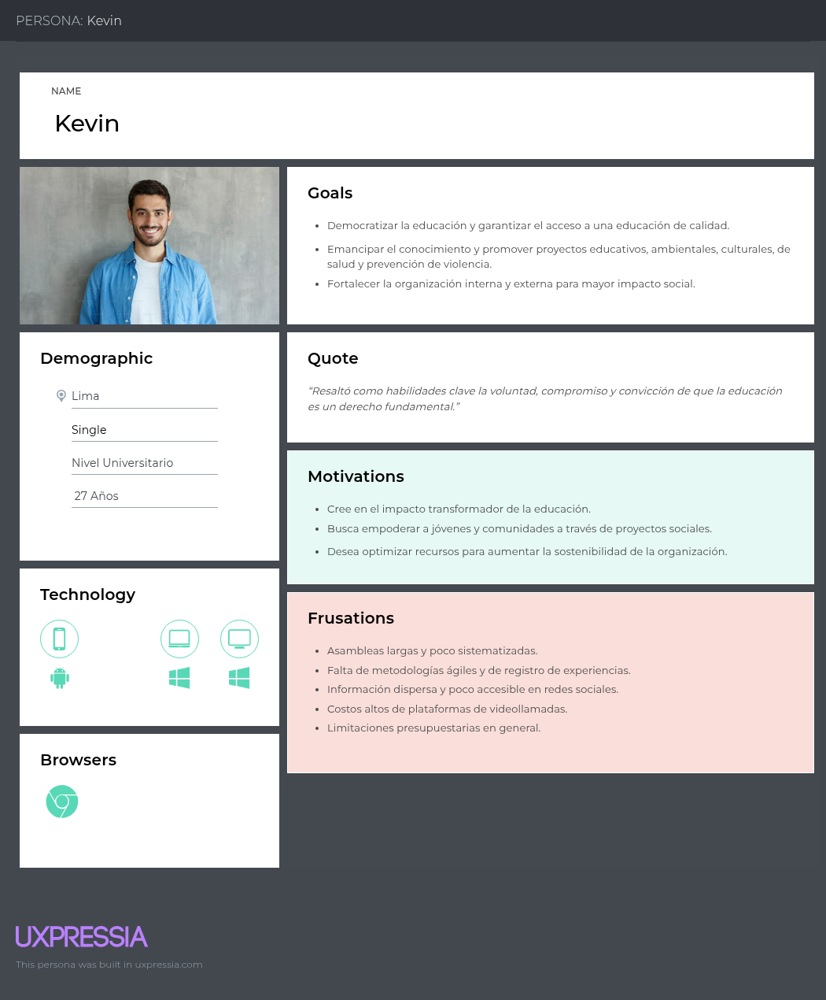

<h3>Universidad Peruana de Ciencias Aplicadas</h3>

 

<strong>Ingeniería de Software - 2025-2</strong> 
<strong>1ASI0729 - Desarrollo de Aplicaciones Open Source</strong> 
<strong>NRC: 7369</strong> 
<strong>Profesor: Nombre del docente</strong> 

 <strong>Informe del Trabajo Final</strong>  

<strong>Startup: nombre </strong> 
<strong>Producto: name </strong> 

### Team Members:

|             Member              |    Code    |
|:-------------------------------:|:----------:|
|  ===== |    ...     |
|  == |    ...     |
| === | **** |
|  ======== |    ...     |

<strong> Setiembre 2025</strong> 

# Registro de Versiones del Informe
|             Versión             |    Fecha   |    Descripción de modificación   |
|:-------------------------------:|:----------:|:----------:|
|  TB1 |    11/09/2025     |    Se han incluído los siguientes capítulos: Capítulo I: Introducción, Capítulo II: Requirements Elicitation & Analysis, Capítulo III: Requirements Specification, Capítulo IV: Product Design, Avance del Capítulo V: Product Implementation, Validation & Deployment hasta el punto 5.2.1.8, Avance de Conclusiones, Bibliografía y Anexos|           
    
# Project Report Collaboration Insights

- URL Project Report (Github): https://github.com/curso-nombre-startup-7369/report/tree/develop
---

# Contenido

## Tabla de contenidos
- [Student Outcome](#student-outcome)
- [Capítulo I: Introducción](#capítulo-i-introducción)
    - [1.1. Startup Profile](#11-startup-profile)
        - [1.1.1. Descripción de la Startup](#111-descripción-de-la-startup)
        - [1.1.2. Perfiles de integrantes del equipo](#112-perfiles-de-integrantes-del-equipo)
    - [1.2. Solution Profile](#12-solution-profile)
        - [1.2.1. Antecedentes y problemática](#121-antecedentes-y-problemática)
        - [1.2.2. Lean UX Process](#122-lean-ux-process)
            - [1.2.2.1. Lean UX Problem Statements](#1221-lean-ux-problem-statements)
            - [1.2.2.2. Lean UX Assumptions](#1222-lean-ux-assumptions)
            - [1.2.2.3. Lean UX Hypothesis Statements](#1223-lean-ux-hypothesis-statements)
            - [1.2.2.4. Lean UX Canvas](#1224-lean-ux-canvas)
    - [1.3. Segmentos objetivo](#13-segmentos-objetivo)
- [Capítulo II: Requirements Elicitation & Analysis](#capítulo-ii-requirements-elicitation--analysis)
    - [2.1. Competidores](#21-competidores)
        - [2.1.1. Análisis competitivo](#211-análisis-competitivo)
        - [2.1.2. Estrategias y tácticas frente a competidores](#212-estrategias-y-tácticas-frente-a-competidores)
    - [2.2. Entrevistas](#22-entrevistas)
        - [2.2.1. Diseño de entrevistas](#221-diseño-de-entrevistas)
        - [2.2.2. Registro de entrevistas](#222-registro-de-entrevistas)
        - [2.2.3. Análisis de entrevistas](#223-análisis-de-entrevistas)
    - [2.3. Needfinding](#23-needfinding)
        - [2.3.1. User Personas](#231-user-personas)
        - [2.3.2. User Task Matrix](#232-user-task-matrix)
        - [2.3.3. User Journey Mapping](#233-user-journey-mapping)
        - [2.3.4. Empathy Mapping](#234-empathy-mapping)
        - [2.3.5. As-is Scenario Mapping](#235-as-is-scenario-mapping)
    - [2.4. Ubiquitous Language](#24-ubiquitous-language)
- [Capítulo III: Requirements Specification](#capítulo-iii-requirements-specification)
    - [3.1. To-Be Scenario Mapping](#31-to-be-scenario-mapping)
    - [3.2. User Stories](#32-user-stories)
    - [3.3. Impact Mapping](#33-impact-mapping)
    - [3.4. Product Backlog](#34-product-backlog)
- [Capítulo IV: Product Design](#capítulo-iv-product-design)
    - [4.1. Style Guidelines](#41-style-guidelines)
        - [4.1.1. General Style Guidelines](#411-general-style-guidelines)
        - [4.1.2. Web Style Guidelines](#412-web-style-guidelines)
    - [4.2. Information Architecture](#42-information-architecture)
        - [4.2.1. Organization Systems](#421-organization-systems)
        - [4.2.2. Labeling Systems](#422-labeling-systems)
        - [4.2.3. SEO Tags and Meta Tags](#423-seo-tags-and-meta-tags)
        - [4.2.4. Searching Systems](#424-searching-systems)
        - [4.2.5. Navigation Systems](#425-navigation-systems)
    - [4.3. Landing Page UI Design](#43-landing-page-ui-design)
        - [4.3.1. Landing Page Wireframe](#431-landing-page-wireframe)
        - [4.3.2. Landing Page Mock-up](#432-landing-page-mock-up)
    - [4.4. Web Applications UX/UI Design](#44-web-applications-uxui-design)
        - [4.4.1. Web Applications Wireframes](#441-web-applications-wireframes)
        - [4.4.2. Web Applications Wireflow Diagrams](#442-web-applications-wireflow-diagrams)
        - [4.4.3. Web Applications Mock-ups](#443-web-applications-mock-ups)
        - [4.4.4. Web Applications User Flow Diagrams](#444-web-applications-user-flow-diagrams)
    - [4.5. Web Applications Prototyping](#45-web-applications-prototyping)
    - [4.6. Domain-Driven Software Architecture](#46-domain-driven-software-architecture)
        - [4.6.1. Software Architecture Context Diagram](#461-software-architecture-context-diagram)
        - [4.6.2. Software Architecture Container Diagrams](#462-software-architecture-container-diagrams)
        - [4.6.3. Software Architecture Components Diagrams](#463-software-architecture-components-diagrams)
    - [4.7. Software Object-Oriented Design](#47-software-object-oriented-design)
        - [4.7.1. Class Diagrams](#471-class-diagrams)
        - [4.7.2. Class Dictionary](#472-class-dictionary)
    - [4.8. Database Design](#48-database-design)
        - [4.8.1. Database Diagram](#481-database-diagram)
- [Capítulo V: Product Implementation, Validation & Deployment](#capítulo-v-product-implementation-validation--deployment)
    - [5.1. Software Configuration Management](#51-software-configuration-management)
        - [5.1.1. Software Development Environment Configuration](#511-software-development-environment-configuration)
        - [5.1.2. Source Code Management](#512-source-code-management)
        - [5.1.3. Source Code Style Guide & Conventions](#513-source-code-style-guide--conventions)
        - [5.1.4. Software Deployment Configuration](#514-software-deployment-configuration)
    - [5.2. Landing Page, Services & Applications Implementation](#52-landing-page-services--applications-implementation)
        - [5.2.1. Sprint 1](#521-sprint-1)
            - [5.2.1.1. Sprint Planning 1](#5211-sprint-planning-1)
            - [5.2.1.2. Aspect Leaders and Collaborators](#5212-aspect-leaders-and-collaborators)
            - [5.2.1.3. Sprint Backlog 1](#5213-sprint-backlog-1)
            - [5.2.1.4. Development Evidence for Sprint Review](#5214-development-evidence-for-sprint-review)
            - [5.2.1.5. Execution Evidence for Sprint Review](#5215-execution-evidence-for-sprint-review)
            - [5.2.1.6. Services Documentation Evidence for Sprint Review](#5216-services-documentation-evidence-for-sprint-review)
            - [5.2.1.7. Software Deployment Evidence for Sprint Review](#5217-software-deployment-evidence-for-sprint-review)
            - [5.2.1.8. Team Collaboration Insights during Sprint](#5218-team-collaboration-insights-during-sprint)

- [Conclusiones](#conclusiones)
- [Conclusiones y recomendaciones](#conclusiones-y-recomendaciones)
- [Video About-the-Team](#video-about-the-team)
- [Bibliografía](#bibliografía)
- [Anexos](#anexos)

---
# Student Outcome

## Capítulo I: Introducción
---
### 1.1. Startup Profile
#### 1.1.1. Descripción de la Startup
#### 1.1.2. Perfiles de integrantes del equipo
### 1.2. Solution Profile
#### 1.2.1. Antecedentes y problemática
#### 1.2.2. Lean UX Process
##### 1.2.2.1. Lean UX Problem Statements
##### 1.2.2.2. Lean UX Assumptions
##### 1.2.2.3. Lean UX Hypothesis Statements
##### 1.2.2.4. Lean UX Canvas
### 1.3. Segmentos objetivo
## Capítulo II: Requirements Elicitation & Analysis

### 2.1. Competidores

En este apartado se describen las principales plataformas que hoy dominan el sector de voluntariado digital. Analizar sus características permite identificar fortalezas y vacíos que VolunPath puede aprovechar para posicionarse estratégicamente.

| **Competidor**       | **Descripción**                                                                                   | **Características principales**                                                                 |
|-----------------------|---------------------------------------------------------------------------------------------------|-----------------------------------------------------------------------------------------------|
| **Idealist.org**      | Plataforma global que conecta personas con oportunidades de voluntariado, empleo social y proyectos comunitarios. | - Buscador avanzado de oportunidades   - Perfil público de organizaciones   - Publicación de eventos y proyectos   - Gran comunidad internacional |
| **VolunteerMatch.org** | Plataforma estadounidense que vincula ONGs y voluntarios mediante listados detallados de actividades. | - Sistema de emparejamiento entre voluntarios y organizaciones   - Integración con programas de voluntariado corporativo   - Publicación gratuita de oportunidades   - Comunidad sólida en EE. UU. |
| **GoVolunteer.com**   | Plataforma europea que conecta voluntarios con proyectos sociales y comunitarios, con énfasis en Alemania. | - Perfiles de organizaciones y proyectos   - Buscador filtrado por intereses y disponibilidad   - Promoción de proyectos sociales locales   - Espacio de comunidad digital |

---

#### 2.1.1. Análisis competitivo

En esta sección se presenta una tabla comparativa que resume el **perfil, propuesta de valor, mercado objetivo y estrategias clave** de los competidores frente a **VolunPath**, destacando las diferencias y ventajas competitivas.

| **Perfil / Categoría** | **VolunPath** | **Idealist.org** | **VolunteerMatch.org** | **GoVolunteer.com** |
|-------------------------|---------------|------------------|------------------------|----------------------|
| **Overview** | Plataforma web que conecta voluntarios y organizaciones, con perfiles públicos y dashboards privados para gestión interna (roles, tareas, inventarios, presupuestos, calendarios y métricas). | Plataforma global que conecta organizaciones y voluntarios. | Plataforma líder en EE.UU. para conectar ONGs y voluntarios. | Plataforma europea enfocada en proyectos sociales locales (principalmente Alemania). |
| **Ventaja Competitiva / Valor ofrecido** | Gestión integral interna **+** visibilidad pública en un mismo sistema; diseñada específicamente para ONGs latinoamericanas. | Comunidad internacional y amplia visibilidad. | Emparejamiento avanzado y programas corporativos. | Enfoque local con cercanía cultural y lingüística. |
| **Mercado Objetivo** | ONGs pequeñas/medianas, universidades, grupos comunitarios y voluntarios en América Latina. | ONGs, universidades, voluntarios y grupos comunitarios. | ONGs, corporaciones y voluntarios en EE.UU. | Voluntarios y ONGs en Europa (sobre todo Alemania). |
| **Estrategias de Marketing** | Alianzas con universidades, redes de voluntariado y gobiernos locales; marketing digital y gamificación. | Comunidad digital global y alianzas estratégicas. | Programas de responsabilidad social corporativa. | Marketing local y redes comunitarias. |
| **Productos / Servicios** | Perfiles públicos, dashboards internos, métricas de impacto y reportes automáticos. | Perfiles públicos y gestión básica de actividades. | Listado de oportunidades y matching corporativo. | Perfiles de proyectos locales y comunidad digital. |
| **Precios y Costos** | MVP gratuito + planes premium escalables según tamaño de la organización. | Gratuito con opciones premium para ONGs. | Gratuito para voluntarios, pago para ONGs premium. | Generalmente gratuito (financiado por apoyos sociales). |
| **Canales de Distribución** | Web responsive y app móvil en desarrollo. | Web responsive y futura app móvil. | Web + integraciones corporativas. | Web (principalmente en alemán). |
| **Fortalezas** | Plataforma integral, diseñada para el sector social latinoamericano. | Alcance global y visibilidad. | Matching avanzado y enfoque corporativo. | Conexión local y relevancia cultural. |
| **Debilidades** | Startup nueva, sin base de usuarios inicial ni posicionamiento consolidado. | Limitado en gestión interna. | Poca presencia fuera de EE.UU. | Alcance muy localizado. |
| **Oportunidades** | Digitalización creciente en América Latina y necesidad de transparencia. | Digitalización y confianza para donantes. | Expansión a otros países. | Crecer fuera de Alemania. |
| **Amenazas** | Competidores globales con mayor base de usuarios y capital. | Competencia emergente. | Saturación de mercado en EE.UU. | Dificultad para escalar internacionalmente. |

---

#### 2.1.2. Estrategias y tácticas frente a competidores

En este punto se desarrolla una **matriz FODA** que analiza la situación actual de VolunPath, identificando fortalezas, debilidades, oportunidades y amenazas. A partir de ese análisis, se plantean estrategias FO, DO, FA y DA para guiar la toma de decisiones estratégicas.

| **Fortalezas** | **Debilidades** |
|-----------------|-----------------|
| **Las fortalezas son los aspectos internos positivos que diferencian a VolunPath.**   - Gestión interna integral (roles, inventarios, presupuestos, calendarios).   - Combina perfil público + panel privado.   - Transparencia con métricas de impacto.   - Enfoque en ONGs pequeñas y medianas en LATAM. | **Las debilidades son limitaciones internas que pueden afectar la competitividad.**   - Startup nueva, sin base de usuarios inicial.   - Recursos limitados frente a competidores globales.   - Dependencia de adopción tecnológica por ONGs con baja digitalización.   - Menor reconocimiento de marca. |

| **Oportunidades** | **Estrategia FO** |
|--------------------|-------------------|
| **Las oportunidades representan condiciones externas favorables en el entorno.**   - Digitalización creciente de ONGs en LATAM.   - Demanda de transparencia y métricas para donantes.   - Brechas de mercado poco cubiertas en la región.   - Alianzas con universidades y gobiernos locales.   - Tendencia de gamificación y aprendizaje digital. | **Las estrategias FO aprovechan fortalezas internas para capitalizar oportunidades externas.**   - Ofrecer dashboards integrales para ONGs.   - Posicionar la transparencia como valor diferenciador.   - Crear alianzas institucionales para acelerar adopción. |

| **Estrategia DO** | **Amenazas** |
|-------------------|--------------|
| **Las estrategias DO buscan superar debilidades internas aprovechando oportunidades externas.**   - Brindar capacitaciones gratuitas en digitalización.   - Modelo freemium para facilitar adopción inicial.   - Alianzas con universidades/gobiernos para soporte. | **Las amenazas son factores externos que representan riesgos para VolunPath.**   - Competidores globales con gran base de usuarios.   - Nuevos entrantes con más capital.   - Saturación de plataformas similares.   - Resistencia cultural a la digitalización. |

| **Estrategia FA** | **Estrategia DA** |
|-------------------|-------------------|
| **Las estrategias FA utilizan las fortalezas para enfrentar amenazas externas.**   - Diferenciarse con gestión interna única (no solo matching).   - Construir comunidad sólida con gamificación.   - Posicionarse como la plataforma más accesible en LATAM. | **Las estrategias DA buscan reducir debilidades internas mientras se enfrentan amenazas.**   - Fidelizar usuarios desde etapas iniciales.   - Reducir barreras de entrada con onboarding simple.   - Diversificar usuarios entre ONGs, universidades y voluntarios. |

### 2.2. Entrevistas

En esta sección se presenta la investigación realizada mediante entrevistas a representantes de los segmentos objetivo de la plataforma: organizaciones de voluntariado y voluntarios individuales.
El propósito de estas entrevistas fue comprender las necesidades, motivaciones, problemas y expectativas de los usuarios en relación a la gestión de voluntarios y la participación en actividades solidarias. Esta información es fundamental para orientar el diseño del MVP y asegurar que la plataforma responda a los retos reales que enfrentan los usuarios.

#### 2.2.1. Diseño de entrevistas

En esta sección se detalla el diseño de entrevistas realizadas a los segmentos objetivo de la plataforma: organizaciones de voluntariado y voluntarios individuales. Se incluyen tanto las preguntas principales, enfocadas en entender procesos, necesidades y problemas, como las preguntas complementarias, destinadas a recolectar información demográfica y conductual para construir arquetipos de usuario.

## A. Para organizaciones  

1. Nombre de la organización y antigüedad  
2. Ubicación (distrito, ciudad, país)  
3. Número de miembros activos y roles principales  
4. Canales digitales utilizados para comunicación y coordinación (WhatsApp, correo, redes sociales)  
5. Nivel de familiaridad con herramientas digitales de gestión y métricas  
6. Personalidad del equipo (proactivo, colaborativo, innovador)  
7. Habilidades clave del equipo para el voluntariado  
8. Plataformas, marcas o influencias que siguen para informarse o capacitarse  
9. Objetivos principales al gestionar voluntarios  
10. Frustraciones actuales en la coordinación de actividades y comunicación  
11. ¿Cómo coordinan actualmente a sus voluntarios y asignan roles durante las actividades?  
12. ¿Qué herramientas digitales utilizan para organizar tareas, eventos o proyectos? ¿Qué limitaciones encuentran en ellas?  
13. ¿Cómo gestionan inventarios, recursos y presupuestos para sus actividades de voluntariado?  
14. ¿Qué dificultades enfrentan al comunicar eventos y tareas a los voluntarios?  
15. Si existiera una plataforma que centralice todo esto, ¿qué funcionalidades serían imprescindibles para ustedes?  

## B. Para voluntarios  

1. ¿Cuál es tu nombre completo y cuántos años tienes?  
2. ¿Cómo te identificas en cuanto a género?  
3. ¿En qué distrito o ciudad resides actualmente?  
4. ¿Cuál es tu estado civil? (soltero/a, casado/a, conviviente, otro)  
5. ¿Vives solo/a, con tu familia o con compañeros?  
6. ¿Cuál es tu ocupación actual o nivel de estudios?  
7. ¿Cómo te describirías en cuanto a tu forma de relacionarte con los demás y tu nivel de compromiso o proactividad?  
8. ¿Qué habilidades, talentos o conocimientos consideras que podrías aportar al voluntariado?  
9. ¿Qué redes sociales, plataformas o influencias digitales sueles usar para informarte o mantenerte conectado/a?  
10. ¿Qué dispositivos utilizas con mayor frecuencia (móvil, laptop, tablet) y qué canales digitales prefieres para comunicarte o recibir información (WhatsApp, correo, apps, redes sociales)?  
11. ¿Cómo descubres actualmente oportunidades de voluntariado?  
12. ¿Qué dificultades encuentras al participar en actividades voluntarias?  
13. Cuando participas, ¿cómo organizas tus tareas y actividades?  
14. ¿Qué te motiva a seguir participando en voluntariados?  
15. ¿Qué tipo de reconocimiento o historial de participación te gustaría tener en una plataforma?  

#### 2.2.2. Registro de entrevistas
#### 2.2.3. Análisis de entrevistas
### 2.3. Needfinding
#### 2.3.1. User Personas

A través de perfiles detallados, esta sección describe a los diferentes User Personas, explorando sus características demográficas, motivaciones, necesidades, comportamientos y frustraciones. El análisis permite identificar patrones comunes y específicos en los segmentos objetivo, facilitando el diseño de soluciones alineadas con sus expectativas, optimizando su experiencia y resolviendo los desafíos más relevantes que enfrentan en su contexto.

Segmento 1 → Organizaciones de voluntariado

  

Segmento 2 → Voluntarios

  

#### 2.3.2. User Task Matrix

Segmento 1 → Organizaciones de voluntariado

**Nombre:** Kevin  
**Edad:** 27 años  
**Interés:** Tener una plataforma centralizada y asequible que les permita organizarse mejor, ahorrar recursos, aumentar su visibilidad y demostrar el impacto de su labor social.  

#### Tareas del Usuario

| Tarea | Frecuencia | Importancia | Comentarios |
|-------|------------|-------------|-------------|
| Coordinar voluntarios y asignar roles | Alta (semanal o diaria en eventos) | Muy alta | Actualmente usan WhatsApp y reuniones largas; buscan reducir el tiempo invertido y evitar confusiones. |
| Planificar actividades y proyectos | Media-alta (mensual/trimestral) | Muy alta | La planificación consume tiempo por la dispersión de herramientas; una plataforma integrada ayudaría a centralizar. |
| Gestionar recursos (tiempo, dinero, materiales) | Media (según proyecto) | Alta | Es clave para la sostenibilidad de las actividades; necesitan control de gastos y presupuestos. |
| Sistematizar experiencias y generar reportes | Media (al finalizar proyectos) | Alta | Recolectar evidencias es importante para transparencia y aprendizaje, pero actualmente es engorroso. |
| Difundir iniciativas y logros | Alta (semanal/mensual) | Alta | Necesitan mayor visibilidad para atraer voluntarios y aliados; hoy lo hacen en redes sociales de forma poco estructurada. |
| Usar plataformas de comunicación y gestión | Alta (diaria/semanal) | Media | Actualmente recurren a Zoom y Drive, pero buscan soluciones más económicas y adaptadas. |

---

Segmento 2 → Voluntarios

**Nombre:** Carmen  
**Edad:** 27 años  
**Interés:** Como voluntaria, participar en proyectos con impacto social claro, bien organizados y que reconozcan su esfuerzo.  

#### Tareas del Usuario

| Tarea | Frecuencia | Importancia | Comentarios |
|-------|------------|-------------|-------------|
| Descubrir oportunidades de voluntariado | Semanal | Alta | Usa redes sociales, publicaciones de amigos, páginas de organizaciones y WhatsApp. |
| Comunicarse y coordinar con voluntarios y líderes | Diaria | Alta | Prefiere WhatsApp para comunicación rápida y correo electrónico para lo formal. |
| Participar en actividades voluntarias (proyectos/eventos) | Mensual / Quincenal | Alta | Se motiva por el impacto social y la conexión con otras personas. |
| Organizar y planificar sus tareas personales y de voluntariado | Semanal | Alta | Usa recordatorios, divide actividades por días y reparte responsabilidades. |
| Manejar conflictos de tiempo (trabajo, estudios, voluntariado) | Frecuente | Alta | Dificultad principal: falta de tiempo y superposición de actividades. |
| Recibir reconocimiento y validar historial de participación | Ocasional | Media-Alta | Desea certificados digitales, insignias y un historial con horas y proyectos. |
| Informarse sobre proyectos e impacto del voluntariado | Mensual | Media | Le interesa ver los resultados y sentir que su aporte genera impacto positivo. |

#### 2.3.3. User Journey Mapping

#### Segmento 1 – Organizaciones
En el caso de las organizaciones de voluntariado, el User Journey Mapping refleja cómo coordinadores como Kevin interactúan con la gestión de voluntarios desde la planeación de actividades hasta la evaluación de resultados. Este recorrido permite identificar los puntos de dolor en procesos clave como la asignación de roles, el manejo de recursos, la comunicación con equipos y la necesidad de reportes de impacto. Así, se evidencia cómo la plataforma puede aportar valor al optimizar tiempos, centralizar información y dar mayor visibilidad frente a aliados y donantes.

  

#### Segmento 2 – Voluntarios
En el caso de los voluntarios individuales, el User Journey Mapping permite comprender cómo participantes como Carmen descubren, se inscriben y colaboran en actividades solidarias. Este análisis muestra sus motivaciones, expectativas y dificultades a lo largo del proceso: desde encontrar oportunidades confiables, organizar su tiempo entre trabajo/estudios y voluntariado, hasta recibir reconocimiento por su aporte. De esta manera, se identifican momentos críticos donde la plataforma puede generar confianza, motivación y sentido de pertenencia para aumentar la retención y el compromiso del voluntariado.

  

### 2.3.2. Empathy Mapping  

En esta sección se desarrolla el **Empathy Mapping** para los segmentos objetivo identificados. Esta herramienta permite visualizar cómo piensan, sienten, dicen y hacen los usuarios en relación con el voluntariado y el uso de herramientas digitales. Su propósito es profundizar en la comprensión de sus motivaciones, frustraciones y expectativas, generando insights que orienten el diseño del MVP.  

#### Empathy Mapping – Segmento 1 (Kevin, líder de organización)  

Este mapa se centra en comprender la perspectiva de un **líder organizacional** que gestiona voluntarios y proyectos sociales. Se busca identificar sus principales dolores en la coordinación, gestión de recursos y visibilidad, así como las aspiraciones que lo motivan a adoptar una plataforma digital centralizada.  

  

#### Empathy Mapping – Segmento 2 (Carmen, voluntaria)  

Este mapa explora la experiencia de una **voluntaria activa** que busca oportunidades claras, bien organizadas y con reconocimiento. El análisis se orienta a entender cómo vive su rol dentro de los proyectos sociales, qué la motiva a participar y qué barreras enfrenta al equilibrar su tiempo personal con el voluntariado.  

  

#### 2.3.5. As-is Scenario Mapping
### 2.4. Ubiquitous Language

## Capítulo III: Requirements Specification
---
### 3.1. To-Be Scenario Mapping
### 3.2. User Stories
### 3.3. Impact Mapping
### 3.4. Product Backlog

## Capítulo IV: Product Design
---
### 4.1. Style Guidelines
#### 4.1.1. General Style Guidelines
#### 4.1.2. Web Style Guidelines
### 4.2. Information Architecture
#### 4.2.1. Organization Systems
#### 4.2.2. Labeling Systems
#### 4.2.3. SEO Tags and Meta Tags
#### 4.2.4. Searching Systems
#### 4.2.5. Navigation Systems
### 4.3. Landing Page UI Design
#### 4.3.1. Landing Page Wireframe
#### 4.3.2. Landing Page Mock-up
### 4.4. Web Applications UX/UI Design
#### 4.4.1. Web Applications Wireframes
#### 4.4.2. Web Applications Wireflow Diagrams
#### 4.4.3. Web Applications Mock-ups
#### 4.4.4. Web Applications User Flow Diagrams
### 4.5. Web Applications Prototyping
### 4.6. Domain-Driven Software Architecture
#### 4.6.1. Software Architecture Context Diagram
#### 4.6.2. Software Architecture Container Diagrams
#### 4.6.3. Software Architecture Components Diagrams
### 4.7. Software Object-Oriented Design
#### 4.7.1. Class Diagrams
#### 4.7.2. Class Dictionary
### 4.8. Database Design
#### 4.8.1. Database Diagram

## Capítulo V: Product Implementation, Validation & Deployment
---
### 5.1. Software Configuration Management
#### 5.1.1. Software Development Environment Configuration
#### 5.1.2. Source Code Management
#### 5.1.3. Source Code Style Guide & Conventions
#### 5.1.4. Software Deployment Configuration
### 5.2. Landing Page, Services & Applications Implementation
#### 5.2.1. Sprint 1

##### 5.2.1.1. Sprint Planning 1
##### 5.2.1.2. Aspect Leaders and Collaborators
##### 5.2.1.3. Sprint Backlog 1
##### 5.2.1.4. Development Evidence for Sprint Review
##### 5.2.1.5. Execution Evidence for Sprint Review
##### 5.2.1.6. Services Documentation Evidence for Sprint Review
##### 5.2.1.7. Software Deployment Evidence for Sprint Review
##### 5.2.1.8. Team Collaboration Insights during Sprint

# Conclusiones
---
## Conclusiones y recomendaciones
## Video About-the-Team

# Bibliografía

# Anexos

